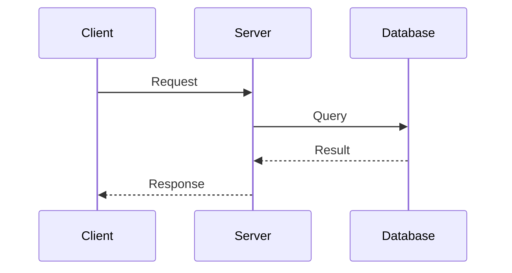
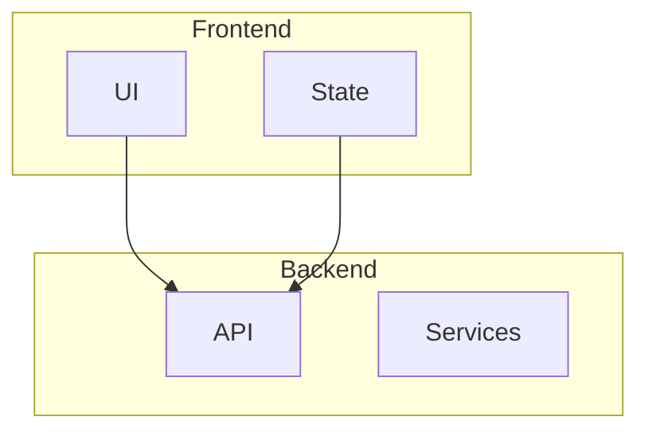

# Documentation Guide

This guide explains how to write, maintain, and contribute to the Noa Server
documentation.

## 📋 Table of Contents

- [Documentation Principles](#documentation-principles)
- [File Organization](#file-organization)
- [Writing Style](#writing-style)
- [Formatting Guidelines](#formatting-guidelines)
- [Code Examples](#code-examples)
- [Diagrams and Images](#diagrams-and-images)
- [Cross-References](#cross-references)
- [Review Process](#review-process)

## Documentation Principles

### 1. User-Centric

- Write for your audience (user, developer, architect)
- Focus on tasks users want to accomplish
- Provide context and explain the "why"

### 2. Clear and Concise

- Use simple, direct language
- Break complex topics into digestible sections
- Avoid jargon unless necessary (define when used)

### 3. Accurate and Current

- Keep documentation synchronized with code
- Update docs as part of feature development
- Review and refresh periodically

### 4. Example-Driven

- Include practical, working examples
- Show real-world use cases
- Provide code snippets that can be copied

### 5. Searchable

- Use descriptive headings
- Include relevant keywords
- Maintain consistent terminology

## File Organization

### Directory Structure

```
docs/
├── user/              # User-facing documentation
│   └── tutorials/     # Step-by-step tutorials
├── developer/         # Developer documentation
│   └── examples/      # Code examples
├── architecture/      # Architecture documentation
│   └── adr/          # Architecture Decision Records
├── README.md         # Documentation index
└── DOCUMENTATION_GUIDE.md
```

### Naming Conventions

- Use UPPERCASE for main documents: `GETTING_STARTED.md`
- Use lowercase with hyphens for subdocuments: `first-workflow.md`
- Use descriptive names that reflect content
- ADRs follow format: `NNN-title-of-decision.md`

## Writing Style

### Voice and Tone

- Use second person ("you") for user docs
- Use active voice: "Run the command" not "The command should be run"
- Be friendly but professional
- Use present tense

### Structure

Every document should have:

1. **Title** - Clear, descriptive H1
2. **Introduction** - Brief overview (1-2 paragraphs)
3. **Table of Contents** - For longer documents
4. **Body** - Main content with clear headings
5. **Examples** - Practical demonstrations
6. **See Also** - Related documentation links

### Headings

```markdown
# H1 - Document Title (one per document)

## H2 - Major Sections

### H3 - Subsections

#### H4 - Minor Subsections (use sparingly)
```

## Formatting Guidelines

### Lists

Use bulleted lists for unordered items:

```markdown
- First item
- Second item
- Third item
```

Use numbered lists for sequential steps:

```markdown
1. First step
2. Second step
3. Third step
```

### Emphasis

- **Bold** for UI elements, important concepts: `**important**`
- _Italic_ for emphasis, first use of terms: `*emphasis*`
- `Code` for inline code, commands, filenames: `` `code` ``

### Callouts

Use blockquotes for important notes:

```markdown
> **Note**: This is an important note.

> **Warning**: This is a warning.

> **Tip**: This is a helpful tip.
```

### Tables

Use tables for structured data:

```markdown
| Column 1 | Column 2 | Column 3 |
| -------- | -------- | -------- |
| Value 1  | Value 2  | Value 3  |
```

## Code Examples

### Inline Code

Use backticks for inline code:

```markdown
Use the `npm install` command to install dependencies.
```

### Code Blocks

Use fenced code blocks with language identifiers:

````markdown
```javascript
const example = 'code';
console.log(example);
```

```bash
npm install
npm run build
```

```typescript
interface Example {
  name: string;
  value: number;
}
```
````

### Complete Examples

Provide complete, working examples that users can copy:

````markdown
## Example: Creating a Custom Agent

```typescript
import { Agent } from '@noa-server/core';

class CustomAgent extends Agent {
  async execute(task: Task): Promise<Result> {
    // Implementation
    return { success: true };
  }
}

export default CustomAgent;
```
````

`````

### Best Practices for Examples
- Make examples self-contained
- Include necessary imports
- Add comments explaining key parts
- Test all code examples
- Show expected output

## Diagrams and Images

### Mermaid Diagrams
Use Mermaid for architecture diagrams:

````markdown
```mermaid
graph TD
    A[Client] --> B[API Gateway]
    B --> C[Service 1]
    B --> D[Service 2]
    C --> E[Database]
    D --> E
`````

````

### Common Diagram Types

**Flowcharts**:
```mermaid
graph LR
    A[Start] --> B{Decision}
    B -->|Yes| C[Action 1]
    B -->|No| D[Action 2]
```

**Sequence Diagrams**:


**Component Diagrams**:


### Screenshots
- Use PNG format for screenshots
- Store in `docs/images/` directory
- Use descriptive filenames: `login-screen.png`
- Include alt text for accessibility
- Keep file sizes reasonable (<200KB)

## Cross-References

### Internal Links
Link to other documentation:
```markdown
See the [Getting Started Guide](user/GETTING_STARTED.md) for setup instructions.
```

### External Links
Link to external resources:
```markdown
Learn more about [TypeScript](https://www.typescriptlang.org/).
```

### Anchor Links
Link to sections within documents:
```markdown
See [Installation](#installation) for details.
```

## Review Process

### Before Submitting
1. **Spell check** - Run through spell checker
2. **Link check** - Verify all links work
3. **Code check** - Test all code examples
4. **Format check** - Ensure consistent formatting
5. **Review** - Read from user perspective

### Checklist
- [ ] Document has clear title and introduction
- [ ] Content is accurate and up-to-date
- [ ] Examples are tested and working
- [ ] Links are valid
- [ ] Diagrams render correctly
- [ ] Follows style guide
- [ ] Spelling and grammar checked
- [ ] Cross-references added to related docs

### Documentation Updates
When updating documentation:

1. **Update content** - Make necessary changes
2. **Update date** - Change "Last Updated" date
3. **Update version** - Increment version if major changes
4. **Update index** - Update README.md if adding new docs
5. **Test examples** - Verify code still works
6. **Review impact** - Check if related docs need updates

### ADR Template
Architecture Decision Records follow this template:

```markdown
# ADR NNN: Title

## Status
[Proposed | Accepted | Deprecated | Superseded]

## Context
What is the issue we're addressing?

## Decision
What decision did we make?

## Consequences
What are the positive and negative consequences?

## Alternatives Considered
What other options were evaluated?
```

## Tools and Resources

### Recommended Tools
- **VS Code** - Markdown editing with preview
- **Markdown Lint** - Style checking
- **Mermaid Live Editor** - Diagram creation
- **Vale** - Prose linting
- **Grammarly** - Grammar checking

### Useful References
- [Markdown Guide](https://www.markdownguide.org/)
- [Mermaid Documentation](https://mermaid.js.org/)
- [Google Developer Documentation Style Guide](https://developers.google.com/style)

## Getting Help

Questions about documentation?
- Open an issue on GitHub
- Ask in the developer chat
- Consult the [Contributing Guide](developer/CONTRIBUTING.md)

---

**Remember**: Good documentation is an essential part of good software. Take pride in creating clear, helpful documentation!
````
