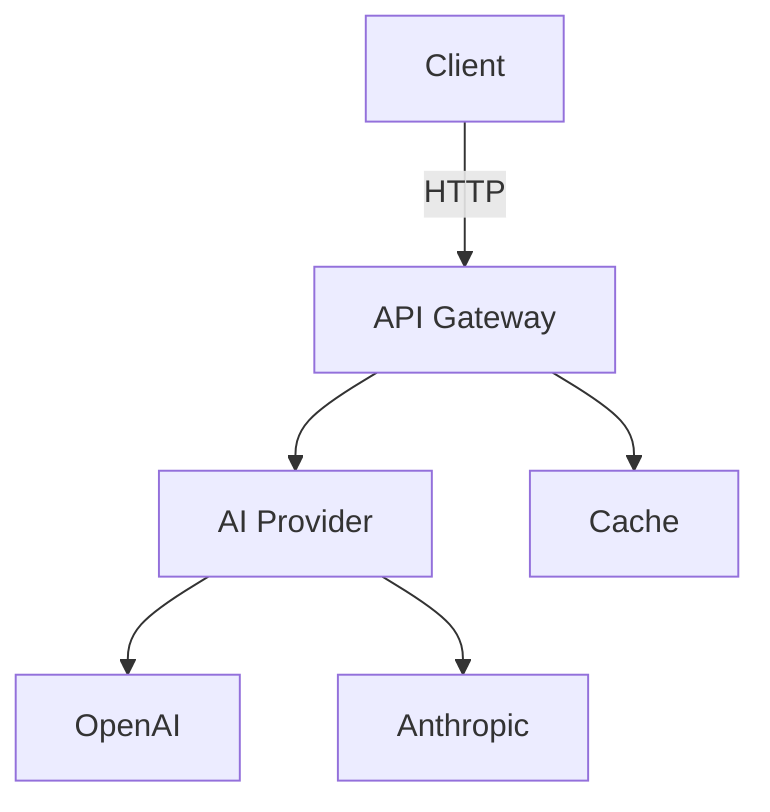

# Documentation Style Guide

> Standards and conventions for writing NOA Server documentation

## Markdown Conventions

### Headings

Use ATX-style headings (# syntax):

```markdown
# Level 1 Heading (Document Title)

## Level 2 Heading (Main Sections)

### Level 3 Heading (Subsections)

#### Level 4 Heading (Details)
```

**Rules:**

- Only one H1 (#) per document (the title)
- Don't skip heading levels
- Use sentence case for headings
- Add blank line before and after headings

### Code Blocks

Always specify the language identifier:

````markdown
```typescript
const example = 'Good';
```

```
Bad - no language specified
```
````

**Supported Languages:**

- `typescript`, `javascript`, `bash`, `json`, `yaml`
- `python`, `go`, `rust`, `java`, `sql`
- `dockerfile`, `nginx`, `markdown`

### Links

**Internal Links:**

```markdown
[Link Text](../path/to/file.md) [API Docs](API_DOCS.md#section-anchor)
```

**External Links:**

```markdown
[OpenAI](https://openai.com)
```

**Rules:**

- Use relative paths for internal links
- Include descriptive link text (not "click here")
- Test all links before committing

### Lists

**Unordered Lists:**

```markdown
- First item
- Second item
  - Nested item
  - Another nested item
- Third item
```

**Ordered Lists:**

```markdown
1. First step
2. Second step
3. Third step
```

**Rules:**

- Use `-` for unordered lists (not `*` or `+`)
- Indent nested lists with 2 spaces
- Add blank line before and after lists

### Tables

```markdown
| Column 1 | Column 2 | Column 3 |
| -------- | -------- | -------- |
| Value 1  | Value 2  | Value 3  |
| Value 4  | Value 5  | Value 6  |
```

**Rules:**

- Align columns for readability
- Use header row with separators
- Keep tables simple (max 5 columns)

### Emphasis

```markdown
**Bold text** for strong emphasis _Italic text_ for emphasis `Inline code` for
code references
```

**Rules:**

- Use bold sparingly
- Use inline code for: commands, file names, variables
- Don't use ALL CAPS for emphasis

## Front Matter

All documentation files should include YAML front matter:

```markdown
---
title: Document Title
category: API | Architecture | Development | Operations
last_updated: 2025-10-23
related: [file1.md, file2.md]
---
```

**Fields:**

- `title`: Document title (required)
- `category`: Documentation category (required)
- `last_updated`: Last update date in YYYY-MM-DD format (required)
- `related`: Array of related documentation files (optional)

## Code Examples

### TypeScript/JavaScript

```typescript
// ✅ Good: Clear, documented, realistic
import { NoaClient } from '@noa/sdk';

// Initialize client with API key
const client = new NoaClient({
  apiKey: process.env.OPENAI_API_KEY,
});

// Generate chat completion
const response = await client.chat.completions.create({
  model: 'gpt-4',
  messages: [{ role: 'user', content: 'Hello!' }],
});

console.log(response.choices[0].message.content);
```

```javascript
// ❌ Bad: Unclear, hardcoded values
const x = new X({ k: 'sk-123' });
const r = await x.y({ m: 'gpt-4', msg: [{ r: 'user', c: 'Hi' }] });
```

**Rules:**

- Use meaningful variable names
- Add comments for complex logic
- Use environment variables for secrets
- Include error handling
- Test all code examples

### Bash Scripts

```bash
#!/bin/bash
# Good: Clear, safe, documented

set -euo pipefail  # Exit on error, undefined variables, pipe failures

# Install dependencies
echo "Installing dependencies..."
pnpm install

# Run tests
echo "Running tests..."
pnpm test || {
  echo "Tests failed!"
  exit 1
}

echo "✅ All tests passed"
```

**Rules:**

- Include shebang (`#!/bin/bash`)
- Use `set -euo pipefail` for safety
- Add comments for clarity
- Handle errors gracefully

### Configuration Files

```yaml
# Good: Commented, organized, clear defaults
server:
  # Server port (default: 3000)
  port: 3000

  # Server host (default: 0.0.0.0)
  host: 0.0.0.0

database:
  # PostgreSQL connection URL
  url: ${DATABASE_URL}

  # Connection pool settings
  pool:
    min: 2
    max: 10
```

**Rules:**

- Add comments explaining each option
- Use environment variables for secrets
- Show default values
- Organize logically

## Diagrams

### Mermaid Diagrams

Use Mermaid for architecture diagrams:

````markdown

````

**Supported Diagram Types:**

- `graph TD` - Top-down flowchart
- `sequenceDiagram` - Sequence diagrams
- `classDiagram` - Class diagrams
- `erDiagram` - Entity-relationship diagrams

**Rules:**

- Keep diagrams simple and focused
- Use descriptive labels
- Add legend if needed
- Test rendering in GitHub

## Tone and Voice

### Writing Style

**✅ Do:**

- Use active voice: "Run the command" (not "The command should be run")
- Be concise and clear
- Use second person: "You can configure..."
- Explain the "why" not just the "how"

**❌ Don't:**

- Use jargon without explanation
- Assume knowledge level
- Write long paragraphs (max 5 lines)
- Use emoji excessively (sparingly for visual emphasis)

### Examples

**Good:**

```markdown
## Configure the API Key

To authenticate with OpenAI, set your API key:

1. Create a `.env` file in the project root
2. Add your API key:
```

OPENAI_API_KEY=sk-your-key-here

```
3. Restart the server

The API key is used to authenticate all requests to OpenAI's API.
```

**Bad:**

```markdown
## API Key Configuration

The API key configuration is an important step in the setup process that should
not be skipped because without it the system will not be able to communicate
with the OpenAI API endpoints and will result in authentication errors being
thrown by the application.
```

## File Naming

### Documentation Files

```
✅ Good:
- API_DOCS.md
- GETTING_STARTED.md
- quick-reference/CLI_COMMANDS.md

❌ Bad:
- api.md
- gettingstarted.md
- commands-cli.md
```

**Rules:**

- Use UPPERCASE for top-level docs
- Use lowercase with hyphens for nested docs
- Use descriptive names
- Add `.md` extension

### Code Examples

```
✅ Good:
- examples/chat-completion.ts
- examples/embeddings-generation.py

❌ Bad:
- ex1.ts
- test.py
```

## Structure

### Document Structure

Every documentation file should follow this structure:

```markdown
---
title: Document Title
category: Category
last_updated: 2025-10-23
---

# Document Title

> Brief description (1-2 sentences)

## Overview

High-level introduction to the topic.

## Main Content

### Section 1

Content...

### Section 2

Content...

## Examples

Practical examples...

## Additional Resources

Related links...

---

**[← Back to Documentation Index](INDEX.md)**
```

### README Structure

Package READMEs should follow:

```markdown
# @noa/package-name

Brief description.

## Installation

Installation instructions...

## Usage

Basic usage examples...

## API Reference

Link to detailed API docs...

## Contributing

Link to contributing guide...
```

## Accessibility

**Alt Text for Images:**

```markdown

```

**Screen Reader Friendly:**

- Use semantic HTML in tables
- Provide text alternatives for diagrams
- Use descriptive link text

## Maintenance

### Updating Documentation

When updating documentation:

1. ✅ Update `last_updated` in front matter
2. ✅ Add entry to CHANGELOG.md if significant
3. ✅ Run validation scripts
4. ✅ Test all code examples
5. ✅ Check all links
6. ✅ Update related documentation

### Deprecation Notice

When documenting deprecated features:

```markdown
> **⚠️ DEPRECATED:** This feature is deprecated and will be removed in v3.0. Use
> [new feature](./new-feature.md) instead.
```

## Review Checklist

Before submitting documentation:

- [ ] Front matter complete
- [ ] Title is clear and descriptive
- [ ] Code examples tested
- [ ] Links validated
- [ ] Language identifiers on code blocks
- [ ] No spelling/grammar errors
- [ ] Follows style guide
- [ ] Related docs updated

**[← Back to Documentation Index](INDEX.md)**
