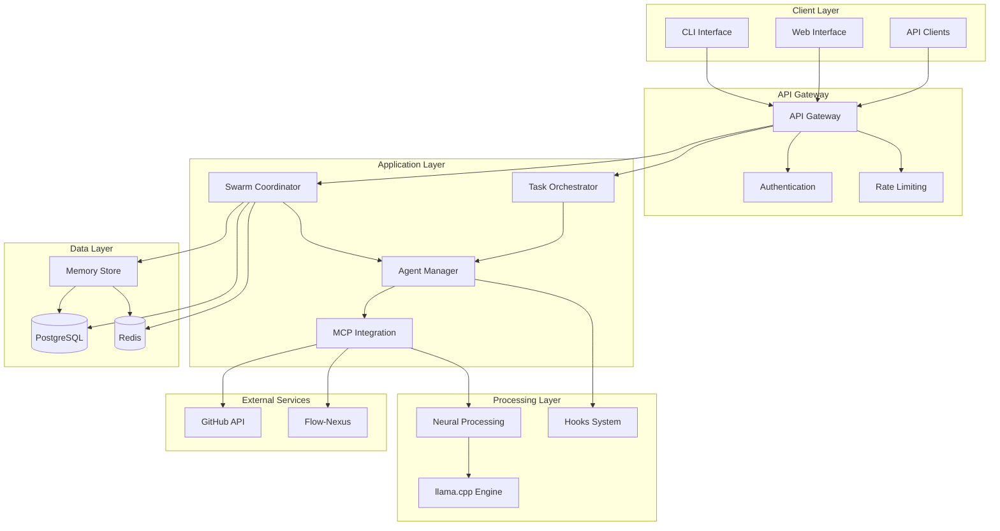
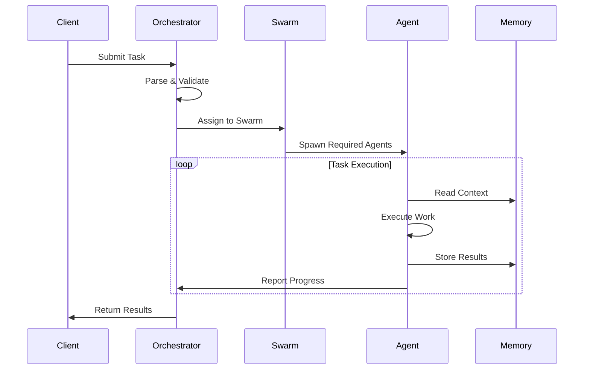

# Architecture Overview

High-level architecture of the Noa Server platform.

## 📋 Table of Contents

- [System Architecture](#system-architecture)
- [Core Components](#core-components)
- [Design Principles](#design-principles)
- [Technology Stack](#technology-stack)
- [Deployment Models](#deployment-models)
- [Performance Characteristics](#performance-characteristics)

## System Architecture

### High-Level Architecture



### Component Layers

**1. Client Layer**
- CLI tools for command-line interaction
- Web interface for visual management
- API clients for programmatic access

**2. API Gateway**
- Request routing and load balancing
- Authentication and authorization
- Rate limiting and throttling
- Request/response transformation

**3. Application Layer**
- Swarm coordination and topology management
- Agent lifecycle and communication
- Task orchestration and scheduling
- MCP tool integration

**4. Processing Layer**
- Neural processing with llama.cpp
- Hooks system for automation
- Pattern learning and application

**5. Data Layer**
- Memory store for agent coordination
- PostgreSQL for persistent data
- Redis for caching and pub/sub

**6. External Services**
- GitHub integration for repository operations
- Flow-Nexus for cloud features

## Core Components

### 1. Swarm Coordinator

Manages agent swarms with different topologies.

**Responsibilities**:
- Initialize and configure swarms
- Manage swarm topology (mesh, hierarchical, adaptive)
- Coordinate agent communication
- Handle swarm scaling and optimization
- Monitor swarm health

**Key Classes**:
```typescript
class SwarmCoordinator {
  async initialize(config: SwarmConfig): Promise<Swarm>
  async scale(swarmId: string, targetAgents: number): Promise<void>
  async optimize(swarmId: string): Promise<OptimizationResult>
  getStatus(swarmId: string): SwarmStatus
}
```

**Topologies Supported**:
- **Mesh**: Peer-to-peer communication
- **Hierarchical**: Tree structure with coordinators
- **Star**: Central coordinator with workers
- **Adaptive**: Dynamic topology adjustment

### 2. Agent Manager

Handles agent lifecycle and operations.

**Responsibilities**:
- Spawn and terminate agents
- Manage agent state and health
- Route messages between agents
- Track agent metrics
- Handle agent failures

**Key Classes**:
```typescript
class AgentManager {
  async spawn(config: AgentConfig): Promise<Agent>
  async stop(agentId: string): Promise<void>
  getAgent(agentId: string): Agent | null
  listAgents(filter?: AgentFilter): Agent[]
  getMetrics(agentId: string): AgentMetrics
}
```

**Agent Types** (54+ specialized agents):
- Development: coder, backend-dev, frontend-dev
- Quality: reviewer, tester, security-manager
- Architecture: system-architect, code-analyzer
- Operations: cicd-engineer, perf-analyzer

### 3. Task Orchestrator

Coordinates task execution across agents.

**Responsibilities**:
- Parse and validate task definitions
- Resolve task dependencies
- Distribute tasks to agents
- Monitor task progress
- Aggregate task results

**Key Classes**:
```typescript
class TaskOrchestrator {
  async orchestrate(task: Task): Promise<TaskResult>
  async execute(taskId: string): Promise<void>
  getStatus(taskId: string): TaskStatus
  cancel(taskId: string): Promise<void>
}
```

**Task Flow**:


### 4. MCP Integration

Integrates with Model Context Protocol servers.

**Responsibilities**:
- Connect to MCP servers
- Expose MCP tools to agents
- Route MCP requests
- Handle MCP tool responses
- Manage MCP connections

**Key Classes**:
```typescript
class MCPIntegration {
  async connect(server: MCPServerConfig): Promise<void>
  async invoke(tool: string, params: any): Promise<any>
  listTools(server?: string): MCPTool[]
  disconnect(server: string): Promise<void>
}
```

**Supported MCP Servers**:
- claude-flow: Core orchestration
- neural-processing: llama.cpp integration
- ruv-swarm: Enhanced coordination
- flow-nexus: Cloud features

### 5. Memory Store

Provides shared memory for agent coordination.

**Responsibilities**:
- Store and retrieve key-value data
- Support hierarchical keys
- Handle concurrent access
- Provide pub/sub for updates
- Manage memory lifecycle

**Key Classes**:
```typescript
class MemoryStore {
  async store(key: string, value: any, ttl?: number): Promise<void>
  async retrieve(key: string): Promise<any>
  async list(prefix: string): Promise<string[]>
  async delete(key: string): Promise<void>
  subscribe(pattern: string, callback: (key, value) => void): void
}
```

**Storage Backend**:
- SQLite for local development
- PostgreSQL for production
- Redis for caching and pub/sub

### 6. Neural Processing

Local AI model inference with llama.cpp.

**Responsibilities**:
- Load and manage GGUF models
- Process chat completions
- Stream responses
- Benchmark performance
- Validate models

**Key Classes**:
```typescript
class NeuralProcessor {
  async loadModel(path: string): Promise<Model>
  async complete(prompt: string, options?: CompletionOptions): Promise<string>
  async stream(prompt: string, callback: (chunk: string) => void): Promise<void>
  benchmark(model: string, iterations: number): Promise<BenchmarkResult>
}
```

**Features**:
- CUDA acceleration support
- Multiple model formats (GGUF)
- Quantization support (Q4, Q5, Q8)
- Streaming responses
- Batch processing

### 7. Hooks System

Automated coordination through hooks.

**Responsibilities**:
- Execute pre/post operation hooks
- Auto-format code
- Update memory
- Train patterns
- Generate metrics

**Hook Types**:
- **Pre-Task**: Prepare resources, assign agents
- **Post-Edit**: Format code, update memory
- **Post-Task**: Generate summary, train patterns
- **Session**: Save/restore state, export metrics

**Key Classes**:
```typescript
class HooksSystem {
  async executePreTask(task: Task): Promise<void>
  async executePostEdit(file: string, changes: any): Promise<void>
  async executePostTask(taskId: string): Promise<void>
  registerHook(type: HookType, handler: HookHandler): void
}
```

## Design Principles

### 1. Modularity

Each component has a single, well-defined responsibility:

- **Core**: Base functionality, shared utilities
- **API**: REST API and GraphQL endpoints
- **Swarm**: Swarm coordination logic
- **Agent**: Agent implementation and management
- **MCP**: MCP integration layer
- **Neural**: Neural processing with llama.cpp

### 2. Scalability

Designed for horizontal scaling:

- **Stateless agents**: Can be distributed across nodes
- **Shared memory**: Centralized state management
- **Message queues**: Async communication
- **Load balancing**: Distribute work evenly
- **Auto-scaling**: Adjust resources based on load

### 3. Extensibility

Easy to extend with new capabilities:

- **Plugin architecture**: Add new agent types
- **MCP tools**: Integrate external tools
- **Custom topologies**: Implement new coordination patterns
- **Hooks**: Extend automation behavior
- **Neural models**: Add new AI models

### 4. Reliability

Built for production use:

- **Fault tolerance**: Handle agent failures gracefully
- **Self-healing**: Automatically recover from errors
- **Circuit breakers**: Prevent cascade failures
- **Retry logic**: Recover from transient failures
- **Health checks**: Monitor component health

### 5. Performance

Optimized for speed and efficiency:

- **Parallel execution**: Run agents concurrently
- **Caching**: Reduce redundant computation
- **Connection pooling**: Efficient resource usage
- **Lazy loading**: Load resources on demand
- **Batch processing**: Group operations

## Technology Stack

### Core Technologies

**Runtime**:
- Node.js 18+ (JavaScript runtime)
- TypeScript 5+ (Type safety)

**Database**:
- PostgreSQL 14+ (Primary database)
- Redis 7+ (Caching and pub/sub)
- SQLite 3+ (Development and memory)

**AI/ML**:
- llama.cpp (Local model inference)
- CUDA 11.8+ (GPU acceleration)
- GGUF models (LLaMA, Mistral, etc.)

### Frameworks and Libraries

**Backend**:
- Express.js (REST API)
- Apollo Server (GraphQL)
- TypeORM (Database ORM)
- Bull (Job queues)

**Testing**:
- Jest (Unit/integration testing)
- Supertest (API testing)
- Playwright (E2E testing)

**Development**:
- ESLint (Linting)
- Prettier (Code formatting)
- Husky (Git hooks)
- Commitlint (Commit conventions)

### Infrastructure

**Containerization**:
- Docker (Container runtime)
- Docker Compose (Multi-container apps)

**Monitoring**:
- Prometheus (Metrics)
- Grafana (Visualization)
- Winston (Logging)
- Jaeger (Distributed tracing)

**CI/CD**:
- GitHub Actions (Automation)
- Jest (Testing)
- Docker (Building images)

## Deployment Models

### 1. Local Development

```
Developer Machine
├── Node.js Server (localhost:3000)
├── PostgreSQL (localhost:5432)
├── Redis (localhost:6379)
└── llama.cpp (local models)
```

### 2. Docker Compose

```
Docker Network
├── api (noa-server)
├── db (postgresql)
├── cache (redis)
├── neural (llama.cpp)
└── monitoring (prometheus/grafana)
```

### 3. Kubernetes (Production)

```
Kubernetes Cluster
├── API Pods (scalable)
├── Agent Pods (scalable)
├── PostgreSQL (StatefulSet)
├── Redis (StatefulSet)
├── Neural Processing (GPU nodes)
└── Monitoring Stack
```

### 4. Serverless (Hybrid)

```
Cloud + Local
├── API Gateway (AWS/GCP)
├── Lambda Functions (agent execution)
├── RDS/Cloud SQL (database)
├── ElastiCache/MemoryStore (cache)
└── Local llama.cpp (neural processing)
```

## Performance Characteristics

### Benchmarks

**Agent Spawning**:
- Spawn time: 50-100ms per agent
- Concurrent spawns: Up to 20 agents/second
- Memory per agent: 50-100MB

**Task Execution**:
- Simple tasks: 1-5 seconds
- Complex tasks: 30-120 seconds
- Parallel efficiency: 2.8-4.4x speedup

**Neural Processing**:
- CPU inference: 1-3 tokens/second
- GPU (CUDA): 10-30 tokens/second
- Model loading: 2-5 seconds

### Scalability Limits

**Single Instance**:
- Max agents: 20-30 (depending on hardware)
- Max concurrent tasks: 10-15
- Memory usage: 2-4GB

**Clustered**:
- Max agents: 100+ (distributed)
- Max concurrent tasks: 50+
- Horizontal scaling supported

### Optimization Strategies

1. **Caching**: 32.3% token reduction
2. **Parallel execution**: 2.8-4.4x faster
3. **Connection pooling**: Efficient resource usage
4. **Lazy loading**: Faster startup
5. **Pattern reuse**: Learn from success

## Next Steps

- [System Design](SYSTEM_DESIGN.md) - Detailed system design
- [Component Architecture](COMPONENT_ARCHITECTURE.md) - Component details
- [Data Flow](DATA_FLOW.md) - Data flow and processing
- [Deployment Architecture](DEPLOYMENT_ARCHITECTURE.md) - Deployment strategies
- [Technology Stack](TECHNOLOGY_STACK.md) - Detailed tech stack

---

**Questions?** See [Developer Documentation](../developer/) or ask in [Discussions](https://github.com/your-org/noa-server/discussions).
