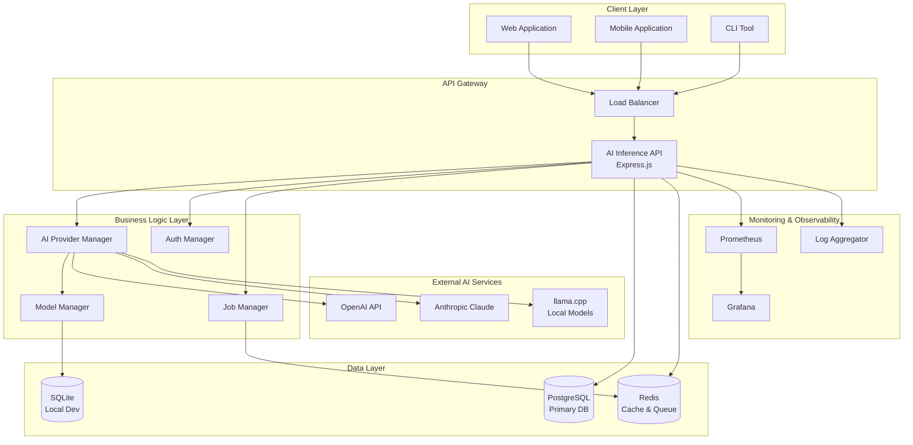
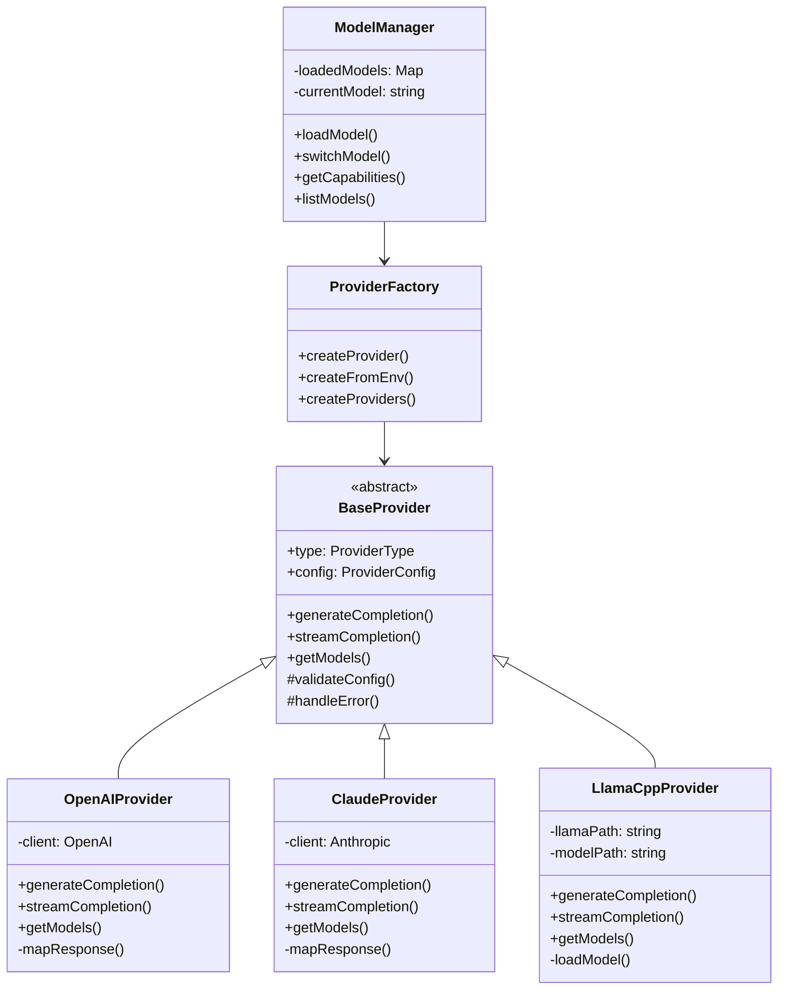
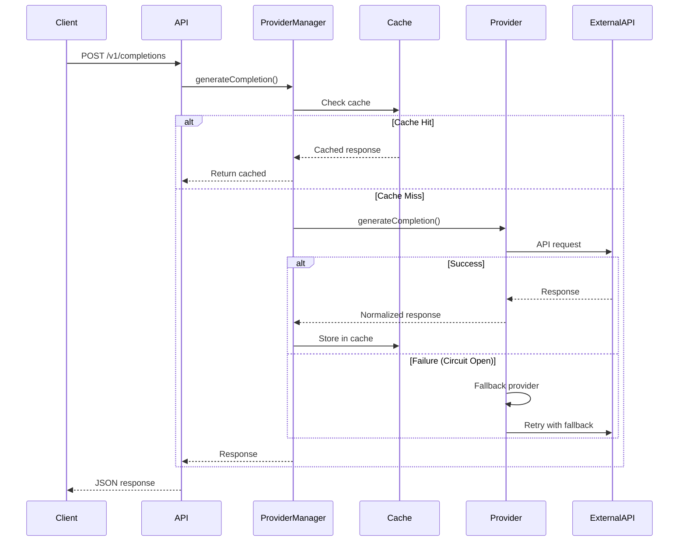
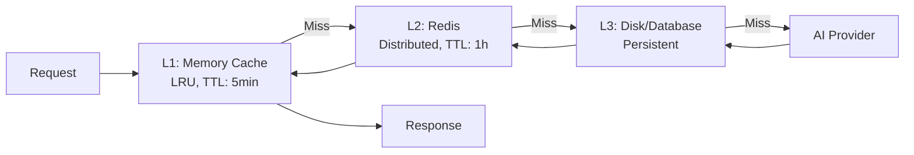
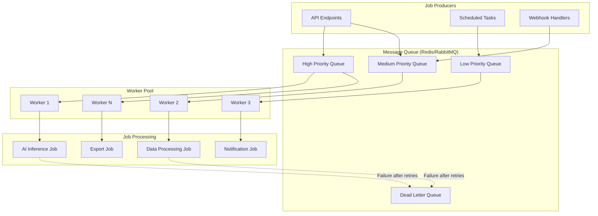
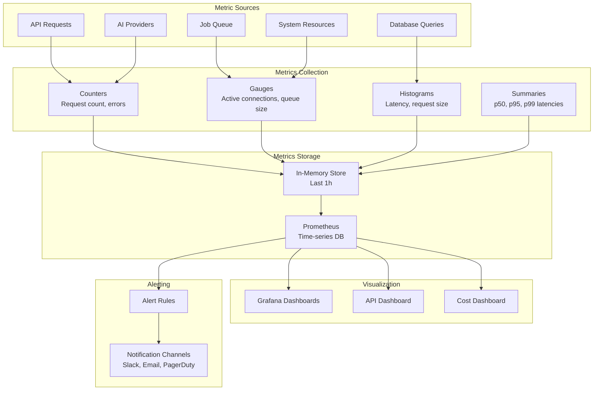
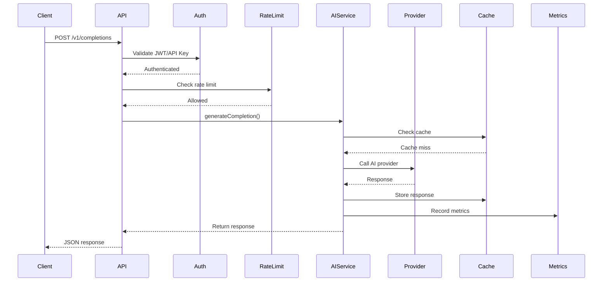
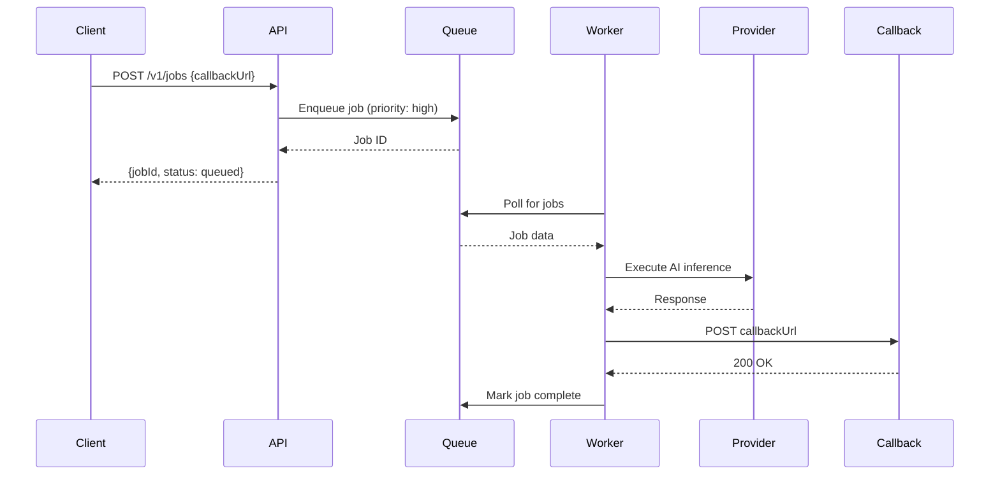

# NOA Server - Component Architecture

## Table of Contents

- [Overview](#overview)
- [AI Provider System](#ai-provider-system)
- [API Layer](#api-layer)
- [Message Queue System](#message-queue-system)
- [Monitoring System](#monitoring-system)
- [Component Interactions](#component-interactions)

## Overview

The NOA Server follows a modular monolithic architecture with clear component
boundaries. Each major component is isolated in its own package within the pnpm
monorepo, promoting code reuse and maintainability.

### Container Diagram (C4 Level 2)



## AI Provider System

Location: `/packages/ai-provider/`

### Purpose

Provides unified interface for interacting with multiple AI providers (OpenAI,
Claude, llama.cpp) with automatic fallback, caching, and error handling.

### Architecture



### Key Components

#### 1. BaseProvider (Abstract)

```typescript
// Location: /packages/ai-provider/src/providers/base.ts

export abstract class BaseProvider {
  protected config: ProviderConfig;
  protected type: ProviderType;

  abstract generateCompletion(
    params: CompletionParams
  ): Promise<CompletionResponse>;
  abstract streamCompletion(
    params: CompletionParams
  ): AsyncGenerator<StreamChunk>;
  abstract getModels(): Promise<ModelInfo[]>;

  protected validateConfig(config: ProviderConfig): void;
  protected handleError(error: unknown): AIProviderError;
}
```

**Responsibilities:**

- Define common provider interface
- Shared error handling logic
- Configuration validation
- Response normalization

#### 2. Provider Implementations

**OpenAIProvider**

```typescript
// Location: /packages/ai-provider/src/providers/openai.ts

export class OpenAIProvider extends BaseProvider {
  private client: OpenAI;

  async generateCompletion(
    params: CompletionParams
  ): Promise<CompletionResponse> {
    const response = await this.client.chat.completions.create({
      model: params.model,
      messages: params.messages,
      temperature: params.temperature,
      max_tokens: params.maxTokens,
    });
    return this.mapResponse(response);
  }
}
```

**ClaudeProvider**

```typescript
// Location: /packages/ai-provider/src/providers/claude.ts

export class ClaudeProvider extends BaseProvider {
  private client: Anthropic;

  async generateCompletion(
    params: CompletionParams
  ): Promise<CompletionResponse> {
    const response = await this.client.messages.create({
      model: params.model,
      max_tokens: params.maxTokens || 1024,
      messages: params.messages,
    });
    return this.mapResponse(response);
  }
}
```

**LlamaCppProvider**

```typescript
// Location: /packages/ai-provider/src/providers/llama-cpp.ts

export class LlamaCppProvider extends BaseProvider {
  private modelPath: string;
  private loadedModel?: LlamaModel;

  async generateCompletion(
    params: CompletionParams
  ): Promise<CompletionResponse> {
    if (!this.loadedModel) {
      await this.loadModel();
    }
    const response = await this.loadedModel.complete(params.messages);
    return this.mapResponse(response);
  }
}
```

#### 3. ModelManager

```typescript
// Location: /packages/ai-provider/src/managers/model-manager.ts

export class ModelManager {
  private loadedModels: Map<string, ModelInfo>;
  private currentModelKey: string | null;

  async loadModel(
    providerConfig: ProviderConfig,
    modelId: string
  ): Promise<void>;
  switchToModel(key: string): void;
  getCurrentModel(): ModelInfo | null;
  getModelsByCapability(capability: ModelCapability): ModelInfo[];
}
```

**Features:**

- Model registry with capability discovery
- LRU cache for loaded models (max 10 models)
- Automatic model switching
- Capability filtering

### Data Flow



### Circuit Breaker Pattern

```typescript
// Pseudocode for circuit breaker
class CircuitBreaker {
  state: 'CLOSED' | 'OPEN' | 'HALF_OPEN' = 'CLOSED';
  failureCount: number = 0;
  threshold: number = 5;
  timeout: number = 60000; // 60s

  async execute<T>(
    fn: () => Promise<T>,
    fallback?: () => Promise<T>
  ): Promise<T> {
    if (this.state === 'OPEN') {
      if (Date.now() - this.openedAt > this.timeout) {
        this.state = 'HALF_OPEN';
      } else if (fallback) {
        return fallback();
      } else {
        throw new Error('Circuit breaker open');
      }
    }

    try {
      const result = await fn();
      if (this.state === 'HALF_OPEN') {
        this.state = 'CLOSED';
        this.failureCount = 0;
      }
      return result;
    } catch (error) {
      this.failureCount++;
      if (this.failureCount >= this.threshold) {
        this.state = 'OPEN';
        this.openedAt = Date.now();
      }
      if (fallback) {
        return fallback();
      }
      throw error;
    }
  }
}
```

### Multi-Tier Caching



## API Layer

Location: `/packages/ai-inference-api/`

### Purpose

Provides RESTful API interface for AI inference with authentication, validation,
rate limiting, and comprehensive monitoring.

### Architecture

```mermaid
graph TB
    subgraph Middleware["Middleware Stack"]
        Helmet[Helmet<br/>Security Headers]
        CORS[CORS<br/>Cross-Origin]
        BodyParser[Body Parser<br/>JSON/URL-encoded]
        ReqLogger[Request Logger<br/>Correlation IDs]
        PerfMonitor[Performance Monitor<br/>Latency Tracking]
        MetricsCollector[Metrics Collector<br/>Prometheus]
        Auth[Authentication<br/>JWT/API Key]
        RateLimit[Rate Limiter<br/>Token Bucket]
        Validation[Validation<br/>Zod Schemas]
    end

    subgraph Routes["API Routes"]
        HealthRoutes[/health/*<br/>Health Checks]
        StatusRoutes[/status<br/>System Status]
        ModelsRoutes[/v1/models<br/>Model Management]
        InferenceRoutes[/v1/completions<br/>Inference]
        MonitoringRoutes[/metrics<br/>Metrics Export]
    end

    subgraph Services["Business Services"]
        AIService[AI Service<br/>Provider Orchestration]
        HealthService[Health Service<br/>Dependency Checks]
        MetricsService[Metrics Service<br/>Aggregation]
    end

    Request[HTTP Request] --> Helmet
    Helmet --> CORS
    CORS --> BodyParser
    BodyParser --> ReqLogger
    ReqLogger --> PerfMonitor
    PerfMonitor --> MetricsCollector
    MetricsCollector --> Auth
    Auth --> RateLimit
    RateLimit --> Validation
    Validation --> Routes
    Routes --> Services
    Services --> Response[HTTP Response]
```

### Key Components

#### 1. Middleware Stack

**Security Middleware (Helmet)**

```typescript
// Location: /packages/ai-inference-api/src/index.ts

app.use(
  helmet({
    contentSecurityPolicy: {
      directives: {
        defaultSrc: ["'self'"],
        styleSrc: ["'self'", "'unsafe-inline'"],
        scriptSrc: ["'self'"],
        imgSrc: ["'self'", 'data:', 'https:'],
      },
    },
    hsts: {
      maxAge: 31536000,
      includeSubDomains: true,
      preload: true,
    },
  })
);
```

**CORS Configuration**

```typescript
app.use(
  cors({
    origin: process.env.CORS_ORIGIN || '*',
    credentials: true,
    methods: ['GET', 'POST', 'PUT', 'DELETE', 'OPTIONS'],
    allowedHeaders: ['Content-Type', 'Authorization', 'X-API-Key'],
  })
);
```

**Request Logger with Correlation IDs**

```typescript
// Location: /packages/ai-inference-api/src/middleware/request-logger.ts

export const requestLogger: RequestHandler = (req, res, next) => {
  const correlationId = req.headers['x-correlation-id'] || uuidv4();
  req.correlationId = correlationId;

  logger.info('Incoming request', {
    correlationId,
    method: req.method,
    path: req.path,
    userAgent: req.headers['user-agent'],
    ip: req.ip,
  });

  next();
};
```

**Performance Monitor**

```typescript
// Location: /packages/ai-inference-api/src/middleware/performance-monitor.ts

export const performanceMonitor: RequestHandler = (req, res, next) => {
  const startTime = Date.now();

  res.on('finish', () => {
    const duration = Date.now() - startTime;

    // Track latency percentiles (p50, p95, p99)
    metrics.recordLatency(req.path, duration);

    logger.info('Request completed', {
      correlationId: req.correlationId,
      duration,
      statusCode: res.statusCode,
    });
  });

  next();
};
```

**Rate Limiter (Token Bucket Algorithm)**

```typescript
// Pseudocode for token bucket rate limiter

class TokenBucketRateLimiter {
  private buckets: Map<string, TokenBucket> = new Map();
  private capacity: number = 100; // tokens
  private refillRate: number = 10; // tokens per second

  async checkLimit(key: string): Promise<boolean> {
    let bucket = this.buckets.get(key);
    if (!bucket) {
      bucket = new TokenBucket(this.capacity, this.refillRate);
      this.buckets.set(key, bucket);
    }

    bucket.refill();
    return bucket.consume(1);
  }
}

class TokenBucket {
  private tokens: number;
  private lastRefill: number;

  constructor(
    private capacity: number,
    private refillRate: number
  ) {
    this.tokens = capacity;
    this.lastRefill = Date.now();
  }

  refill(): void {
    const now = Date.now();
    const elapsed = (now - this.lastRefill) / 1000;
    const tokensToAdd = elapsed * this.refillRate;
    this.tokens = Math.min(this.capacity, this.tokens + tokensToAdd);
    this.lastRefill = now;
  }

  consume(count: number): boolean {
    if (this.tokens >= count) {
      this.tokens -= count;
      return true;
    }
    return false;
  }
}
```

#### 2. API Routes

**Health Check Routes**

```typescript
// Location: /packages/ai-inference-api/src/routes/health.ts

router.get('/health', (req, res) => {
  res.json({ status: 'healthy', timestamp: new Date().toISOString() });
});

router.get('/health/ready', async (req, res) => {
  const checks = await Promise.all([
    checkDatabase(),
    checkRedis(),
    checkAIProviders(),
  ]);

  const ready = checks.every((c) => c.status === 'ok');
  res.status(ready ? 200 : 503).json({
    ready,
    checks,
    timestamp: new Date().toISOString(),
  });
});

router.get('/health/detailed', async (req, res) => {
  const health = {
    status: 'healthy',
    uptime: process.uptime(),
    memory: process.memoryUsage(),
    cpu: process.cpuUsage(),
    dependencies: {
      database: await checkDatabase(),
      redis: await checkRedis(),
      providers: await checkAIProviders(),
    },
  };
  res.json(health);
});
```

**Inference Routes**

```typescript
// Location: /packages/ai-inference-api/src/routes/inference.ts

router.post(
  '/v1/completions',
  authenticate,
  rateLimiter,
  validateRequest(completionSchema),
  async (req, res) => {
    try {
      const response = await aiService.generateCompletion(req.body);
      res.json(response);
    } catch (error) {
      next(error);
    }
  }
);

router.post(
  '/v1/chat/completions',
  authenticate,
  rateLimiter,
  validateRequest(chatCompletionSchema),
  async (req, res) => {
    if (req.body.stream) {
      // Server-Sent Events for streaming
      res.setHeader('Content-Type', 'text/event-stream');
      res.setHeader('Cache-Control', 'no-cache');
      res.setHeader('Connection', 'keep-alive');

      for await (const chunk of aiService.streamCompletion(req.body)) {
        res.write(`data: ${JSON.stringify(chunk)}\n\n`);
      }
      res.end();
    } else {
      const response = await aiService.generateCompletion(req.body);
      res.json(response);
    }
  }
);
```

**Models Routes**

```typescript
// Location: /packages/ai-inference-api/src/routes/models.ts

router.get('/v1/models', authenticate, async (req, res) => {
  const models = await aiService.listModels();
  res.json({ data: models });
});

router.get('/v1/models/:id', authenticate, async (req, res) => {
  const model = await aiService.getModel(req.params.id);
  if (!model) {
    return res.status(404).json({ error: 'Model not found' });
  }
  res.json(model);
});
```

### Error Handling

```typescript
// Location: /packages/ai-inference-api/src/middleware/errorHandler.ts

export const errorHandler: ErrorRequestHandler = (err, req, res, next) => {
  const error = categorizeError(err);

  logger.error('Request error', {
    correlationId: req.correlationId,
    error: error.message,
    stack: error.stack,
    category: error.category,
  });

  res.status(error.statusCode).json({
    error: {
      message: error.message,
      code: error.code,
      category: error.category,
      correlationId: req.correlationId,
    },
  });
};

function categorizeError(err: Error): CategorizedError {
  if (err instanceof ValidationError) {
    return {
      statusCode: 400,
      code: 'VALIDATION_ERROR',
      category: 'client',
      ...err,
    };
  }
  if (err instanceof AuthenticationError) {
    return { statusCode: 401, code: 'AUTH_ERROR', category: 'client', ...err };
  }
  if (err instanceof RateLimitError) {
    return {
      statusCode: 429,
      code: 'RATE_LIMIT_EXCEEDED',
      category: 'client',
      ...err,
    };
  }
  if (err instanceof AIProviderError) {
    return {
      statusCode: 502,
      code: 'PROVIDER_ERROR',
      category: 'external',
      ...err,
    };
  }
  return {
    statusCode: 500,
    code: 'INTERNAL_ERROR',
    category: 'server',
    ...err,
  };
}
```

## Message Queue System

Location: `/packages/message-queue/`

### Purpose

Handles asynchronous job processing with priority queues, retry logic, and dead
letter queue for failed jobs.

### Architecture



### Key Components

#### 1. Job Queue Manager

```typescript
// Location: /packages/message-queue/src/queue-manager.ts

export class QueueManager {
  private queues: Map<string, Queue>;
  private workers: Map<string, Worker[]>;

  async addJob(
    queueName: string,
    jobData: JobData,
    options: JobOptions = {}
  ): Promise<Job> {
    const queue = this.getQueue(queueName);
    return queue.add(jobData, {
      priority: options.priority || Priority.MEDIUM,
      attempts: options.maxRetries || 3,
      backoff: {
        type: 'exponential',
        delay: 1000,
      },
      removeOnComplete: true,
      removeOnFail: false,
    });
  }

  async createWorker(
    queueName: string,
    processor: JobProcessor,
    options: WorkerOptions = {}
  ): Promise<Worker> {
    const worker = new Worker(queueName, processor, {
      concurrency: options.concurrency || 5,
      limiter: {
        max: options.maxJobsPerSecond || 10,
        duration: 1000,
      },
    });

    worker.on('completed', this.handleJobCompleted);
    worker.on('failed', this.handleJobFailed);

    if (!this.workers.has(queueName)) {
      this.workers.set(queueName, []);
    }
    this.workers.get(queueName)!.push(worker);

    return worker;
  }

  private handleJobFailed(job: Job, error: Error): void {
    if (job.attemptsMade >= job.opts.attempts) {
      // Move to dead letter queue
      this.addJob('dead-letter', {
        originalQueue: job.queueName,
        jobId: job.id,
        jobData: job.data,
        error: error.message,
        attemptsMade: job.attemptsMade,
      });
    }
  }
}
```

#### 2. Job Types

```typescript
// AI Inference Job
export interface AIInferenceJob {
  type: 'ai-inference';
  provider: string;
  model: string;
  prompt: string;
  parameters: Record<string, any>;
  callbackUrl?: string;
}

// Data Processing Job
export interface DataProcessingJob {
  type: 'data-processing';
  operation: 'aggregate' | 'transform' | 'export';
  sourceId: string;
  parameters: Record<string, any>;
}

// Notification Job
export interface NotificationJob {
  type: 'notification';
  channel: 'email' | 'slack' | 'webhook';
  recipient: string;
  message: string;
  priority: 'high' | 'medium' | 'low';
}
```

#### 3. Retry Strategy

```typescript
// Exponential backoff with jitter
function calculateBackoff(attempt: number, baseDelay: number = 1000): number {
  const exponentialDelay = Math.pow(2, attempt) * baseDelay;
  const jitter = Math.random() * 0.3 * exponentialDelay; // 30% jitter
  const maxDelay = 300000; // 5 minutes max
  return Math.min(exponentialDelay + jitter, maxDelay);
}

// Retry with circuit breaker
async function retryWithCircuitBreaker<T>(
  fn: () => Promise<T>,
  options: RetryOptions
): Promise<T> {
  let lastError: Error;

  for (let attempt = 0; attempt < options.maxAttempts; attempt++) {
    try {
      if (circuitBreaker.state === 'OPEN') {
        throw new Error('Circuit breaker open, skipping retry');
      }
      return await fn();
    } catch (error) {
      lastError = error;
      if (attempt < options.maxAttempts - 1) {
        const delay = calculateBackoff(attempt, options.baseDelay);
        await sleep(delay);
      }
    }
  }

  throw lastError;
}
```

## Monitoring System

Location: `/packages/monitoring/`

### Purpose

Comprehensive monitoring with metrics collection, structured logging, health
checks, and real-time performance tracking.

### Architecture



### Key Components

#### 1. Metrics Collector

```typescript
// Location: /packages/monitoring/metrics/prometheus-exporter.ts

export class MetricsCollector {
  private registry: Registry;
  private counters: Map<string, Counter>;
  private gauges: Map<string, Gauge>;
  private histograms: Map<string, Histogram>;

  constructor() {
    this.registry = new Registry();
    this.initializeMetrics();
  }

  private initializeMetrics(): void {
    // Request counters
    this.counters.set(
      'http_requests_total',
      new Counter({
        name: 'http_requests_total',
        help: 'Total HTTP requests',
        labelNames: ['method', 'path', 'status'],
      })
    );

    this.counters.set(
      'http_errors_total',
      new Counter({
        name: 'http_errors_total',
        help: 'Total HTTP errors',
        labelNames: ['method', 'path', 'error_category'],
      })
    );

    // Latency histogram
    this.histograms.set(
      'http_request_duration_seconds',
      new Histogram({
        name: 'http_request_duration_seconds',
        help: 'HTTP request latency',
        labelNames: ['method', 'path', 'status'],
        buckets: [0.01, 0.05, 0.1, 0.5, 1, 2, 5, 10],
      })
    );

    // Active connections gauge
    this.gauges.set(
      'http_active_connections',
      new Gauge({
        name: 'http_active_connections',
        help: 'Number of active HTTP connections',
      })
    );

    // AI provider metrics
    this.counters.set(
      'ai_provider_requests_total',
      new Counter({
        name: 'ai_provider_requests_total',
        help: 'Total AI provider requests',
        labelNames: ['provider', 'model', 'status'],
      })
    );

    this.histograms.set(
      'ai_provider_latency_seconds',
      new Histogram({
        name: 'ai_provider_latency_seconds',
        help: 'AI provider request latency',
        labelNames: ['provider', 'model'],
        buckets: [0.5, 1, 2, 5, 10, 30, 60],
      })
    );

    // Cost tracking
    this.counters.set(
      'ai_provider_cost_total',
      new Counter({
        name: 'ai_provider_cost_total',
        help: 'Total cost in USD',
        labelNames: ['provider', 'model'],
      })
    );
  }

  recordRequest(
    method: string,
    path: string,
    status: number,
    duration: number
  ): void {
    this.counters
      .get('http_requests_total')!
      .inc({ method, path, status: status.toString() });
    this.histograms
      .get('http_request_duration_seconds')!
      .observe({ method, path, status: status.toString() }, duration / 1000);
  }

  getMetrics(): string {
    return this.registry.metrics();
  }
}
```

#### 2. Structured Logger

```typescript
// Location: /packages/monitoring/logging/winston-logger.ts

const logger = winston.createLogger({
  level: process.env.LOG_LEVEL || 'info',
  format: winston.format.combine(
    winston.format.timestamp(),
    winston.format.errors({ stack: true }),
    winston.format.json()
  ),
  defaultMeta: {
    service: 'noa-server',
    environment: process.env.NODE_ENV,
  },
  transports: [
    new winston.transports.Console({
      format: winston.format.combine(
        winston.format.colorize(),
        winston.format.simple()
      ),
    }),
    new winston.transports.File({
      filename: 'logs/error.log',
      level: 'error',
      maxsize: 10 * 1024 * 1024, // 10MB
      maxFiles: 5,
    }),
    new winston.transports.File({
      filename: 'logs/combined.log',
      maxsize: 10 * 1024 * 1024,
      maxFiles: 10,
    }),
  ],
});

// PII masking
logger.add(
  new winston.transports.Stream({
    stream: new PIIMaskingStream(),
    format: winston.format.json(),
  })
);

export { logger };
```

#### 3. Health Check Service

```typescript
// Location: /packages/monitoring/health/health-checker.ts

export class HealthChecker {
  async checkDatabase(): Promise<HealthStatus> {
    try {
      await db.query('SELECT 1');
      return { status: 'ok', latency: Date.now() - start };
    } catch (error) {
      return { status: 'error', error: error.message };
    }
  }

  async checkRedis(): Promise<HealthStatus> {
    try {
      await redis.ping();
      return { status: 'ok', latency: Date.now() - start };
    } catch (error) {
      return { status: 'error', error: error.message };
    }
  }

  async checkAIProviders(): Promise<Record<string, HealthStatus>> {
    const providers = ['openai', 'claude', 'llama-cpp'];
    const results = await Promise.allSettled(
      providers.map((p) => this.checkProvider(p))
    );

    return Object.fromEntries(
      providers.map((p, i) => [
        p,
        results[i].status === 'fulfilled'
          ? results[i].value
          : { status: 'error', error: results[i].reason },
      ])
    );
  }

  async getOverallHealth(): Promise<OverallHealth> {
    const [db, redis, providers] = await Promise.all([
      this.checkDatabase(),
      this.checkRedis(),
      this.checkAIProviders(),
    ]);

    const allHealthy =
      db.status === 'ok' &&
      redis.status === 'ok' &&
      Object.values(providers).some((p) => p.status === 'ok');

    return {
      status: allHealthy ? 'healthy' : 'unhealthy',
      components: { database: db, redis, providers },
      timestamp: new Date().toISOString(),
    };
  }
}
```

## Component Interactions

### Request Flow (Synchronous)



### Request Flow (Asynchronous)



## Related Documentation

- [Component-specific documentation](./components/) - Deep dive into each
  component
- [Data Architecture](./DATA_ARCHITECTURE.md) - Data models and storage
- [API Architecture](./API_ARCHITECTURE.md) - REST API design
- [Deployment Architecture](./DEPLOYMENT_ARCHITECTURE.md) - Infrastructure

---

For detailed implementation of each component, see:

- [AI Provider Component](./components/ai-provider.md)
- [API Layer Component](./components/api-layer.md)
- [Message Queue Component](./components/message-queue.md)
- [Monitoring Component](./components/monitoring.md)
