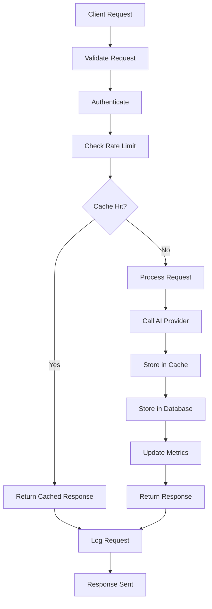
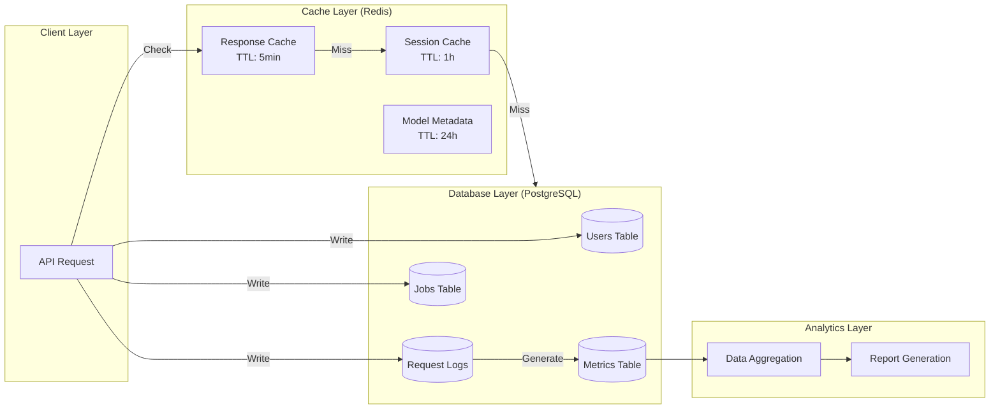
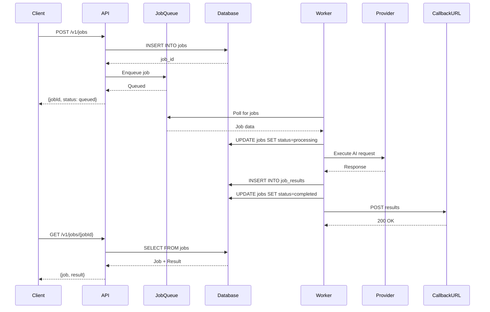

# NOA Server - Data Architecture

## Table of Contents

- [Overview](#overview)
- [Data Models](#data-models)
- [Data Flow](#data-flow)
- [Data Storage](#data-storage)
- [Data Access Patterns](#data-access-patterns)

## Overview

The NOA Server uses a polyglot persistence approach with PostgreSQL as the
primary data store, Redis for caching and job queues, and SQLite for local
development.

### Entity-Relationship Diagram

```mermaid
erDiagram
    USER ||--o{ API_KEY : has
    USER ||--o{ JOB : creates
    USER ||--o{ QUOTA : has
    API_KEY ||--o{ REQUEST_LOG : authenticates
    JOB ||--|| JOB_RESULT : produces
    JOB ||--o{ JOB_RETRY : tracks
    MODEL ||--o{ REQUEST_LOG : used_in
    PROVIDER ||--|| MODEL : provides
    REQUEST_LOG ||--|| METRICS : generates

    USER {
        uuid id PK
        string email UK
        string password_hash
        string role
        timestamp created_at
        timestamp updated_at
    }

    API_KEY {
        uuid id PK
        uuid user_id FK
        string key_hash UK
        string name
        jsonb permissions
        timestamp expires_at
        timestamp last_used_at
        boolean revoked
    }

    QUOTA {
        uuid id PK
        uuid user_id FK
        integer requests_per_hour
        integer requests_per_day
        decimal cost_limit_usd
        timestamp period_start
        integer current_usage
    }

    JOB {
        uuid id PK
        uuid user_id FK
        string type
        string status
        integer priority
        jsonb parameters
        string callback_url
        timestamp created_at
        timestamp started_at
        timestamp completed_at
    }

    JOB_RESULT {
        uuid id PK
        uuid job_id FK UK
        jsonb result
        jsonb metadata
        integer tokens_used
        decimal cost_usd
        timestamp created_at
    }

    JOB_RETRY {
        uuid id PK
        uuid job_id FK
        integer attempt_number
        string error_message
        timestamp attempted_at
    }

    PROVIDER {
        string id PK
        string name
        string api_endpoint
        boolean enabled
        jsonb configuration
        timestamp created_at
    }

    MODEL {
        string id PK
        string provider_id FK
        string name
        jsonb capabilities
        decimal cost_per_1k_tokens
        integer max_tokens
        timestamp created_at
    }

    REQUEST_LOG {
        uuid id PK
        uuid user_id FK
        uuid api_key_id FK
        string model_id FK
        string endpoint
        integer status_code
        integer latency_ms
        integer tokens_used
        decimal cost_usd
        timestamp created_at
    }

    METRICS {
        uuid id PK
        uuid request_log_id FK UK
        string metric_type
        decimal value
        jsonb labels
        timestamp timestamp
    }
```

## Data Models

### User Management

#### User

```typescript
interface User {
  id: string; // UUID
  email: string;
  passwordHash: string;
  role: 'admin' | 'user' | 'readonly';
  profile: {
    fullName?: string;
    organization?: string;
  };
  settings: {
    defaultProvider?: string;
    defaultModel?: string;
    notifications: boolean;
  };
  createdAt: Date;
  updatedAt: Date;
}
```

#### API Key

```typescript
interface ApiKey {
  id: string; // UUID
  userId: string; // FK to User
  keyHash: string; // bcrypt hash
  name: string;
  permissions: {
    endpoints: string[];
    rateLimit: {
      requestsPerHour: number;
      requestsPerDay: number;
    };
  };
  expiresAt?: Date;
  lastUsedAt?: Date;
  revoked: boolean;
  createdAt: Date;
}
```

### AI Provider Models

#### Provider

```typescript
interface Provider {
  id: string; // 'openai' | 'claude' | 'llama-cpp'
  name: string;
  apiEndpoint?: string;
  enabled: boolean;
  configuration: {
    apiKey?: string;
    timeout: number;
    retryAttempts: number;
    circuitBreaker: {
      threshold: number;
      timeout: number;
    };
  };
  createdAt: Date;
  updatedAt: Date;
}
```

#### Model

```typescript
interface Model {
  id: string; // 'gpt-4', 'claude-3-opus', etc.
  providerId: string; // FK to Provider
  name: string;
  capabilities: ModelCapability[];
  pricing: {
    inputCostPer1kTokens: number;
    outputCostPer1kTokens: number;
  };
  limits: {
    maxTokens: number;
    maxRequestsPerMinute: number;
  };
  metadata: {
    version?: string;
    deprecated?: boolean;
  };
  createdAt: Date;
}

enum ModelCapability {
  CHAT = 'chat',
  COMPLETION = 'completion',
  EMBEDDING = 'embedding',
  FUNCTION_CALLING = 'function_calling',
  VISION = 'vision',
  STREAMING = 'streaming',
}
```

### Job Management

#### Job

```typescript
interface Job {
  id: string; // UUID
  userId: string; // FK to User
  type: JobType;
  status: JobStatus;
  priority: 1 | 2 | 3; // 1=high, 2=medium, 3=low
  parameters: {
    provider: string;
    model: string;
    prompt: string;
    temperature?: number;
    maxTokens?: number;
    [key: string]: any;
  };
  callbackUrl?: string;
  createdAt: Date;
  startedAt?: Date;
  completedAt?: Date;
  expiresAt: Date;
}

enum JobType {
  AI_INFERENCE = 'ai_inference',
  DATA_PROCESSING = 'data_processing',
  EXPORT = 'export',
  NOTIFICATION = 'notification',
}

enum JobStatus {
  QUEUED = 'queued',
  PROCESSING = 'processing',
  COMPLETED = 'completed',
  FAILED = 'failed',
  CANCELLED = 'cancelled',
}
```

#### Job Result

```typescript
interface JobResult {
  id: string; // UUID
  jobId: string; // FK to Job (unique)
  result: {
    completion?: string;
    usage?: {
      promptTokens: number;
      completionTokens: number;
      totalTokens: number;
    };
    [key: string]: any;
  };
  metadata: {
    provider: string;
    model: string;
    latencyMs: number;
    retryCount: number;
  };
  cost: {
    inputTokens: number;
    outputTokens: number;
    totalCostUsd: number;
  };
  createdAt: Date;
}
```

### Request Logging & Analytics

#### Request Log

```typescript
interface RequestLog {
  id: string; // UUID
  userId: string; // FK to User
  apiKeyId?: string; // FK to ApiKey
  modelId: string; // FK to Model
  endpoint: string;
  method: string;
  statusCode: number;
  requestBody: any; // Sanitized (PII removed)
  responseBody?: any; // Sanitized
  headers: Record<string, string>; // Sanitized
  latencyMs: number;
  tokensUsed: number;
  costUsd: number;
  error?: {
    category: string;
    message: string;
  };
  metadata: {
    ipAddress: string;
    userAgent: string;
    correlationId: string;
  };
  createdAt: Date;
}
```

#### Metrics

```typescript
interface Metric {
  id: string; // UUID
  requestLogId?: string; // FK to RequestLog
  metricType: MetricType;
  value: number;
  labels: Record<string, string>;
  timestamp: Date;
}

enum MetricType {
  REQUEST_COUNT = 'request_count',
  ERROR_COUNT = 'error_count',
  LATENCY = 'latency',
  TOKEN_USAGE = 'token_usage',
  COST = 'cost',
  CACHE_HIT = 'cache_hit',
  CACHE_MISS = 'cache_miss',
}
```

## Data Flow

### Request Processing Flow



### Data Flow Layers



### Async Job Processing Flow



## Data Storage

### PostgreSQL Schema

```sql
-- Users table
CREATE TABLE users (
    id UUID PRIMARY KEY DEFAULT gen_random_uuid(),
    email VARCHAR(255) UNIQUE NOT NULL,
    password_hash VARCHAR(255) NOT NULL,
    role VARCHAR(50) NOT NULL DEFAULT 'user',
    profile JSONB DEFAULT '{}',
    settings JSONB DEFAULT '{}',
    created_at TIMESTAMP WITH TIME ZONE DEFAULT NOW(),
    updated_at TIMESTAMP WITH TIME ZONE DEFAULT NOW()
);

CREATE INDEX idx_users_email ON users(email);
CREATE INDEX idx_users_role ON users(role);

-- API Keys table
CREATE TABLE api_keys (
    id UUID PRIMARY KEY DEFAULT gen_random_uuid(),
    user_id UUID NOT NULL REFERENCES users(id) ON DELETE CASCADE,
    key_hash VARCHAR(255) UNIQUE NOT NULL,
    name VARCHAR(255) NOT NULL,
    permissions JSONB DEFAULT '{}',
    expires_at TIMESTAMP WITH TIME ZONE,
    last_used_at TIMESTAMP WITH TIME ZONE,
    revoked BOOLEAN DEFAULT FALSE,
    created_at TIMESTAMP WITH TIME ZONE DEFAULT NOW()
);

CREATE INDEX idx_api_keys_user_id ON api_keys(user_id);
CREATE INDEX idx_api_keys_key_hash ON api_keys(key_hash);
CREATE INDEX idx_api_keys_revoked ON api_keys(revoked) WHERE NOT revoked;

-- Providers table
CREATE TABLE providers (
    id VARCHAR(50) PRIMARY KEY,
    name VARCHAR(255) NOT NULL,
    api_endpoint VARCHAR(500),
    enabled BOOLEAN DEFAULT TRUE,
    configuration JSONB DEFAULT '{}',
    created_at TIMESTAMP WITH TIME ZONE DEFAULT NOW(),
    updated_at TIMESTAMP WITH TIME ZONE DEFAULT NOW()
);

-- Models table
CREATE TABLE models (
    id VARCHAR(100) PRIMARY KEY,
    provider_id VARCHAR(50) NOT NULL REFERENCES providers(id),
    name VARCHAR(255) NOT NULL,
    capabilities JSONB DEFAULT '[]',
    pricing JSONB DEFAULT '{}',
    limits JSONB DEFAULT '{}',
    metadata JSONB DEFAULT '{}',
    created_at TIMESTAMP WITH TIME ZONE DEFAULT NOW()
);

CREATE INDEX idx_models_provider_id ON models(provider_id);

-- Jobs table
CREATE TABLE jobs (
    id UUID PRIMARY KEY DEFAULT gen_random_uuid(),
    user_id UUID NOT NULL REFERENCES users(id),
    type VARCHAR(50) NOT NULL,
    status VARCHAR(50) NOT NULL DEFAULT 'queued',
    priority INTEGER NOT NULL DEFAULT 2,
    parameters JSONB NOT NULL,
    callback_url VARCHAR(500),
    created_at TIMESTAMP WITH TIME ZONE DEFAULT NOW(),
    started_at TIMESTAMP WITH TIME ZONE,
    completed_at TIMESTAMP WITH TIME ZONE,
    expires_at TIMESTAMP WITH TIME ZONE DEFAULT NOW() + INTERVAL '24 hours'
);

CREATE INDEX idx_jobs_user_id ON jobs(user_id);
CREATE INDEX idx_jobs_status ON jobs(status);
CREATE INDEX idx_jobs_created_at ON jobs(created_at);
CREATE INDEX idx_jobs_priority_created ON jobs(priority, created_at) WHERE status = 'queued';

-- Job Results table
CREATE TABLE job_results (
    id UUID PRIMARY KEY DEFAULT gen_random_uuid(),
    job_id UUID UNIQUE NOT NULL REFERENCES jobs(id) ON DELETE CASCADE,
    result JSONB NOT NULL,
    metadata JSONB DEFAULT '{}',
    cost JSONB DEFAULT '{}',
    created_at TIMESTAMP WITH TIME ZONE DEFAULT NOW()
);

CREATE INDEX idx_job_results_job_id ON job_results(job_id);

-- Request Logs table (partitioned by created_at)
CREATE TABLE request_logs (
    id UUID PRIMARY KEY DEFAULT gen_random_uuid(),
    user_id UUID REFERENCES users(id),
    api_key_id UUID REFERENCES api_keys(id),
    model_id VARCHAR(100) REFERENCES models(id),
    endpoint VARCHAR(255) NOT NULL,
    method VARCHAR(10) NOT NULL,
    status_code INTEGER NOT NULL,
    latency_ms INTEGER NOT NULL,
    tokens_used INTEGER DEFAULT 0,
    cost_usd DECIMAL(10, 6) DEFAULT 0,
    metadata JSONB DEFAULT '{}',
    created_at TIMESTAMP WITH TIME ZONE DEFAULT NOW()
) PARTITION BY RANGE (created_at);

-- Create monthly partitions
CREATE TABLE request_logs_2025_01 PARTITION OF request_logs
    FOR VALUES FROM ('2025-01-01') TO ('2025-02-01');

CREATE INDEX idx_request_logs_user_id ON request_logs(user_id);
CREATE INDEX idx_request_logs_created_at ON request_logs(created_at);
CREATE INDEX idx_request_logs_model_id ON request_logs(model_id);

-- Metrics table
CREATE TABLE metrics (
    id UUID PRIMARY KEY DEFAULT gen_random_uuid(),
    request_log_id UUID REFERENCES request_logs(id),
    metric_type VARCHAR(50) NOT NULL,
    value DECIMAL(20, 6) NOT NULL,
    labels JSONB DEFAULT '{}',
    timestamp TIMESTAMP WITH TIME ZONE DEFAULT NOW()
);

CREATE INDEX idx_metrics_type_timestamp ON metrics(metric_type, timestamp);
CREATE INDEX idx_metrics_request_log_id ON metrics(request_log_id);
```

### Redis Data Structures

```typescript
// Cache keys structure
const CACHE_KEYS = {
  // Response cache: hash
  RESPONSE: (hash: string) => `cache:response:${hash}`,
  TTL: 300, // 5 minutes

  // Model metadata: hash
  MODEL: (modelId: string) => `cache:model:${modelId}`,
  TTL: 86400, // 24 hours

  // User session: hash
  SESSION: (sessionId: string) => `session:${sessionId}`,
  TTL: 3600, // 1 hour

  // Rate limiting: sorted set
  RATE_LIMIT: (userId: string, window: string) =>
    `ratelimit:${userId}:${window}`,

  // Job queue: list
  JOB_QUEUE: (priority: number) => `queue:jobs:priority:${priority}`,

  // Active connections: set
  ACTIVE_CONNECTIONS: 'connections:active',
};

// Example usage
await redis.setex(
  CACHE_KEYS.RESPONSE(requestHash),
  CACHE_KEYS.TTL,
  JSON.stringify(response)
);
```

## Data Access Patterns

### Read Patterns

1. **User Authentication**
   - Lookup by email: `SELECT * FROM users WHERE email = ?`
   - Validate API key:
     `SELECT * FROM api_keys WHERE key_hash = ? AND NOT revoked`

2. **Model Discovery**
   - List models by provider: `SELECT * FROM models WHERE provider_id = ?`
   - Get model capabilities: `SELECT capabilities FROM models WHERE id = ?`

3. **Job Status Check**
   - Get job by ID:
     `SELECT j.*, jr.result FROM jobs j LEFT JOIN job_results jr ON j.id = jr.job_id WHERE j.id = ?`

4. **Analytics Queries**
   - Usage by user:
     `SELECT COUNT(*), SUM(tokens_used), SUM(cost_usd) FROM request_logs WHERE user_id = ? AND created_at > ?`
   - Top models:
     `SELECT model_id, COUNT(*) FROM request_logs GROUP BY model_id ORDER BY COUNT(*) DESC LIMIT 10`

### Write Patterns

1. **Request Logging (High Volume)**
   - Batch inserts every 5 seconds
   - Use prepared statements
   - Async writes to avoid blocking

2. **Metrics Collection**
   - Buffer metrics in memory
   - Flush to database every 10 seconds
   - Use bulk INSERT

3. **Job Processing**
   - Transactional updates: BEGIN; UPDATE jobs SET status='processing'; INSERT
     INTO job_results; COMMIT;

### Caching Strategy

```typescript
async function getCachedOrFetch<T>(
  cacheKey: string,
  fetchFn: () => Promise<T>,
  ttl: number
): Promise<T> {
  // L1: Check Redis cache
  const cached = await redis.get(cacheKey);
  if (cached) {
    return JSON.parse(cached);
  }

  // L2: Fetch from database
  const data = await fetchFn();

  // Store in cache (fire and forget)
  redis.setex(cacheKey, ttl, JSON.stringify(data)).catch(console.error);

  return data;
}
```

### Database Connection Pooling

```typescript
const pool = new Pool({
  host: process.env.DB_HOST,
  port: parseInt(process.env.DB_PORT || '5432'),
  database: process.env.DB_NAME,
  user: process.env.DB_USER,
  password: process.env.DB_PASSWORD,
  max: 20, // Max connections
  idleTimeoutMillis: 30000,
  connectionTimeoutMillis: 2000,
});
```

## Data Retention & Archival

### Retention Policies

- **Request Logs**: 90 days (partition by month, drop old partitions)
- **Metrics**: 30 days (aggregate to hourly summaries after 7 days)
- **Job Results**: 7 days (delete after expiry)
- **Audit Logs**: 1 year (archive to S3)

### Archival Process

```sql
-- Archive old request logs
INSERT INTO request_logs_archive
SELECT * FROM request_logs WHERE created_at < NOW() - INTERVAL '90 days';

DELETE FROM request_logs WHERE created_at < NOW() - INTERVAL '90 days';

-- Vacuum to reclaim space
VACUUM ANALYZE request_logs;
```

## Related Documentation

- [Component Architecture](./COMPONENTS.md) - System components
- [API Architecture](./API_ARCHITECTURE.md) - REST API design
- [Security Architecture](./SECURITY_ARCHITECTURE.md) - Data security
