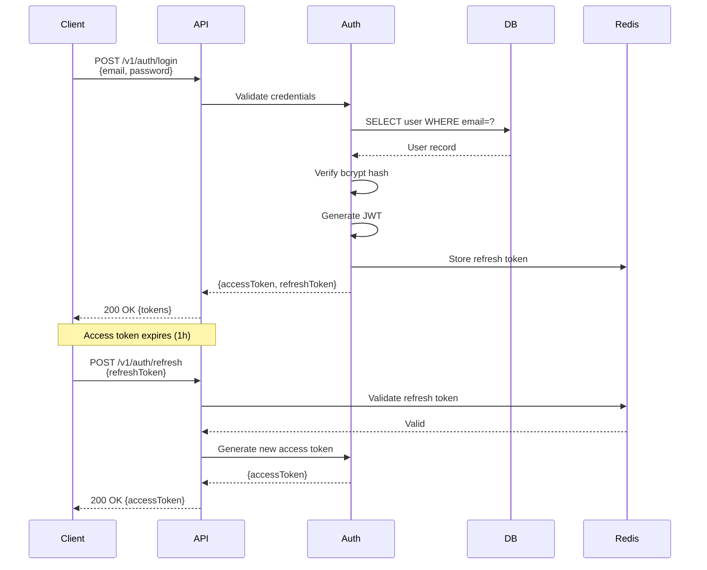

# NOA Server - Security Architecture

## Table of Contents

- [Overview](#overview)
- [Threat Model](#threat-model)
- [Authentication](#authentication)
- [Authorization](#authorization)
- [Security Layers](#security-layers)
- [Data Protection](#data-protection)
- [Audit Logging](#audit-logging)
- [Security Testing](#security-testing)

## Overview

The NOA Server implements defense-in-depth security with multiple layers of
protection, following OWASP Top 10 guidelines and industry best practices.

### Security Principles

1. **Least Privilege**: Minimal permissions by default
2. **Defense in Depth**: Multiple security layers
3. **Fail Securely**: Secure defaults, explicit allow lists
4. **Separation of Duties**: Role-based access control
5. **Complete Mediation**: Every request validated
6. **Zero Trust**: Never trust, always verify

## Threat Model

### Attack Vectors

```mermaid
graph TB
    subgraph Threats["Threat Categories"]
        A1[A1: Injection<br/>SQL, NoSQL, Command]
        A2[A2: Broken Auth<br/>Weak passwords, session hijacking]
        A3[A3: Sensitive Data<br/>Exposure, leakage]
        A4[A4: XXE<br/>XML External Entities]
        A5[A5: Broken Access Control<br/>Privilege escalation]
        A6[A6: Security Misconfiguration<br/>Default credentials]
        A7[A7: XSS<br/>Stored, reflected, DOM]
        A8[A8: Insecure Deserialization]
        A9[A9: Known Vulnerabilities<br/>Outdated dependencies]
        A10[A10: Insufficient Logging]
    end

    subgraph Mitigations["Mitigations"]
        M1[Input Validation<br/>Zod schemas]
        M2[JWT + MFA<br/>API key rotation]
        M3[Encryption<br/>At rest & in transit]
        M4[JSON Only<br/>No XML parsing]
        M5[RBAC<br/>Permission checks]
        M6[Hardened Config<br/>Security headers]
        M7[Content Sanitization<br/>Output encoding]
        M8[Type Validation<br/>TypeScript strict]
        M9[Dependency Scanning<br/>npm audit, Snyk]
        M10[Audit Logging<br/>Structured logs]
    end

    A1 --> M1
    A2 --> M2
    A3 --> M3
    A4 --> M4
    A5 --> M5
    A6 --> M6
    A7 --> M7
    A8 --> M8
    A9 --> M9
    A10 --> M10
```



### Threat Scenarios

| Threat               | Impact | Likelihood | Risk   | Mitigation                          |
| -------------------- | ------ | ---------- | ------ | ----------------------------------- |
| API Key Leakage      | High   | Medium     | High   | Key rotation, rate limiting, alerts |
| SQL Injection        | High   | Low        | Medium | Parameterized queries, ORM          |
| DDoS Attack          | Medium | Medium     | Medium | Rate limiting, CDN, auto-scaling    |
| Privilege Escalation | High   | Low        | Medium | RBAC, audit logging                 |
| Data Breach          | High   | Low        | Medium | Encryption, access controls         |
| Insider Threat       | Medium | Low        | Low    | Audit logs, separation of duties    |

## Authentication

### JWT Token Flow



### JWT Token Structure

```typescript
interface JWTPayload {
  // Standard claims
  sub: string; // Subject (user ID)
  iss: string; // Issuer (noa-server)
  aud: string; // Audience (api.noa-server.com)
  exp: number; // Expiration time (Unix timestamp)
  iat: number; // Issued at (Unix timestamp)
  jti: string; // JWT ID (unique identifier)

  // Custom claims
  email: string;
  role: 'admin' | 'user' | 'readonly';
  permissions: string[];
  tier: 'free' | 'pro' | 'enterprise';
}

// Example
const payload = {
  sub: 'usr_1234567890',
  iss: 'noa-server',
  aud: 'api.noa-server.com',
  exp: Math.floor(Date.now() / 1000) + 3600, // 1 hour
  iat: Math.floor(Date.now() / 1000),
  jti: uuidv4(),
  email: 'user@example.com',
  role: 'user',
  permissions: ['read:models', 'create:completions'],
  tier: 'pro',
};

const token = jwt.sign(payload, process.env.JWT_SECRET, {
  algorithm: 'HS256',
});
```

### API Key Generation & Validation

```typescript
import crypto from 'crypto';
import bcrypt from 'bcrypt';

// Generate API key
function generateApiKey(): { key: string; hash: string } {
  const randomBytes = crypto.randomBytes(32);
  const key = `noa_sk_${randomBytes.toString('base64url')}`;
  const hash = bcrypt.hashSync(key, 10);
  return { key, hash };
}

// Validate API key
async function validateApiKey(providedKey: string): Promise<ApiKey | null> {
  // Lookup by prefix to reduce search space
  const prefix = providedKey.substring(0, 15);
  const candidates = await db.query(
    'SELECT * FROM api_keys WHERE key_hash LIKE $1 AND NOT revoked',
    [`${prefix}%`]
  );

  for (const candidate of candidates) {
    if (await bcrypt.compare(providedKey, candidate.key_hash)) {
      // Update last used timestamp
      await db.query('UPDATE api_keys SET last_used_at = NOW() WHERE id = $1', [
        candidate.id,
      ]);
      return candidate;
    }
  }

  return null;
}
```

### Multi-Factor Authentication (MFA)

```typescript
import speakeasy from 'speakeasy';
import QRCode from 'qrcode';

// Enable MFA
async function enableMFA(
  userId: string
): Promise<{ secret: string; qrCode: string }> {
  const secret = speakeasy.generateSecret({
    name: `NOA Server (${user.email})`,
    issuer: 'NOA Server',
  });

  await db.query(
    'UPDATE users SET mfa_secret = $1, mfa_enabled = true WHERE id = $2',
    [secret.base32, userId]
  );

  const qrCode = await QRCode.toDataURL(secret.otpauth_url);
  return { secret: secret.base32, qrCode };
}

// Verify MFA token
function verifyMFAToken(secret: string, token: string): boolean {
  return speakeasy.totp.verify({
    secret,
    encoding: 'base32',
    token,
    window: 2, // Allow 2 time steps before/after
  });
}
```

## Authorization

### RBAC Model

```typescript
// Permission structure
interface Permission {
  resource: string; // 'users', 'models', 'completions', 'jobs'
  action: string; // 'create', 'read', 'update', 'delete', '*'
  scope?: string; // 'own', 'all'
}

// Role definitions
const ROLES: Record<string, Permission[]> = {
  admin: [{ resource: '*', action: '*', scope: 'all' }],
  user: [
    { resource: 'models', action: 'read', scope: 'all' },
    { resource: 'completions', action: 'create', scope: 'own' },
    { resource: 'jobs', action: '*', scope: 'own' },
    { resource: 'users', action: 'read', scope: 'own' },
    { resource: 'users', action: 'update', scope: 'own' },
  ],
  readonly: [
    { resource: 'models', action: 'read', scope: 'all' },
    { resource: 'jobs', action: 'read', scope: 'own' },
    { resource: 'users', action: 'read', scope: 'own' },
  ],
};

// Permission check
function hasPermission(
  userRole: string,
  resource: string,
  action: string,
  resourceOwnerId?: string,
  userId?: string
): boolean {
  const permissions = ROLES[userRole] || [];

  return permissions.some((p) => {
    // Check resource match
    const resourceMatch = p.resource === '*' || p.resource === resource;
    if (!resourceMatch) return false;

    // Check action match
    const actionMatch = p.action === '*' || p.action === action;
    if (!actionMatch) return false;

    // Check scope
    if (p.scope === 'all') return true;
    if (p.scope === 'own' && resourceOwnerId === userId) return true;

    return false;
  });
}
```

### Permission Middleware

```typescript
function requirePermission(resource: string, action: string): RequestHandler {
  return (req, res, next) => {
    const user = req.user; // From JWT
    const resourceOwnerId = req.params.userId || req.body.userId;

    if (!hasPermission(user.role, resource, action, resourceOwnerId, user.id)) {
      return res.status(403).json({
        error: {
          code: 'FORBIDDEN',
          message: `Insufficient permissions for ${action} on ${resource}`,
        },
      });
    }

    next();
  };
}

// Usage
app.get(
  '/v1/users/:userId',
  authenticate,
  requirePermission('users', 'read'),
  getUserById
);
```

## Security Layers

### Layer 1: Network Security

```typescript
// Helmet.js configuration
app.use(
  helmet({
    contentSecurityPolicy: {
      directives: {
        defaultSrc: ["'self'"],
        scriptSrc: ["'self'", "'unsafe-inline'"],
        styleSrc: ["'self'", "'unsafe-inline'"],
        imgSrc: ["'self'", 'data:', 'https:'],
        connectSrc: ["'self'"],
        fontSrc: ["'self'"],
        objectSrc: ["'none'"],
        mediaSrc: ["'self'"],
        frameSrc: ["'none'"],
      },
    },
    hsts: {
      maxAge: 31536000,
      includeSubDomains: true,
      preload: true,
    },
    frameguard: { action: 'deny' },
    noSniff: true,
    xssFilter: true,
    referrerPolicy: { policy: 'same-origin' },
  })
);

// CORS configuration
app.use(
  cors({
    origin: (origin, callback) => {
      const allowedOrigins = process.env.ALLOWED_ORIGINS?.split(',') || [];
      if (!origin || allowedOrigins.includes(origin)) {
        callback(null, true);
      } else {
        callback(new Error('Not allowed by CORS'));
      }
    },
    credentials: true,
    methods: ['GET', 'POST', 'PUT', 'PATCH', 'DELETE'],
    allowedHeaders: ['Content-Type', 'Authorization', 'X-API-Key'],
    exposedHeaders: ['X-RateLimit-Limit', 'X-RateLimit-Remaining'],
    maxAge: 86400,
  })
);
```

### Layer 2: Input Validation

```typescript
import { z } from 'zod';

// Request schema
const completionSchema = z.object({
  model: z.enum(['gpt-4', 'gpt-3.5-turbo', 'claude-3-opus', 'claude-3-sonnet']),
  prompt: z.string().min(1).max(10000),
  temperature: z.number().min(0).max(2).optional().default(0.7),
  maxTokens: z.number().int().min(1).max(4096).optional().default(1000),
  stream: z.boolean().optional().default(false),
});

// Validation middleware
function validateRequest<T>(schema: z.ZodSchema<T>): RequestHandler {
  return (req, res, next) => {
    try {
      req.body = schema.parse(req.body);
      next();
    } catch (error) {
      if (error instanceof z.ZodError) {
        return res.status(400).json({
          error: {
            code: 'VALIDATION_ERROR',
            message: 'Invalid request body',
            details: error.errors.map((e) => ({
              field: e.path.join('.'),
              issue: e.message,
            })),
          },
        });
      }
      next(error);
    }
  };
}

// Usage
app.post(
  '/v1/completions',
  authenticate,
  validateRequest(completionSchema),
  createCompletion
);
```

### Layer 3: SQL Injection Prevention

```typescript
// ALWAYS use parameterized queries
// ✅ GOOD
const users = await db.query('SELECT * FROM users WHERE email = $1', [email]);

// ❌ BAD - Never concatenate user input
const users = await db.query(
  `SELECT * FROM users WHERE email = '${email}'` // VULNERABLE!
);

// Use ORM with parameterization
const user = await User.findOne({
  where: { email: email }, // Parameterized by ORM
});
```

### Layer 4: XSS Prevention

```typescript
import DOMPurify from 'isomorphic-dompurify';

// Sanitize HTML input
function sanitizeHtml(html: string): string {
  return DOMPurify.sanitize(html, {
    ALLOWED_TAGS: ['b', 'i', 'em', 'strong', 'a'],
    ALLOWED_ATTR: ['href'],
  });
}

// Output encoding
function encodeHtml(text: string): string {
  return text
    .replace(/&/g, '&amp;')
    .replace(/</g, '&lt;')
    .replace(/>/g, '&gt;')
    .replace(/"/g, '&quot;')
    .replace(/'/g, '&#x27;');
}

// JSON responses are automatically safe (Express escapes)
res.json({ message: userInput }); // Safe
```

### Layer 5: CSRF Protection

```typescript
import csrf from 'csurf';

// Enable CSRF protection for state-changing operations
const csrfProtection = csrf({ cookie: true });

app.post('/v1/users/me', authenticate, csrfProtection, updateUserProfile);

// Include CSRF token in form
app.get('/form', csrfProtection, (req, res) => {
  res.render('form', { csrfToken: req.csrfToken() });
});
```

## Data Protection

### Encryption at Rest

```typescript
import crypto from 'crypto';

// Encrypt sensitive fields
function encrypt(text: string, key: Buffer): string {
  const iv = crypto.randomBytes(16);
  const cipher = crypto.createCipheriv('aes-256-gcm', key, iv);

  let encrypted = cipher.update(text, 'utf8', 'hex');
  encrypted += cipher.final('hex');

  const authTag = cipher.getAuthTag();

  return `${iv.toString('hex')}:${authTag.toString('hex')}:${encrypted}`;
}

function decrypt(encrypted: string, key: Buffer): string {
  const [ivHex, authTagHex, encryptedHex] = encrypted.split(':');
  const iv = Buffer.from(ivHex, 'hex');
  const authTag = Buffer.from(authTagHex, 'hex');

  const decipher = crypto.createDecipheriv('aes-256-gcm', key, iv);
  decipher.setAuthTag(authTag);

  let decrypted = decipher.update(encryptedHex, 'hex', 'utf8');
  decrypted += decipher.final('utf8');

  return decrypted;
}

// Usage
const encryptionKey = Buffer.from(process.env.ENCRYPTION_KEY, 'hex');
const encryptedApiKey = encrypt(apiKey, encryptionKey);
```

### Encryption in Transit (TLS)

```typescript
import https from 'https';
import fs from 'fs';

const options = {
  key: fs.readFileSync('private-key.pem'),
  cert: fs.readFileSync('certificate.pem'),
  ciphers: [
    'ECDHE-ECDSA-AES256-GCM-SHA384',
    'ECDHE-RSA-AES256-GCM-SHA384',
    'ECDHE-ECDSA-CHACHA20-POLY1305',
    'ECDHE-RSA-CHACHA20-POLY1305',
  ].join(':'),
  honorCipherOrder: true,
  minVersion: 'TLSv1.2',
};

https.createServer(options, app).listen(443);
```

### Password Hashing

```typescript
import bcrypt from 'bcrypt';

const SALT_ROUNDS = 12;

// Hash password
async function hashPassword(password: string): Promise<string> {
  return bcrypt.hash(password, SALT_ROUNDS);
}

// Verify password
async function verifyPassword(
  password: string,
  hash: string
): Promise<boolean> {
  return bcrypt.compare(password, hash);
}

// Password strength validation
function validatePasswordStrength(password: string): boolean {
  const minLength = 12;
  const hasUpperCase = /[A-Z]/.test(password);
  const hasLowerCase = /[a-z]/.test(password);
  const hasNumbers = /\d/.test(password);
  const hasSpecialChars = /[!@#$%^&*(),.?":{}|<>]/.test(password);

  return (
    password.length >= minLength &&
    hasUpperCase &&
    hasLowerCase &&
    hasNumbers &&
    hasSpecialChars
  );
}
```

## Audit Logging

### Structured Audit Logs

```typescript
interface AuditLog {
  timestamp: Date;
  eventType: string;
  userId: string;
  action: string;
  resource: string;
  resourceId?: string;
  outcome: 'success' | 'failure';
  metadata: {
    ipAddress: string;
    userAgent: string;
    correlationId: string;
  };
  sensitiveFields?: string[];
}

// Log security events
function auditLog(event: AuditLog): void {
  logger.info('Security audit event', {
    ...event,
    // Mask PII
    userId: maskPII(event.userId),
    metadata: {
      ...event.metadata,
      ipAddress: maskIP(event.metadata.ipAddress),
    },
  });

  // Store in separate audit database
  auditDb.insert('audit_logs', event);
}

// Usage
auditLog({
  timestamp: new Date(),
  eventType: 'AUTHENTICATION',
  userId: user.id,
  action: 'login',
  resource: 'auth',
  outcome: 'success',
  metadata: {
    ipAddress: req.ip,
    userAgent: req.headers['user-agent'],
    correlationId: req.correlationId,
  },
});
```

### PII Masking

```typescript
function maskPII(value: string): string {
  if (value.length <= 4) return '***';
  return `${value.substring(0, 2)}***${value.substring(value.length - 2)}`;
}

function maskEmail(email: string): string {
  const [local, domain] = email.split('@');
  return `${maskPII(local)}@${domain}`;
}

function maskIP(ip: string): string {
  const parts = ip.split('.');
  return `${parts[0]}.${parts[1]}.***.**`;
}
```

## Security Testing

### Dependency Scanning

```bash
# npm audit
npm audit --audit-level=moderate

# Snyk scanning
npx snyk test
npx snyk monitor

# GitHub Dependabot
# Configured in .github/dependabot.yml
```

### SAST (Static Application Security Testing)

```bash
# ESLint with security plugin
npm install --save-dev eslint-plugin-security
eslint --ext .js,.ts src/

# SonarQube
sonar-scanner
```

### DAST (Dynamic Application Security Testing)

```bash
# OWASP ZAP
zap-cli quick-scan --self-contained --start-options '-config api.key=12345' \
  https://api.noa-server.com

# Burp Suite (manual)
```

### Penetration Testing Checklist

- [ ] SQL Injection testing
- [ ] XSS testing (stored, reflected, DOM)
- [ ] CSRF testing
- [ ] Authentication bypass attempts
- [ ] Authorization escalation tests
- [ ] Rate limiting validation
- [ ] API key leakage tests
- [ ] Sensitive data exposure
- [ ] Session hijacking attempts
- [ ] Insecure deserialization

## Security Incident Response

### Incident Response Plan

1. **Detection**: Automated alerts, monitoring
2. **Containment**: Isolate affected systems
3. **Eradication**: Remove threat, patch vulnerabilities
4. **Recovery**: Restore services, verify integrity
5. **Lessons Learned**: Post-mortem, improve defenses

### Security Contact

```
security@noa-server.com
PGP Key: [PUBLIC_KEY_ID]
```

## Related Documentation

- [API Architecture](./API_ARCHITECTURE.md) - Authentication flows
- [Data Architecture](./DATA_ARCHITECTURE.md) - Data protection
- [Observability](./OBSERVABILITY.md) - Security monitoring
