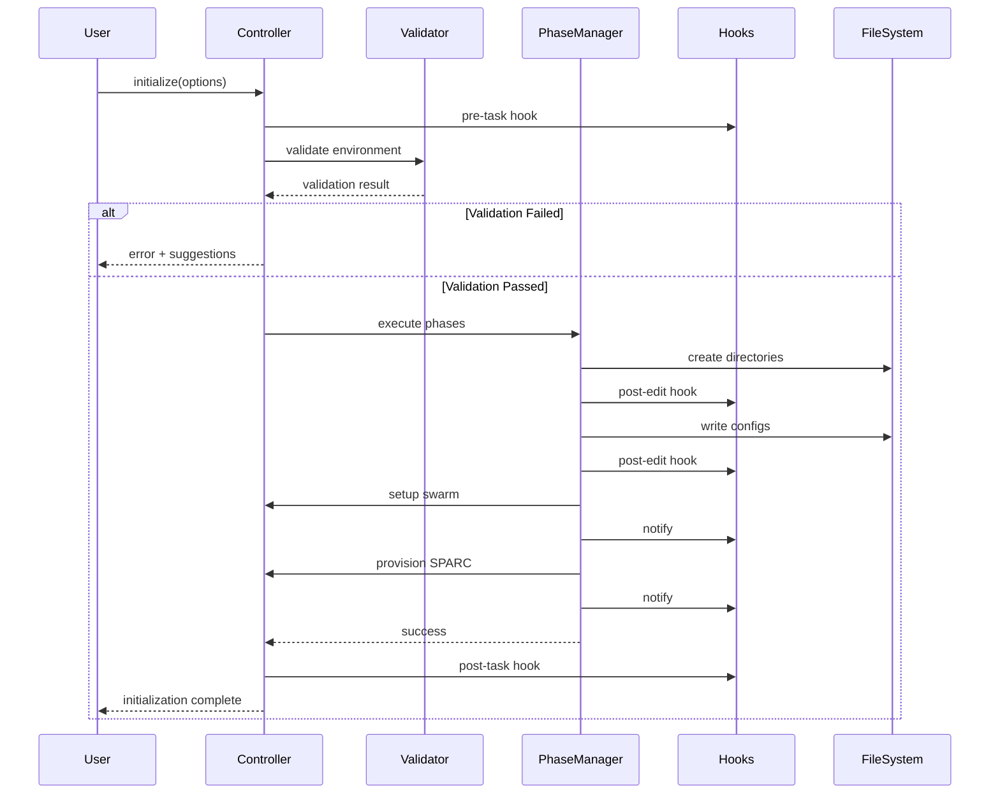

# Initialization System Architecture

## Executive Summary

This document defines the architecture for the initialization system within the
noa-server project, designed to support SPARC methodology, swarm coordination,
and multi-agent development workflows.

## 1. System Overview

### 1.1 Purpose

The initialization system provides a robust, extensible framework for
bootstrapping new projects and environments with:

- Directory structure creation
- Configuration management
- Swarm coordination setup
- SPARC environment provisioning
- Agent coordination protocols

### 1.2 Design Principles

1. **Idempotency**: Initialization operations can be safely repeated
2. **Composability**: Modular components that can be used independently
3. **Extensibility**: Plugin-based architecture for custom initializers
4. **Safety**: Rollback mechanisms and validation at each phase
5. **Performance**: Parallel execution where possible

## 2. Architecture Patterns

### 2.1 Primary Patterns

#### Strategy Pattern

Used for different initialization strategies:

- **SparcInitStrategy**: SPARC methodology setup
- **SwarmInitStrategy**: Multi-agent coordination
- **StandardInitStrategy**: Basic project scaffolding
- **CustomInitStrategy**: User-defined initialization flows

#### Builder Pattern

For constructing complex initialization configurations:

```typescript
InitializationBuilder.withDirectoryStructure()
  .withConfiguration(config)
  .withSwarmTopology('mesh')
  .withSparcEnvironment()
  .build();
```

#### Factory Pattern

For creating appropriate initializers based on project type:

```typescript
InitializerFactory.create(projectType: ProjectType): Initializer
```

#### Chain of Responsibility

For sequential initialization phases:

```
Phase1 (Validation) -> Phase2 (Structure) -> Phase3 (Config) ->
Phase4 (Swarm) -> Phase5 (SPARC)
```

#### Observer Pattern

For monitoring initialization progress and hooks:

- Pre-task hooks
- Post-task hooks
- Session management hooks

### 2.2 Supporting Patterns

#### Singleton Pattern

- ConfigurationManager: Single source of truth for config
- StateTracker: Centralized state management

#### Decorator Pattern

- InitializerDecorator: Add logging, validation, rollback to any initializer

#### Template Method Pattern

- BaseInitializer: Defines skeleton with customizable steps

## 3. Component Architecture

### 3.1 Core Components

```
┌─────────────────────────────────────────────────────────────┐
│                    Initialization Orchestrator               │
│  ┌──────────────────────────────────────────────────────┐  │
│  │              InitializationController                 │  │
│  │  - validatePrerequisites()                           │  │
│  │  - executePhases()                                   │  │
│  │  - handleRollback()                                  │  │
│  └──────────────────────────────────────────────────────┘  │
└─────────────────────────────────────────────────────────────┘
                            │
        ┌───────────────────┼───────────────────┐
        │                   │                   │
        ▼                   ▼                   ▼
┌──────────────┐    ┌──────────────┐    ┌──────────────┐
│   Phase      │    │   Strategy   │    │   Factory    │
│   Manager    │    │   Manager    │    │   Manager    │
│              │    │              │    │              │
│ - execute()  │    │ - select()   │    │ - create()   │
│ - validate() │    │ - apply()    │    │ - register() │
└──────────────┘    └──────────────┘    └──────────────┘
        │                   │                   │
        └───────────────────┴───────────────────┘
                            │
        ┌───────────────────┼───────────────────┐
        │                   │                   │
        ▼                   ▼                   ▼
┌──────────────┐    ┌──────────────┐    ┌──────────────┐
│  Directory   │    │    Config    │    │    Swarm     │
│  Structure   │    │   Manager    │    │  Coordinator │
└──────────────┘    └──────────────┘    └──────────────┘
```

### 3.2 Module Breakdown

#### 3.2.1 Initialization Controller

**Responsibility**: Orchestrate the entire initialization process

**Key Methods**:

- `initialize(options: InitOptions): Promise<InitResult>`
- `validateEnvironment(): ValidationResult`
- `executePhase(phase: Phase): PhaseResult`
- `rollback(checkpoint: Checkpoint): void`

**Dependencies**:

- PhaseManager
- StrategyManager
- StateTracker
- HooksManager

#### 3.2.2 Phase Manager

**Responsibility**: Execute initialization phases in sequence

**Phases**:

1. **Validation Phase**: Check prerequisites, permissions, conflicts
2. **Structure Phase**: Create directory hierarchy
3. **Configuration Phase**: Generate config files
4. **Swarm Phase**: Setup coordination topology
5. **SPARC Phase**: Provision SPARC environment

**Key Methods**:

- `registerPhase(phase: Phase): void`
- `executePhase(phaseId: string): Promise<PhaseResult>`
- `getPhaseStatus(phaseId: string): PhaseStatus`

#### 3.2.3 Strategy Manager

**Responsibility**: Select and apply appropriate initialization strategy

**Strategies**:

- **Standard**: Basic project setup
- **SPARC**: Full SPARC methodology environment
- **Swarm**: Multi-agent coordination focus
- **Minimal**: Bare-bones setup
- **Custom**: User-defined configuration

**Key Methods**:

- `selectStrategy(context: InitContext): Strategy`
- `applyStrategy(strategy: Strategy): Promise<void>`
- `registerCustomStrategy(name: string, strategy: Strategy): void`

#### 3.2.4 Directory Structure Manager

**Responsibility**: Create and manage project directory hierarchy

**Structure**:

```
project-root/
├── .claude/
│   ├── commands/
│   │   ├── swarm/
│   │   └── sparc/
│   └── config/
├── src/
│   ├── lib/
│   ├── utils/
│   └── index.ts
├── tests/
│   ├── unit/
│   ├── integration/
│   └── e2e/
├── docs/
│   ├── architecture/
│   ├── api/
│   └── guides/
├── config/
│   ├── development.json
│   ├── production.json
│   └── test.json
├── scripts/
│   ├── setup/
│   ├── automation/
│   └── deployment/
└── examples/
```

**Key Methods**:

- `createStructure(template: DirectoryTemplate): void`
- `validateStructure(): ValidationResult`
- `ensureDirectoryExists(path: string): void`

#### 3.2.5 Configuration Manager

**Responsibility**: Generate and manage configuration files

**Configuration Types**:

- **CLAUDE.md**: Project instructions
- **.mcp.json**: MCP server configuration
- **package.json**: NPM dependencies
- **tsconfig.json**: TypeScript configuration
- **jest.config.js**: Test configuration
- **.gitignore**: Version control exclusions

**Key Methods**:

- `generateConfig(type: ConfigType, options: ConfigOptions): Config`
- `validateConfig(config: Config): ValidationResult`
- `mergeConfigs(existing: Config, new: Config): Config`

#### 3.2.6 Swarm Coordinator

**Responsibility**: Setup multi-agent coordination infrastructure

**Coordination Topologies**:

- **Mesh**: Full peer-to-peer connectivity
- **Hierarchical**: Tree-based coordination
- **Ring**: Circular message passing
- **Star**: Central coordinator pattern

**Key Methods**:

- `initializeTopology(type: TopologyType): void`
- `registerAgent(agent: AgentConfig): void`
- `setupMemory(namespace: string): void`
- `configureHooks(): void`

#### 3.2.7 SPARC Environment Provisioner

**Responsibility**: Setup SPARC methodology environment

**Components**:

- **Mode Registry**: Register SPARC modes
- **Batch Tools**: Setup parallel execution
- **TDD Environment**: Configure test-driven workflow
- **Documentation**: Generate SPARC guides

**Key Methods**:

- `provisionModes(): void`
- `setupBatchTools(): void`
- `configureTDD(): void`
- `generateDocumentation(): void`

## 4. Initialization Sequence

### 4.1 Standard Initialization Flow



### 4.2 Phase Dependencies

```
┌─────────────────┐
│   Phase 1:      │
│   Validation    │  No dependencies
└────────┬────────┘
         │
         ▼
┌─────────────────┐
│   Phase 2:      │
│   Structure     │  Depends on: Phase 1
└────────┬────────┘
         │
         ▼
┌─────────────────┐
│   Phase 3:      │
│  Configuration  │  Depends on: Phase 2
└────────┬────────┘
         │
         ├─────────────────┐
         │                 │
         ▼                 ▼
┌─────────────────┐  ┌─────────────────┐
│   Phase 4:      │  │   Phase 5:      │
│     Swarm       │  │     SPARC       │
└─────────────────┘  └─────────────────┘
    Depends on:          Depends on:
    Phase 2, 3           Phase 2, 3

    (Phases 4 and 5 can run in parallel)
```

## 5. Data Models

### 5.1 Core Data Structures

```typescript
// Initialization Options
interface InitOptions {
  projectName: string;
  projectType: ProjectType;
  strategy: InitStrategy;
  sparc: boolean;
  swarm: boolean;
  topology?: TopologyType;
  force: boolean;
  dryRun: boolean;
  template?: string;
  customConfig?: Record<string, any>;
}

// Initialization Result
interface InitResult {
  success: boolean;
  phasesCompleted: PhaseResult[];
  filesCreated: string[];
  configurationsGenerated: Config[];
  errors: InitError[];
  warnings: string[];
  duration: number;
  checkpoint?: Checkpoint;
}

// Phase Definition
interface Phase {
  id: string;
  name: string;
  description: string;
  dependencies: string[];
  execute: (context: InitContext) => Promise<PhaseResult>;
  validate: (context: InitContext) => ValidationResult;
  rollback: (checkpoint: Checkpoint) => Promise<void>;
}

// Initialization Context
interface InitContext {
  options: InitOptions;
  workingDirectory: string;
  environment: Environment;
  state: InitState;
  metadata: Record<string, any>;
}

// State Tracking
interface InitState {
  currentPhase: string;
  completedPhases: string[];
  failedPhases: string[];
  checkpoints: Checkpoint[];
  startTime: number;
  endTime?: number;
}
```

### 5.2 Configuration Schema

```typescript
// Project Configuration
interface ProjectConfig {
  name: string;
  version: string;
  type: ProjectType;
  structure: DirectoryTemplate;
  dependencies: Dependencies;
  scripts: Record<string, string>;
  agents: AgentConfig[];
  swarm: SwarmConfig;
  sparc: SparcConfig;
}

// Swarm Configuration
interface SwarmConfig {
  enabled: boolean;
  topology: TopologyType;
  maxAgents: number;
  agents: AgentDefinition[];
  memory: MemoryConfig;
  hooks: HookConfig;
}

// SPARC Configuration
interface SparcConfig {
  enabled: boolean;
  modes: SparcMode[];
  batchTools: boolean;
  tdd: boolean;
  documentation: boolean;
}
```

## 6. Integration Points

### 6.1 Claude Flow Integration

**Hooks Integration**:

```typescript
class ClaudeFlowIntegration {
  async preTaskHook(description: string): Promise<void> {
    await exec(
      `npx claude-flow@alpha hooks pre-task --description "${description}"`
    );
  }

  async postEditHook(file: string, memoryKey: string): Promise<void> {
    await exec(
      `npx claude-flow@alpha hooks post-edit --file "${file}" --memory-key "${memoryKey}"`
    );
  }

  async notifyHook(message: string): Promise<void> {
    await exec(`npx claude-flow@alpha hooks notify --message "${message}"`);
  }

  async postTaskHook(taskId: string): Promise<void> {
    await exec(`npx claude-flow@alpha hooks post-task --task-id "${taskId}"`);
  }
}
```

**Memory Integration**:

```typescript
class MemoryIntegration {
  async store(key: string, value: any): Promise<void> {
    await exec(
      `npx claude-flow@alpha memory store "${key}" "${JSON.stringify(value)}"`
    );
  }

  async retrieve(key: string): Promise<any> {
    const result = await exec(
      `npx claude-flow@alpha memory retrieve --key "${key}"`
    );
    return JSON.parse(result);
  }
}
```

### 6.2 MCP Server Integration

**Swarm Initialization**:

```typescript
class MCPIntegration {
  async initializeSwarm(
    topology: TopologyType,
    maxAgents: number
  ): Promise<void> {
    await mcp('swarm_init', { topology, maxAgents });
  }

  async spawnAgent(type: AgentType): Promise<string> {
    const result = await mcp('agent_spawn', { type });
    return result.agentId;
  }
}
```

### 6.3 File System Integration

**Safe File Operations**:

```typescript
class FileSystemIntegration {
  async createDirectory(
    path: string,
    options: CreateDirOptions
  ): Promise<void> {
    await fs.mkdir(path, { recursive: true, mode: options.mode });
  }

  async writeFile(
    path: string,
    content: string,
    backup: boolean
  ): Promise<void> {
    if (backup && (await this.fileExists(path))) {
      await this.backupFile(path);
    }
    await fs.writeFile(path, content, 'utf-8');
  }

  async backupFile(path: string): Promise<string> {
    const backupPath = `${path}.backup.${Date.now()}`;
    await fs.copyFile(path, backupPath);
    return backupPath;
  }
}
```

## 7. Error Handling and Rollback

### 7.1 Error Handling Strategy

**Error Types**:

1. **ValidationError**: Pre-condition failures
2. **FileSystemError**: Directory/file operation failures
3. **ConfigurationError**: Invalid configuration
4. **DependencyError**: Missing dependencies
5. **NetworkError**: Remote resource failures

**Error Recovery**:

```typescript
class ErrorHandler {
  async handleError(
    error: InitError,
    context: InitContext
  ): Promise<ErrorResolution> {
    switch (error.type) {
      case 'ValidationError':
        return this.suggestFixes(error);
      case 'FileSystemError':
        return this.attemptRollback(context);
      case 'ConfigurationError':
        return this.provideDefaults(error);
      default:
        return this.escalateError(error);
    }
  }
}
```

### 7.2 Rollback Mechanism

**Checkpoint System**:

```typescript
class CheckpointManager {
  async createCheckpoint(phase: string, state: InitState): Promise<Checkpoint> {
    const checkpoint: Checkpoint = {
      id: generateId(),
      timestamp: Date.now(),
      phase,
      state: cloneDeep(state),
      filesCreated: [],
      filesModified: [],
      backups: [],
    };

    await this.saveCheckpoint(checkpoint);
    return checkpoint;
  }

  async rollback(checkpoint: Checkpoint): Promise<void> {
    // Restore files from backups
    for (const backup of checkpoint.backups) {
      await fs.copyFile(backup.path, backup.original);
    }

    // Remove created files
    for (const file of checkpoint.filesCreated) {
      await fs.unlink(file);
    }

    // Restore state
    await this.restoreState(checkpoint.state);
  }
}
```

## 8. Performance Considerations

### 8.1 Parallel Execution

**Parallelizable Operations**:

- Phase 4 (Swarm) and Phase 5 (SPARC) can run in parallel
- Directory creation can be parallelized per branch
- Configuration file generation can be parallelized
- Hook notifications can be batched

**Optimization Strategy**:

```typescript
class PerformanceOptimizer {
  async executeParallel<T>(tasks: Task<T>[]): Promise<T[]> {
    const results = await Promise.allSettled(
      tasks.map((task) => task.execute())
    );

    return results.map((result, index) => {
      if (result.status === 'fulfilled') {
        return result.value;
      } else {
        throw new TaskError(tasks[index], result.reason);
      }
    });
  }
}
```

### 8.2 Caching Strategy

**Cache Targets**:

- Template files
- Configuration defaults
- Dependency resolution
- Validation results

**Cache Implementation**:

```typescript
class CacheManager {
  private cache: Map<string, CacheEntry> = new Map();

  async get<T>(key: string, factory: () => Promise<T>): Promise<T> {
    if (this.cache.has(key)) {
      const entry = this.cache.get(key)!;
      if (!this.isExpired(entry)) {
        return entry.value as T;
      }
    }

    const value = await factory();
    this.cache.set(key, { value, timestamp: Date.now() });
    return value;
  }
}
```

## 9. Security Considerations

### 9.1 Input Validation

**Validation Rules**:

- Project name: alphanumeric with hyphens/underscores
- Paths: must be within project boundary
- Templates: must be from trusted sources
- Configurations: must conform to schema

```typescript
class SecurityValidator {
  validateProjectName(name: string): ValidationResult {
    if (!/^[a-zA-Z0-9_-]+$/.test(name)) {
      return {
        valid: false,
        error: 'Project name must be alphanumeric with hyphens/underscores',
      };
    }
    return { valid: true };
  }

  validatePath(path: string, root: string): ValidationResult {
    const resolved = resolvePath(path);
    if (!resolved.startsWith(root)) {
      return {
        valid: false,
        error: 'Path must be within project directory',
      };
    }
    return { valid: true };
  }
}
```

### 9.2 Permission Handling

**Permission Checks**:

- Write permissions for target directory
- Execute permissions for scripts
- Read permissions for templates

```typescript
class PermissionChecker {
  async checkPermissions(context: InitContext): Promise<PermissionResult> {
    const results: PermissionCheck[] = [];

    // Check write permission
    results.push(await this.checkWritePermission(context.workingDirectory));

    // Check execute permission for scripts
    for (const script of context.options.scripts || []) {
      results.push(await this.checkExecutePermission(script));
    }

    return {
      allGranted: results.every((r) => r.granted),
      checks: results,
    };
  }
}
```

## 10. Testing Strategy

### 10.1 Test Levels

**Unit Tests**:

- Individual phase execution
- Configuration generation
- Validation logic
- Error handling

**Integration Tests**:

- Full initialization workflow
- Hook integration
- MCP integration
- File system operations

**End-to-End Tests**:

- Complete project initialization
- Multi-strategy scenarios
- Rollback scenarios
- Performance benchmarks

### 10.2 Test Structure

```typescript
describe('InitializationController', () => {
  describe('initialize', () => {
    it('should complete standard initialization', async () => {
      const controller = new InitializationController();
      const result = await controller.initialize({
        projectName: 'test-project',
        projectType: 'standard',
        strategy: 'standard',
        sparc: false,
        swarm: false,
        force: false,
        dryRun: false,
      });

      expect(result.success).toBe(true);
      expect(result.phasesCompleted).toHaveLength(3);
    });

    it('should rollback on failure', async () => {
      const controller = new InitializationController();
      // ... test rollback scenario
    });
  });
});
```

## 11. Extensibility

### 11.1 Plugin System

**Plugin Interface**:

```typescript
interface InitializerPlugin {
  name: string;
  version: string;

  init(context: InitContext): Promise<void>;
  validate?(context: InitContext): ValidationResult;
  hooks?: {
    beforeInit?: (context: InitContext) => Promise<void>;
    afterInit?: (result: InitResult) => Promise<void>;
  };
}

class PluginManager {
  private plugins: Map<string, InitializerPlugin> = new Map();

  register(plugin: InitializerPlugin): void {
    this.plugins.set(plugin.name, plugin);
  }

  async executePlugins(context: InitContext): Promise<void> {
    for (const plugin of this.plugins.values()) {
      await plugin.init(context);
    }
  }
}
```

### 11.2 Custom Templates

**Template System**:

```typescript
interface ProjectTemplate {
  name: string;
  description: string;
  structure: DirectoryTemplate;
  files: FileTemplate[];
  dependencies: Dependencies;
  postInit?: (context: InitContext) => Promise<void>;
}

class TemplateRegistry {
  private templates: Map<string, ProjectTemplate> = new Map();

  register(template: ProjectTemplate): void {
    this.templates.set(template.name, template);
  }

  get(name: string): ProjectTemplate | undefined {
    return this.templates.get(name);
  }

  list(): ProjectTemplate[] {
    return Array.from(this.templates.values());
  }
}
```

## 12. Monitoring and Observability

### 12.1 Metrics Collection

**Key Metrics**:

- Initialization duration
- Phase execution times
- Error rates
- Rollback frequency
- Resource usage

```typescript
class MetricsCollector {
  async recordMetric(metric: Metric): Promise<void> {
    await this.store.save({
      name: metric.name,
      value: metric.value,
      timestamp: Date.now(),
      labels: metric.labels,
    });
  }

  async getMetrics(query: MetricQuery): Promise<Metric[]> {
    return this.store.query(query);
  }
}
```

### 12.2 Logging Strategy

**Log Levels**:

- DEBUG: Detailed execution flow
- INFO: Phase transitions, major operations
- WARN: Non-critical issues, fallbacks used
- ERROR: Failures, exceptions

```typescript
class InitLogger {
  debug(message: string, context?: any): void {
    this.log('DEBUG', message, context);
  }

  info(message: string, context?: any): void {
    this.log('INFO', message, context);
  }

  warn(message: string, context?: any): void {
    this.log('WARN', message, context);
  }

  error(message: string, error?: Error): void {
    this.log('ERROR', message, { error: error?.stack });
  }
}
```

## 13. Architecture Decision Records (ADRs)

### ADR-001: Use Strategy Pattern for Initialization Types

**Status**: Accepted

**Context**: Different projects require different initialization approaches
(standard, SPARC, swarm, custom).

**Decision**: Implement Strategy pattern to encapsulate initialization logic for
each type.

**Consequences**:

- Positive: Easy to add new initialization types
- Positive: Clear separation of concerns
- Negative: Slight overhead for simple cases

### ADR-002: Implement Checkpoint-Based Rollback

**Status**: Accepted

**Context**: Initialization failures should not leave projects in inconsistent
states.

**Decision**: Use checkpoint system with file backups for rollback capability.

**Consequences**:

- Positive: Safe recovery from failures
- Positive: Testable rollback scenarios
- Negative: Additional disk space for backups

### ADR-003: Parallel Execution of Independent Phases

**Status**: Accepted

**Context**: Some initialization phases are independent and can run
concurrently.

**Decision**: Implement dependency graph and execute independent phases in
parallel.

**Consequences**:

- Positive: Faster initialization times
- Positive: Better resource utilization
- Negative: More complex orchestration logic

## 14. Future Enhancements

### 14.1 Planned Features

1. **Interactive Mode**: CLI prompts for configuration
2. **Template Marketplace**: Share and download community templates
3. **Incremental Updates**: Update existing projects to new patterns
4. **Health Checks**: Validate initialized projects
5. **Migration Tools**: Migrate from other project structures

### 14.2 Technology Roadmap

- Phase 1 (Current): Core initialization system
- Phase 2 (Q1 2025): Plugin system and custom templates
- Phase 3 (Q2 2025): Interactive mode and health checks
- Phase 4 (Q3 2025): Template marketplace and migration tools

## 15. Conclusion

This architecture provides a robust, extensible foundation for project
initialization within the noa-server ecosystem. The use of proven design
patterns, comprehensive error handling, and integration with existing tools
(Claude Flow, MCP servers) ensures reliability and maintainability.

### Key Architectural Strengths

1. **Modularity**: Clear separation of concerns with well-defined interfaces
2. **Extensibility**: Plugin system and custom templates support
3. **Safety**: Rollback mechanisms and validation at every step
4. **Performance**: Parallel execution of independent phases
5. **Integration**: Seamless integration with Claude Flow and MCP ecosystem

### Implementation Priority

1. Core initialization controller and phase manager
2. Directory structure and configuration managers
3. Swarm and SPARC provisioners
4. Rollback and error handling mechanisms
5. Hook integration and monitoring

---

**Document Version**: 1.0 **Last Updated**: 2025-10-22 **Author**:
SystemDesigner (Architecture Agent) **Status**: Design Complete - Ready for
Implementation
