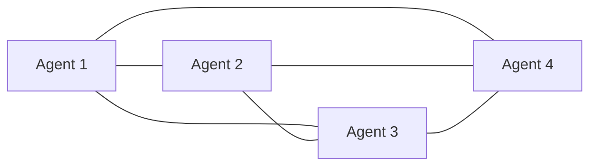
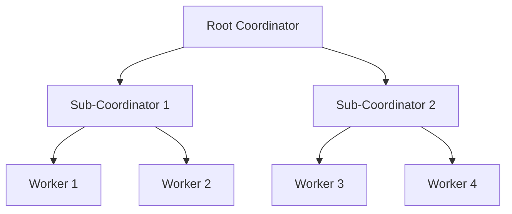
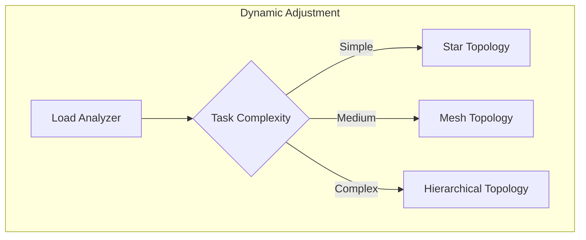

# Noa Server Features

Comprehensive guide to all features available in Noa Server.

## 📋 Table of Contents

- [Agent Swarms](#agent-swarms)
- [Task Orchestration](#task-orchestration)
- [MCP Integration](#mcp-integration)
- [Neural Processing](#neural-processing)
- [Memory and State Management](#memory-and-state-management)
- [Workflow Automation](#workflow-automation)
- [GitHub Integration](#github-integration)
- [Observability and Monitoring](#observability-and-monitoring)
- [Security Features](#security-features)
- [Performance Optimization](#performance-optimization)

## Agent Swarms

### 54+ Specialized Agents

Noa Server includes a comprehensive library of specialized AI agents:

#### Development Agents

- **coder**: General-purpose code generation
- **backend-dev**: Backend/API development specialist
- **frontend-dev**: Frontend/UI development specialist
- **mobile-dev**: Mobile app development
- **ml-developer**: Machine learning implementation
- **reviewer**: Code review and quality assurance
- **tester**: Test creation and execution
- **debugger**: Bug identification and fixing

#### Architecture Agents

- **system-architect**: System design and architecture
- **repo-architect**: Repository structure design
- **code-analyzer**: Code analysis and metrics
- **api-docs**: API documentation generation

#### Operations Agents

- **cicd-engineer**: CI/CD pipeline setup
- **workflow-automation**: Workflow optimization
- **perf-analyzer**: Performance analysis
- **performance-benchmarker**: Benchmarking

#### Coordination Agents

- **hierarchical-coordinator**: Tree-structured coordination
- **mesh-coordinator**: Peer-to-peer coordination
- **adaptive-coordinator**: Self-optimizing coordination
- **collective-intelligence-coordinator**: Swarm intelligence
- **swarm-memory-manager**: Shared memory management

#### Consensus Agents

- **byzantine-coordinator**: Byzantine fault tolerance
- **raft-manager**: Raft consensus protocol
- **gossip-coordinator**: Gossip protocol coordination
- **consensus-builder**: General consensus building
- **crdt-synchronizer**: CRDT-based synchronization
- **quorum-manager**: Quorum-based decisions

#### GitHub Agents

- **pr-manager**: Pull request management
- **code-review-swarm**: Coordinated code reviews
- **issue-tracker**: Issue management
- **release-manager**: Release coordination
- **project-board-sync**: Project board automation
- **multi-repo-swarm**: Multi-repository operations

#### SPARC Agents

- **sparc-coord**: SPARC methodology coordinator
- **sparc-coder**: SPARC-guided development
- **specification**: Requirements specification
- **pseudocode**: Algorithm design
- **architecture**: Architecture design
- **refinement**: Iterative refinement

### Swarm Topologies

#### Mesh Topology



**Characteristics**:

- Direct peer-to-peer communication
- High fault tolerance
- Best for collaborative tasks
- Overhead: O(n²) connections

**Use Cases**:

- Code review sessions
- Collaborative design
- Brainstorming
- Small teams (3-7 agents)

**Configuration**:

```bash
npx claude-flow@alpha swarm init \
  --topology mesh \
  --max-agents 5 \
  --redundancy high
```

#### Hierarchical Topology



**Characteristics**:

- Tree-structured organization
- Efficient for large teams
- Clear chain of command
- Overhead: O(log n) coordination

**Use Cases**:

- Large projects (10+ agents)
- Enterprise workflows
- Structured development
- Multi-team coordination

**Configuration**:

```bash
npx claude-flow@alpha swarm init \
  --topology hierarchical \
  --max-agents 20 \
  --levels 3 \
  --coordinator-ratio 0.2
```

#### Adaptive Topology



**Characteristics**:

- Self-optimizing structure
- Adjusts based on workload
- Intelligent resource allocation
- Overhead: Smart optimization

**Use Cases**:

- Variable workloads
- Mixed task complexity
- Auto-scaling systems
- Production environments

**Configuration**:

```bash
npx claude-flow@alpha swarm init \
  --topology adaptive \
  --max-agents 15 \
  --auto-scale true \
  --min-agents 3 \
  --optimization-interval 300
```

### Swarm Features

#### Auto-Spawning

Automatically spawn agents based on task requirements:

```json
{
  "task": "Build REST API",
  "autoSpawn": true,
  "requirements": {
    "backend-dev": 1,
    "security-manager": 1,
    "tester": 1
  }
}
```

#### Self-Healing

Automatically recover from agent failures:

```bash
# Enable self-healing
npx claude-flow@alpha swarm configure \
  --self-healing true \
  --recovery-strategy replace \
  --health-check-interval 30
```

#### Load Balancing

Distribute tasks efficiently:

```bash
# Configure load balancing
npx claude-flow@alpha swarm configure \
  --load-balancing round-robin \
  --task-queue-size 100 \
  --max-concurrent-tasks 10
```

## Task Orchestration

### SPARC Methodology

Systematic development using Specification, Pseudocode, Architecture,
Refinement, Completion:

```bash
# Full SPARC workflow
npx claude-flow@alpha sparc tdd "Build user authentication"

# Individual phases
npx claude-flow@alpha sparc run spec-pseudocode "Design API"
npx claude-flow@alpha sparc run architect "System design"
npx claude-flow@alpha sparc run refinement "Implement feature"
```

### Batch Processing

Execute multiple tasks concurrently:

```bash
# Batch execution
npx claude-flow@alpha sparc batch \
  "spec-pseudocode,architect,refinement" \
  "Build payment system"

# Pipeline processing
npx claude-flow@alpha sparc pipeline "Build e-commerce platform"
```

### Task Dependencies

Define task dependencies:

```json
{
  "tasks": [
    {
      "id": "task-1",
      "name": "Database Schema",
      "dependencies": []
    },
    {
      "id": "task-2",
      "name": "API Implementation",
      "dependencies": ["task-1"]
    },
    {
      "id": "task-3",
      "name": "Frontend Integration",
      "dependencies": ["task-2"]
    }
  ]
}
```

### Priority Management

```bash
# High priority task
npx claude-flow@alpha task create \
  --name "Security Fix" \
  --priority critical \
  --sla 4h

# Priority queue
npx claude-flow@alpha task list --sort-by priority
```

## MCP Integration

### Claude Flow MCP (Required)

Core orchestration capabilities:

**Available Tools**:

- `swarm_init`: Initialize swarm coordination
- `agent_spawn`: Define agent types
- `task_orchestrate`: Orchestrate workflows
- `swarm_status`: Check swarm status
- `agent_metrics`: View agent performance
- `memory_usage`: Monitor memory
- `neural_train`: Train patterns
- `benchmark_run`: Run benchmarks

**Example Usage**:

```bash
# Via Claude Code
mcp__claude-flow__swarm_init --topology mesh
mcp__claude-flow__agent_spawn --type coder
mcp__claude-flow__task_orchestrate --task-file task.json
```

### Ruv-Swarm MCP (Optional)

Enhanced coordination features:

**Additional Tools**:

- Enhanced consensus protocols
- Advanced load balancing
- Distributed caching
- Real-time analytics

**Setup**:

```bash
claude mcp add ruv-swarm npx ruv-swarm mcp start
```

### Flow-Nexus MCP (Optional)

Cloud-based features (70+ tools):

**Key Features**:

- Cloud sandboxes for execution
- Pre-built project templates
- AI assistant (Seraphina)
- Real-time collaboration
- Cloud storage
- Advanced analytics

**Setup**:

```bash
# Register account
npx flow-nexus@latest register

# Add MCP server
claude mcp add flow-nexus npx flow-nexus@latest mcp start

# Login
mcp__flow-nexus__user_login
```

### Neural Processing MCP (Optional)

Local AI processing with llama.cpp:

**Features**:

- Local model inference
- CUDA acceleration
- Model benchmarking
- GGUF format support

**Setup**:

```bash
cd packages/llama.cpp
source ~/praisonai_env/bin/activate
claude --dangerously-skip-permissions
```

## Neural Processing

### Local AI Models

Run AI models locally with llama.cpp:

**Supported Models**:

- LLaMA 2 (7B, 13B, 70B)
- Mistral (7B)
- CodeLLaMA
- Custom GGUF models

**Model Management**:

```bash
# List models
mcp__neural-processing__list_available_models

# Validate model
mcp__neural-processing__validate_model \
  --model-path "models/llama-2-7b.gguf"

# Benchmark
mcp__neural-processing__benchmark_model \
  --model "llama-2-7b" \
  --iterations 100
```

### Chat Completion

```bash
# Standard completion
mcp__neural-processing__chat_completion \
  --prompt "Explain microservices" \
  --model "llama-2-7b" \
  --max-tokens 500

# Streaming completion
mcp__neural-processing__stream_chat \
  --prompt "Generate API documentation" \
  --stream true
```

### CUDA Acceleration

**Requirements**:

- NVIDIA GPU (Compute Capability 6.0+)
- CUDA Toolkit 11.8+
- cuBLAS library

**Configuration**:

```env
CUDA_ENABLED=true
CUDA_DEVICE=0
CUDA_MEMORY_LIMIT=8GB
```

**Performance**:

- Up to 10x faster inference
- Batch processing support
- Dynamic memory management

## Memory and State Management

### Shared Memory

Agents share context through distributed memory:

**Features**:

- Key-value storage
- Prefix-based retrieval
- Cross-session persistence
- Automatic cleanup

**Usage**:

```bash
# Store data
npx claude-flow@alpha memory store \
  --key "project/api-design/auth-method" \
  --value "JWT with refresh tokens"

# Retrieve data
npx claude-flow@alpha memory retrieve \
  --key "project/api-design/auth-method"

# List keys
npx claude-flow@alpha memory list --prefix "project/"

# Export
npx claude-flow@alpha memory export --file memory-backup.json
```

### Session Persistence

Save and restore work sessions:

```bash
# Save session
npx claude-flow@alpha session save \
  --session-id "dev-session-001" \
  --include-memory true \
  --include-metrics true

# Restore session
npx claude-flow@alpha session restore \
  --file sessions/dev-session-001.json \
  --resume-tasks true
```

### Neural Pattern Learning

Learn from successful workflows:

```bash
# Train pattern
npx claude-flow@alpha neural train \
  --workflow-id "successful-api-build" \
  --pattern-name "rest-api-pattern"

# Apply pattern
npx claude-flow@alpha neural apply \
  --pattern "rest-api-pattern" \
  --task "Build new API"

# List patterns
npx claude-flow@alpha neural patterns --sort-by accuracy
```

## Workflow Automation

### Hooks System

Automatic coordination through hooks:

**Pre-Task Hooks**:

- Auto-assign agents by file type
- Validate commands for safety
- Prepare resources
- Optimize topology

**Post-Task Hooks**:

- Auto-format code
- Train neural patterns
- Update memory
- Analyze performance

**Session Hooks**:

- Generate summaries
- Persist state
- Track metrics
- Export workflows

**Usage**:

```bash
# Pre-task
npx claude-flow@alpha hooks pre-task \
  --description "Build authentication API"

# Post-edit
npx claude-flow@alpha hooks post-edit \
  --file "src/auth.ts" \
  --memory-key "swarm/backend/auth"

# Post-task
npx claude-flow@alpha hooks post-task \
  --task-id "task-123" \
  --export-metrics true
```

### Automatic Optimization

Self-optimizing workflows:

```bash
# Enable auto-optimization
npx claude-flow@alpha configure \
  --auto-optimize true \
  --optimization-targets "speed,cost,quality" \
  --learning-rate 0.1
```

**Optimization Features**:

- Topology selection based on task
- Agent allocation optimization
- Task batching
- Resource utilization
- Cost reduction

## GitHub Integration

### Repository Analysis

```bash
# Analyze repository
mcp__claude-flow__github_repo_analyze \
  --repo "owner/repo"

# Code quality metrics
mcp__claude-flow__github_code_quality \
  --repo "owner/repo" \
  --branch "main"
```

### Pull Request Management

```bash
# Create PR with agent review
npx claude-flow@alpha github pr create \
  --title "Add authentication" \
  --agents "code-review-swarm" \
  --auto-review true

# Enhance PR description
mcp__claude-flow__github_pr_enhance \
  --pr-number 123 \
  --repo "owner/repo"
```

### Issue Triage

```bash
# Auto-triage issues
mcp__claude-flow__github_issue_triage \
  --repo "owner/repo" \
  --auto-label true \
  --auto-assign true

# Analyze issue patterns
mcp__claude-flow__github_issue_patterns \
  --repo "owner/repo" \
  --timeframe "30d"
```

### Release Management

```bash
# Prepare release
npx claude-flow@alpha github release prepare \
  --version "1.2.0" \
  --changelog-generator true \
  --breaking-changes-check true

# Deploy release
npx claude-flow@alpha github release deploy \
  --version "1.2.0" \
  --environment "production"
```

## Observability and Monitoring

### Real-Time Metrics

```bash
# Live dashboard
npx claude-flow@alpha metrics dashboard --watch

# Specific metrics
npx claude-flow@alpha metrics get \
  --metric "task-completion-rate" \
  --timeframe "1h"

# Export metrics
npx claude-flow@alpha metrics export \
  --format prometheus \
  --output metrics/prometheus.txt
```

### Performance Analysis

```bash
# Bottleneck detection
npx claude-flow@alpha perf analyze \
  --identify-bottlenecks true \
  --recommendations true

# Performance report
npx claude-flow@alpha perf report \
  --format html \
  --output reports/performance.html
```

### Distributed Tracing

```bash
# View trace
npx claude-flow@alpha trace view --task-id "task-123"

# Trace visualization
npx claude-flow@alpha trace visualize \
  --task-id "task-123" \
  --format jaeger
```

### Logging

```bash
# Structured logging
npx claude-flow@alpha logs --format json --level info

# Filter logs
npx claude-flow@alpha logs \
  --component "swarm-coordinator" \
  --level error \
  --since "1h"

# Export logs
npx claude-flow@alpha logs export \
  --format elasticsearch \
  --output logs/elasticsearch.ndjson
```

## Security Features

### Authentication

- JWT-based authentication
- API key management
- OAuth 2.0 support
- Multi-factor authentication

### Authorization

- Role-based access control (RBAC)
- Fine-grained permissions
- Resource-level access control
- Policy enforcement

### Security Scanning

```bash
# Security audit
npx claude-flow@alpha security audit \
  --scan-dependencies true \
  --scan-code true \
  --report security-report.html

# Vulnerability detection
npx claude-flow@alpha security scan \
  --type vulnerabilities \
  --severity high,critical
```

### Encryption

- TLS/SSL for all communications
- At-rest encryption for sensitive data
- Secret management integration
- Key rotation support

## Performance Optimization

### Results

- **84.8% SWE-Bench solve rate**
- **32.3% token reduction**
- **2.8-4.4x speed improvement**
- **Reduced latency and costs**

### Optimization Features

#### Parallel Execution

- Concurrent agent operations
- Batch task processing
- Parallel file operations
- Multi-threaded coordination

#### Caching

- Result caching
- Memory caching
- Pattern caching
- Model caching

#### Resource Management

- Dynamic agent allocation
- Memory pooling
- Connection pooling
- CPU/GPU optimization

#### Token Optimization

- Smart context management
- Efficient prompting
- Result reuse
- Pattern application

---

**Next**: Explore [Tutorials](tutorials/) for hands-on feature walkthroughs.
