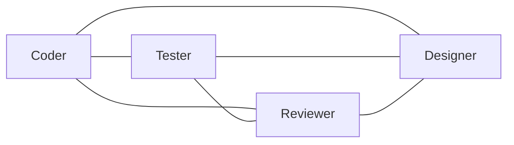
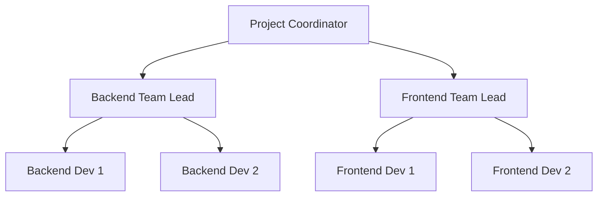
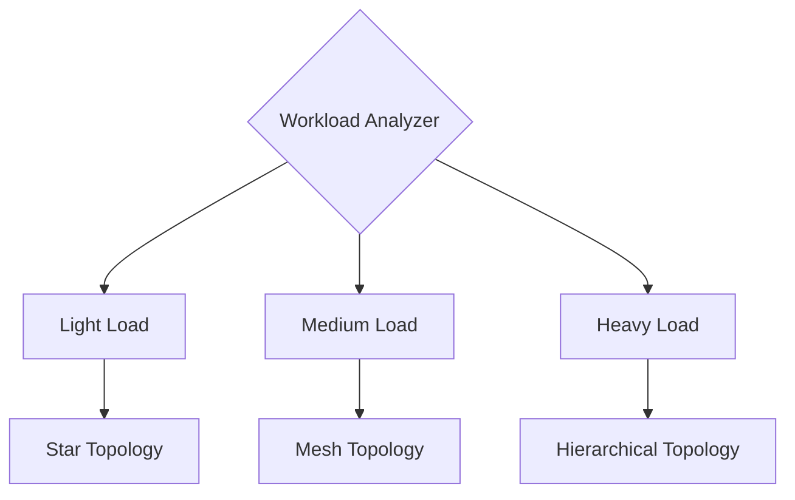

# Tutorial: Agent Swarm Basics

Learn how agent swarms work in Noa Server and how to use them effectively.

## 📋 What You'll Learn

- Understanding swarm topologies
- Agent coordination mechanisms
- Memory and state management
- Consensus protocols
- Performance optimization

## Prerequisites

- Completed [First Workflow Tutorial](first-workflow.md)
- Understanding of distributed systems concepts (helpful)

**Time**: 30-40 minutes

## Introduction to Agent Swarms

A swarm is a group of AI agents working together to solve complex problems. Think of it like a software development team where each member has specific expertise.

### Key Concepts

**Agent**: Specialized AI worker (e.g., coder, tester, reviewer)
**Swarm**: Coordinated group of agents
**Topology**: How agents are connected
**Coordinator**: Agent managing the swarm
**Memory**: Shared context for coordination

## Part 1: Understanding Topologies

### Mesh Topology

Every agent can communicate directly with every other agent.



**Characteristics**:
- Direct peer-to-peer communication
- High fault tolerance
- Best for collaboration
- Higher communication overhead

**When to Use**:
- Code review sessions (3-5 agents)
- Design brainstorming
- Pair programming
- Small team collaboration

**Create Mesh Swarm**:
```bash
npx claude-flow@alpha swarm init \
  --topology mesh \
  --max-agents 5 \
  --name "collab-mesh" \
  --communication-pattern all-to-all
```

**Example Use Case**: Code Review
```bash
# Three agents review code together
# - Coder explains changes
# - Reviewer 1 checks logic
# - Reviewer 2 checks security
# All can discuss and reach consensus
```

### Hierarchical Topology

Tree structure with coordinators managing sub-teams.



**Characteristics**:
- Structured organization
- Efficient for large teams
- Clear chain of command
- Lower communication overhead

**When to Use**:
- Large projects (10+ agents)
- Enterprise workflows
- Multi-team coordination
- Clear role separation

**Create Hierarchical Swarm**:
```bash
npx claude-flow@alpha swarm init \
  --topology hierarchical \
  --max-agents 15 \
  --coordinator-ratio 0.25 \
  --name "enterprise-hierarchy" \
  --levels 3
```

**Example Use Case**: Full Application Build
```bash
# Root Coordinator oversees:
# - Backend Team (API, Database, Services)
# - Frontend Team (UI, Components, Styles)
# - QA Team (Tests, Integration, Performance)
# Each team has a coordinator managing workers
```

### Adaptive Topology

Dynamically adjusts structure based on workload.



**Characteristics**:
- Self-optimizing
- Resource efficient
- Adapts to complexity
- Smart coordination

**When to Use**:
- Variable workloads
- Production environments
- Auto-scaling systems
- Unknown task complexity

**Create Adaptive Swarm**:
```bash
npx claude-flow@alpha swarm init \
  --topology adaptive \
  --max-agents 20 \
  --auto-scale true \
  --min-agents 3 \
  --optimization-interval 300 \
  --name "adaptive-prod"
```

**Example Use Case**: CI/CD Pipeline
```bash
# Adapts based on:
# - Single file change → Star (1 coordinator + workers)
# - Feature branch → Mesh (collaborative review)
# - Major release → Hierarchical (large coordinated effort)
```

## Part 2: Agent Coordination

### Direct Communication

Agents communicate peer-to-peer:

```bash
# Agent 1 sends message to Agent 2
agent1.send(agent2, {
  type: "code_review_request",
  file: "src/api.ts",
  changes: "..."
})

# Agent 2 responds
agent2.send(agent1, {
  type: "code_review_response",
  status: "approved",
  suggestions: [...]
})
```

### Shared Memory

Agents coordinate through shared memory:

```bash
# Agent 1 stores decision
npx claude-flow@alpha memory store \
  --key "swarm/architecture/database" \
  --value "PostgreSQL with read replicas"

# Agent 2 retrieves decision
npx claude-flow@alpha memory retrieve \
  --key "swarm/architecture/database"

# Agent 3 adds related info
npx claude-flow@alpha memory store \
  --key "swarm/architecture/database-schema" \
  --value-file database/schema.sql
```

### Hooks

Automated coordination points:

```bash
# Pre-task hook: Prepare resources
npx claude-flow@alpha hooks pre-task \
  --description "Implement user authentication" \
  --auto-assign true

# Post-edit hook: Share changes
npx claude-flow@alpha hooks post-edit \
  --file "src/auth.ts" \
  --memory-key "swarm/backend/auth" \
  --notify-agents "security-manager,tester"

# Post-task hook: Update metrics
npx claude-flow@alpha hooks post-task \
  --task-id "task-123" \
  --export-metrics true \
  --train-pattern true
```

### Consensus Protocols

Multiple agents reach agreement:

**Byzantine Consensus**:
```bash
# For critical decisions requiring fault tolerance
npx claude-flow@alpha consensus byzantine \
  --agents "agent1,agent2,agent3" \
  --question "Should we use JWT or session-based auth?" \
  --quorum 0.66
```

**Raft Consensus**:
```bash
# For sequential decisions with leader election
npx claude-flow@alpha consensus raft \
  --agents "agent1,agent2,agent3" \
  --decision "Merge PR #123"
```

**Gossip Protocol**:
```bash
# For distributed information sharing
npx claude-flow@alpha consensus gossip \
  --agents "all" \
  --information "API endpoint changed to /v2/auth"
```

## Part 3: Hands-On Exercise

Let's build a more complex workflow using multiple coordination mechanisms.

### Exercise: Build a Microservices Architecture

**Scenario**: Design and implement a microservices system with multiple teams.

**Step 1: Create Hierarchical Swarm**

```bash
npx claude-flow@alpha swarm init \
  --topology hierarchical \
  --max-agents 12 \
  --coordinator-ratio 0.25 \
  --name "microservices-swarm"
```

**Step 2: Define Teams**

```bash
# Architecture Team (3 agents)
npx claude-flow@alpha agent spawn \
  --type system-architect \
  --role team-lead \
  --swarm "microservices-swarm" \
  --name "arch-lead"

npx claude-flow@alpha agent spawn \
  --types "code-analyzer,api-docs" \
  --role worker \
  --swarm "microservices-swarm" \
  --team "architecture"

# Backend Team (4 agents)
npx claude-flow@alpha agent spawn \
  --type hierarchical-coordinator \
  --role team-lead \
  --swarm "microservices-swarm" \
  --name "backend-lead"

npx claude-flow@alpha agent spawn \
  --types "backend-dev,backend-dev,backend-dev" \
  --role worker \
  --swarm "microservices-swarm" \
  --team "backend"

# QA Team (3 agents)
npx claude-flow@alpha agent spawn \
  --type reviewer \
  --role team-lead \
  --swarm "microservices-swarm" \
  --name "qa-lead"

npx claude-flow@alpha agent spawn \
  --types "tester,perf-analyzer" \
  --role worker \
  --swarm "microservices-swarm" \
  --team "qa"
```

**Step 3: Create Task with Memory Coordination**

```bash
cat > tasks/microservices-system.json << 'EOF'
{
  "name": "Microservices Architecture",
  "description": "Design and implement microservices system",
  "swarm": "microservices-swarm",
  "coordination": {
    "memory_prefix": "swarm/microservices",
    "consensus_protocol": "raft",
    "hooks_enabled": true
  },
  "phases": [
    {
      "name": "Architecture Design",
      "team": "architecture",
      "tasks": [
        "Design service boundaries",
        "Define API contracts",
        "Plan data flow"
      ],
      "outputs": {
        "memory": "swarm/microservices/architecture/*",
        "files": "docs/architecture/*"
      }
    },
    {
      "name": "Implementation",
      "team": "backend",
      "depends_on": ["Architecture Design"],
      "coordination": "parallel",
      "tasks": [
        "User Service",
        "Order Service",
        "Payment Service"
      ],
      "inputs": {
        "memory": "swarm/microservices/architecture/*"
      },
      "outputs": {
        "memory": "swarm/microservices/implementation/*",
        "files": "services/*"
      }
    },
    {
      "name": "Testing & QA",
      "team": "qa",
      "depends_on": ["Implementation"],
      "tasks": [
        "Unit tests",
        "Integration tests",
        "Performance tests"
      ],
      "inputs": {
        "memory": "swarm/microservices/implementation/*"
      },
      "outputs": {
        "memory": "swarm/microservices/qa/*",
        "files": "tests/*"
      }
    }
  ]
}
EOF
```

**Step 4: Execute with Monitoring**

```bash
# Start execution
npx claude-flow@alpha task orchestrate \
  --file tasks/microservices-system.json \
  --monitor true

# In another terminal, watch coordination
npx claude-flow@alpha memory list \
  --prefix "swarm/microservices" \
  --watch

# Watch agent communication
npx claude-flow@alpha agent list \
  --swarm "microservices-swarm" \
  --show-communication \
  --watch
```

**Step 5: Observe Coordination Patterns**

Watch how agents coordinate:

```bash
# Architecture team stores design decisions
memory: swarm/microservices/architecture/service-boundaries
memory: swarm/microservices/architecture/api-contracts

# Backend team retrieves and implements
memory.retrieve("swarm/microservices/architecture/*")
# Creates services based on design

# QA team retrieves implementations
memory.retrieve("swarm/microservices/implementation/*")
# Creates tests based on actual code
```

## Part 4: Advanced Coordination

### Cross-Swarm Communication

Multiple swarms working together:

```bash
# Create frontend swarm
npx claude-flow@alpha swarm init \
  --topology mesh \
  --name "frontend-swarm"

# Create backend swarm
npx claude-flow@alpha swarm init \
  --topology hierarchical \
  --name "backend-swarm"

# Link swarms
npx claude-flow@alpha swarm link \
  --from "frontend-swarm" \
  --to "backend-swarm" \
  --communication-channel "api-contracts"
```

### Dynamic Agent Addition

Add agents during execution:

```bash
# Monitor swarm load
npx claude-flow@alpha swarm metrics --name "microservices-swarm"

# If overloaded, add agents
npx claude-flow@alpha agent spawn \
  --type backend-dev \
  --swarm "microservices-swarm" \
  --team "backend" \
  --auto-integrate true
```

### Fault Tolerance

Handle agent failures:

```bash
# Enable self-healing
npx claude-flow@alpha swarm configure \
  --name "microservices-swarm" \
  --self-healing true \
  --recovery-strategy replace \
  --health-check-interval 30

# Simulate failure
npx claude-flow@alpha agent stop \
  --name "backend-dev-2" \
  --force

# Watch automatic recovery
npx claude-flow@alpha swarm status \
  --name "microservices-swarm" \
  --watch
```

## Part 5: Performance Optimization

### Measure Swarm Performance

```bash
# Baseline metrics
npx claude-flow@alpha metrics swarm \
  --name "microservices-swarm" \
  --export baseline-metrics.json

# After optimization
npx claude-flow@alpha metrics swarm \
  --name "microservices-swarm" \
  --export optimized-metrics.json \
  --compare baseline-metrics.json
```

### Optimization Strategies

**1. Topology Optimization**:
```bash
# Analyze current topology efficiency
npx claude-flow@alpha perf analyze \
  --swarm "microservices-swarm" \
  --aspect topology

# Auto-optimize
npx claude-flow@alpha swarm optimize \
  --name "microservices-swarm" \
  --target "communication-overhead"
```

**2. Load Balancing**:
```bash
# Enable intelligent load balancing
npx claude-flow@alpha swarm configure \
  --name "microservices-swarm" \
  --load-balancing weighted-round-robin \
  --consider-agent-performance true
```

**3. Memory Optimization**:
```bash
# Clear old memory entries
npx claude-flow@alpha memory cleanup \
  --prefix "swarm/microservices" \
  --older-than 1h \
  --keep-referenced true
```

## Key Takeaways

### Best Practices

1. **Choose the Right Topology**
   - Mesh: Small collaborative tasks (3-7 agents)
   - Hierarchical: Large structured projects (10+ agents)
   - Adaptive: Variable or unknown workloads

2. **Use Memory Effectively**
   - Store decisions for coordination
   - Use clear, hierarchical keys
   - Clean up when done

3. **Enable Hooks**
   - Automate coordination
   - Reduce manual intervention
   - Improve consistency

4. **Monitor Performance**
   - Track metrics regularly
   - Identify bottlenecks early
   - Optimize based on data

5. **Plan for Failures**
   - Enable self-healing
   - Use consensus for critical decisions
   - Have redundancy for important agents

### Common Patterns

**Pattern 1: Design → Implement → Review**
```bash
Architect → [Parallel Implementers] → Reviewer
```

**Pattern 2: Parallel Teams**
```bash
Coordinator → Backend Team | Frontend Team | QA Team
```

**Pattern 3: Iterative Refinement**
```bash
Coder → Reviewer → Coder → Reviewer → ... (until approved)
```

## Next Steps

- Try [MCP Tools Usage](mcp-tools-usage.md) to leverage MCP capabilities
- Explore [Custom Agent Development](../../developer/examples/custom-agent.md)
- Read [Architecture Overview](../../architecture/ARCHITECTURE_OVERVIEW.md) for technical depth

## Further Reading

- [Features: Agent Swarms](../FEATURES.md#agent-swarms)
- [User Guide: Working with Swarms](../USER_GUIDE.md#working-with-swarms)
- [Architecture: Component Architecture](../../architecture/COMPONENT_ARCHITECTURE.md)

---

**Questions?** Check the [FAQ](../FAQ.md) or ask in [GitHub Discussions](https://github.com/your-org/noa-server/discussions).
