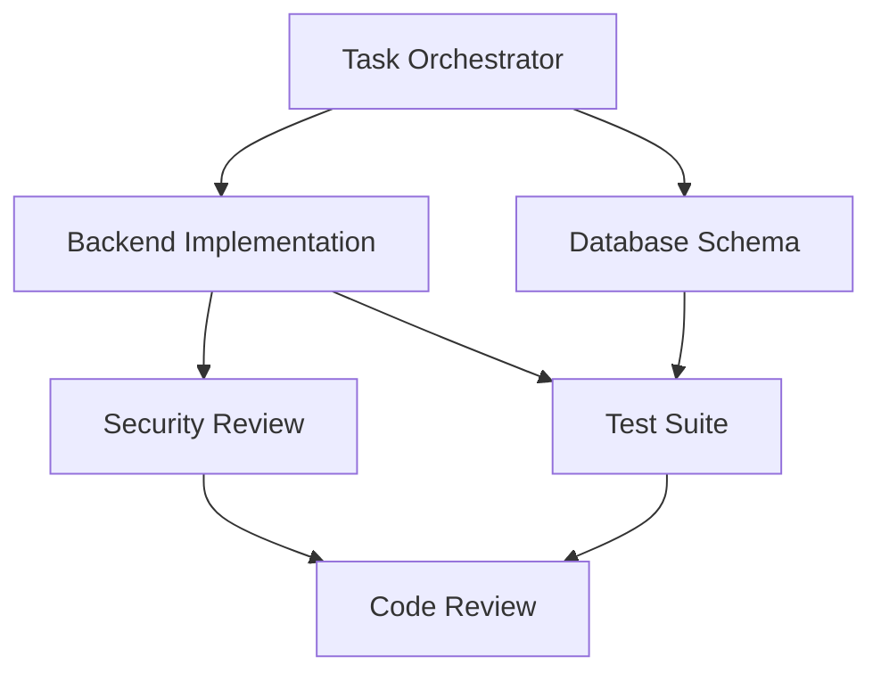

# Tutorial: Your First Workflow

Complete walkthrough of creating and executing your first workflow in Noa Server.

## 📋 What You'll Learn

- Initialize a swarm
- Create a task definition
- Spawn and coordinate agents
- Execute a workflow
- Monitor progress
- Review results

## Prerequisites

- Noa Server installed and running
- Claude Code with MCP servers configured
- Basic understanding of command line

## Tutorial Overview

We'll build a simple REST API with authentication, coordinating multiple agents to handle different aspects of the work.

**Time**: 20-30 minutes

## Step 1: Set Up Your Environment

First, ensure Noa Server is running:

```bash
# Navigate to Noa Server directory
cd ~/noa-server

# Start the server in development mode
npm run dev
```

In another terminal, verify it's running:

```bash
curl http://localhost:3000/health
# Should return: {"status": "healthy", ...}
```

## Step 2: Initialize a Swarm

Create a mesh swarm for collaborative development:

```bash
# Initialize swarm
npx claude-flow@alpha swarm init \
  --topology mesh \
  --max-agents 5 \
  --name "api-dev-swarm" \
  --auto-spawn true

# Verify swarm is running
npx claude-flow@alpha swarm status --name "api-dev-swarm"
```

You should see output like:
```
✓ Swarm initialized: api-dev-swarm
  Topology: mesh
  Max Agents: 5
  Status: healthy
  Agents: 0/5
```

## Step 3: Create a Task Definition

Create a task file that defines what we want to build:

```bash
# Create tasks directory
mkdir -p ~/noa-server/tasks

# Create task definition
cat > ~/noa-server/tasks/build-api.json << 'EOF'
{
  "name": "Build Authentication API",
  "description": "Create a REST API with user authentication using JWT",
  "priority": "high",
  "swarm": "api-dev-swarm",
  "subtasks": [
    {
      "id": "backend",
      "name": "Backend Implementation",
      "agent": "backend-dev",
      "description": "Create Express.js API with authentication endpoints",
      "deliverables": [
        "src/server.js - Express server setup",
        "src/routes/auth.js - Authentication routes",
        "src/middleware/auth.js - JWT middleware",
        "src/models/User.js - User model"
      ],
      "dependencies": []
    },
    {
      "id": "database",
      "name": "Database Schema",
      "agent": "backend-dev",
      "description": "Design and implement PostgreSQL schema",
      "deliverables": [
        "database/schema.sql - Database schema",
        "database/migrations/ - Migration files"
      ],
      "dependencies": []
    },
    {
      "id": "security",
      "name": "Security Review",
      "agent": "security-manager",
      "description": "Review authentication implementation for security issues",
      "deliverables": [
        "security-audit.md - Security findings and recommendations"
      ],
      "dependencies": ["backend"]
    },
    {
      "id": "tests",
      "name": "Test Suite",
      "agent": "tester",
      "description": "Create comprehensive tests for authentication",
      "deliverables": [
        "tests/auth.test.js - Authentication tests",
        "tests/integration.test.js - Integration tests"
      ],
      "dependencies": ["backend", "database"]
    },
    {
      "id": "review",
      "name": "Code Review",
      "agent": "reviewer",
      "description": "Review code quality and adherence to standards",
      "deliverables": [
        "code-review.md - Review findings"
      ],
      "dependencies": ["backend", "database", "tests"]
    }
  ],
  "acceptance_criteria": [
    "All endpoints return correct status codes",
    "JWT tokens are properly validated",
    "Passwords are hashed with bcrypt",
    "Tests achieve 90%+ coverage",
    "No security vulnerabilities found",
    "Code follows style guide"
  ]
}
EOF
```

## Step 4: Execute the Workflow

Now we'll orchestrate the task using Claude Flow:

```bash
# Execute the task
npx claude-flow@alpha task orchestrate \
  --file ~/noa-server/tasks/build-api.json \
  --output ~/noa-server/results/build-api-output.json \
  --verbose
```

This will:
1. Read the task definition
2. Spawn required agents (backend-dev, security-manager, tester, reviewer)
3. Distribute subtasks based on dependencies
4. Execute tasks in parallel where possible
5. Coordinate agent communication through shared memory

## Step 5: Monitor Progress

While the workflow executes, monitor it in real-time:

```bash
# In a new terminal, watch the swarm status
npx claude-flow@alpha swarm monitor --name "api-dev-swarm" --watch

# Or check task status
npx claude-flow@alpha task status --name "Build Authentication API" --watch

# View agent activity
npx claude-flow@alpha agent list --swarm "api-dev-swarm" --verbose
```

You'll see agents working on their assigned tasks:

```
Agent: backend-dev-1
Status: active
Current Task: Backend Implementation
Progress: 60%
Last Update: 2s ago

Agent: backend-dev-2
Status: active
Current Task: Database Schema
Progress: 80%
Last Update: 1s ago

Agent: tester-1
Status: waiting
Current Task: Test Suite
Waiting For: backend, database
```

## Step 6: Review Results

Once the workflow completes:

```bash
# View results
cat ~/noa-server/results/build-api-output.json | jq '.'

# Check created files
ls -lR ~/noa-server/src
ls -lR ~/noa-server/tests
ls -lR ~/noa-server/database
```

Expected output structure:
```
src/
├── server.js           # Express server
├── routes/
│   └── auth.js        # Auth routes
├── middleware/
│   └── auth.js        # JWT middleware
└── models/
    └── User.js        # User model

tests/
├── auth.test.js       # Auth tests
└── integration.test.js # Integration tests

database/
├── schema.sql         # Database schema
└── migrations/        # Migration files

docs/
├── security-audit.md  # Security findings
└── code-review.md     # Code review
```

## Step 7: Run the Tests

Verify everything works:

```bash
# Run tests
npm test

# Check coverage
npm run test:coverage
```

You should see:
```
Test Suites: 2 passed, 2 total
Tests:       12 passed, 12 total
Coverage:    92.5%
```

## Step 8: Review Agent Findings

Check the security audit and code review:

```bash
# Security audit
cat docs/security-audit.md

# Code review
cat docs/code-review.md
```

## Step 9: Try the API

Start the API and test it:

```bash
# Start the API server
cd ~/noa-server
node src/server.js

# In another terminal, test registration
curl -X POST http://localhost:3000/api/auth/register \
  -H "Content-Type: application/json" \
  -d '{"username": "testuser", "email": "test@example.com", "password": "SecurePass123!"}'

# Test login
curl -X POST http://localhost:3000/api/auth/login \
  -H "Content-Type: application/json" \
  -d '{"email": "test@example.com", "password": "SecurePass123!"}'

# Should return JWT token
```

## Step 10: View Metrics

Check performance metrics:

```bash
# Task metrics
npx claude-flow@alpha task metrics --name "Build Authentication API"

# Swarm metrics
npx claude-flow@alpha metrics swarm --name "api-dev-swarm"

# Agent performance
npx claude-flow@alpha agent list --swarm "api-dev-swarm" --metrics
```

Typical metrics:
```json
{
  "task": "Build Authentication API",
  "duration": "8m 34s",
  "agents_used": 5,
  "parallel_efficiency": "73%",
  "token_usage": 12450,
  "files_created": 12,
  "lines_of_code": 847,
  "test_coverage": "92.5%"
}
```

## Understanding What Happened

Let's break down the workflow:

### 1. Task Distribution


Tasks executed in parallel:
- Backend and Database ran simultaneously (no dependencies)
- Tests waited for both Backend and Database
- Security Review ran after Backend
- Code Review ran last, after everything else

### 2. Agent Coordination

Agents communicated through shared memory:

```bash
# Backend agent stored API design decisions
memory.store("api-dev-swarm/backend/auth-method", "JWT with refresh tokens")

# Security agent retrieved and reviewed
memory.retrieve("api-dev-swarm/backend/auth-method")

# Tester agent used the same information
memory.retrieve("api-dev-swarm/backend/auth-method")
```

### 3. Hooks in Action

Hooks automated coordination:

```bash
# Pre-task hook
# - Assigned agents by file type
# - Prepared resources
# - Optimized topology

# Post-edit hook (after each file)
# - Auto-formatted code
# - Stored in memory
# - Updated progress

# Post-task hook
# - Generated summary
# - Trained neural patterns
# - Exported metrics
```

## Next Steps

Now that you've completed your first workflow, try:

1. **Modify the task**: Add more features or agents
2. **Try different topologies**: Use hierarchical for larger projects
3. **Create custom agents**: See [Custom Agent Tutorial](../developer/examples/custom-agent.md)
4. **Use neural patterns**: Train from this successful workflow
5. **Integrate with GitHub**: Automate PR creation and reviews

## Advanced: Using Neural Patterns

Train a pattern from this successful workflow:

```bash
# Train pattern
npx claude-flow@alpha neural train \
  --workflow "Build Authentication API" \
  --pattern-name "rest-api-with-auth"

# Use the pattern for a new project
npx claude-flow@alpha neural apply \
  --pattern "rest-api-with-auth" \
  --task "Build Blog API with authentication"
```

The pattern will replicate the successful workflow structure for new similar tasks.

## Troubleshooting

### Agents not spawning?

```bash
# Check swarm status
npx claude-flow@alpha swarm status --name "api-dev-swarm"

# Verify MCP connection
claude mcp list

# Restart swarm
npx claude-flow@alpha swarm restart --name "api-dev-swarm"
```

### Task taking too long?

```bash
# Check bottlenecks
npx claude-flow@alpha perf analyze

# View agent status
npx claude-flow@alpha agent list --swarm "api-dev-swarm" --status
```

### Errors in results?

```bash
# Check logs
npx claude-flow@alpha logs --component agent --level error

# View detailed task results
cat ~/noa-server/results/build-api-output.json | jq '.errors'
```

## Summary

Congratulations! You've:

- ✓ Initialized a swarm
- ✓ Created a task definition
- ✓ Orchestrated multiple agents
- ✓ Monitored workflow execution
- ✓ Reviewed and tested results
- ✓ Understood agent coordination

**Time to complete**: ~15-20 minutes
**Agents used**: 5
**Files created**: ~12
**Tests written**: ~12
**Coverage**: 90%+

## Related Tutorials

- [Agent Swarm Basics](agent-swarm-basics.md) - Deep dive into swarm coordination
- [MCP Tools Usage](mcp-tools-usage.md) - Leveraging MCP capabilities
- [Custom Agent Development](../../developer/examples/custom-agent.md) - Build your own agents

## Further Reading

- [User Guide](../USER_GUIDE.md) - Comprehensive documentation
- [Features](../FEATURES.md) - All available features
- [Architecture Overview](../../architecture/ARCHITECTURE_OVERVIEW.md) - How it works

---

**Questions?** Check the [FAQ](../FAQ.md) or [open an issue](https://github.com/your-org/noa-server/issues).
