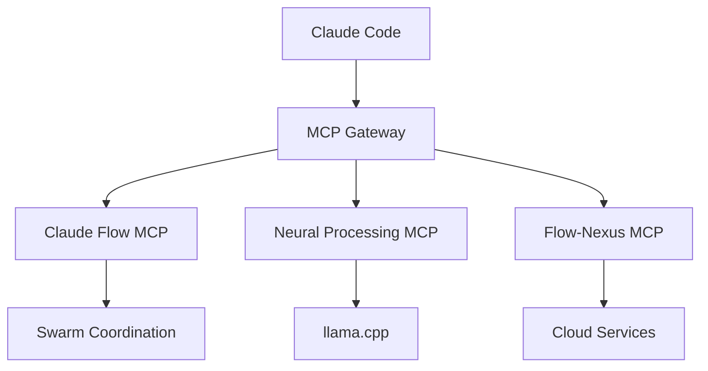

# Tutorial: MCP Tools Usage

Learn how to leverage Model Context Protocol (MCP) tools in Noa Server for powerful workflow orchestration.

## 📋 What You'll Learn

- Understanding MCP architecture
- Using Claude Flow MCP tools
- Neural processing with MCP
- GitHub integration via MCP
- Building custom MCP tools

## Prerequisites

- Completed [First Workflow Tutorial](first-workflow.md)
- Understanding of [Agent Swarm Basics](agent-swarm-basics.md)
- Claude Code installed with MCP servers configured

**Time**: 40-50 minutes

## Introduction to MCP

Model Context Protocol (MCP) provides standardized interfaces for AI agents to interact with tools, data sources, and each other.

### MCP Architecture



### Available MCP Servers

1. **claude-flow** (required): Core orchestration
2. **neural-processing** (built-in): Local AI with llama.cpp
3. **ruv-swarm** (optional): Enhanced coordination
4. **flow-nexus** (optional): Cloud features

## Part 1: Setting Up MCP

### Verify MCP Installation

```bash
# Check Claude Code installation
which claude

# List MCP servers
claude mcp list
```

Expected output:
```
MCP Servers:
  claude-flow: ✓ Connected
  neural-processing: ✓ Connected (if in llama.cpp directory)
  ruv-swarm: ○ Not configured
  flow-nexus: ○ Not configured
```

### Add MCP Servers

```bash
# Add claude-flow (required)
claude mcp add claude-flow npx claude-flow@alpha mcp start

# Add ruv-swarm (optional)
claude mcp add ruv-swarm npx ruv-swarm mcp start

# Add flow-nexus (optional, requires registration)
npx flow-nexus@latest register
claude mcp add flow-nexus npx flow-nexus@latest mcp start

# Verify all connected
claude mcp list
```

### Test MCP Connection

```bash
# From Claude Code, test a tool
mcp__claude-flow__swarm_status

# Or via command line
npx claude-flow@alpha mcp test-connection
```

## Part 2: Claude Flow MCP Tools

### Swarm Management Tools

**Initialize Swarm**:
```javascript
// In Claude Code
mcp__claude-flow__swarm_init({
  topology: "mesh",
  maxAgents: 5,
  name: "dev-swarm",
  autoSpawn: true
})
```

**Check Status**:
```javascript
mcp__claude-flow__swarm_status({
  name: "dev-swarm",
  detailed: true
})
```

**Scale Swarm**:
```javascript
mcp__claude-flow__swarm_scale({
  name: "dev-swarm",
  agents: 10,
  autoOptimize: true
})
```

### Agent Management Tools

**Spawn Agents**:
```javascript
// Single agent
mcp__claude-flow__agent_spawn({
  type: "backend-dev",
  swarm: "dev-swarm",
  name: "backend-dev-1"
})

// Multiple agents
mcp__claude-flow__agent_spawn_batch({
  types: ["coder", "tester", "reviewer"],
  swarm: "dev-swarm"
})
```

**List Agents**:
```javascript
mcp__claude-flow__agent_list({
  swarm: "dev-swarm",
  status: "active",
  showMetrics: true
})
```

**Agent Metrics**:
```javascript
mcp__claude-flow__agent_metrics({
  name: "backend-dev-1",
  metrics: ["cpu", "memory", "tasks_completed"],
  timeframe: "1h"
})
```

### Task Orchestration Tools

**Create Task**:
```javascript
mcp__claude-flow__task_create({
  name: "Build Feature",
  description: "Implement user profile page",
  agents: ["backend-dev", "frontend-dev", "tester"],
  priority: "high",
  deadline: "2025-10-25T00:00:00Z"
})
```

**Orchestrate Task**:
```javascript
mcp__claude-flow__task_orchestrate({
  taskFile: "tasks/user-profile.json",
  swarm: "dev-swarm",
  parallel: true
})
```

**Monitor Task**:
```javascript
mcp__claude-flow__task_status({
  taskId: "task-123",
  watch: true,
  updateInterval: 5000
})
```

### Memory Tools

**Store in Memory**:
```javascript
mcp__claude-flow__memory_store({
  key: "project/architecture/api-design",
  value: "RESTful with GraphQL for complex queries",
  ttl: 86400  // 24 hours
})
```

**Retrieve from Memory**:
```javascript
mcp__claude-flow__memory_retrieve({
  key: "project/architecture/api-design"
})
```

**List Memory Keys**:
```javascript
mcp__claude-flow__memory_list({
  prefix: "project/",
  pattern: "*api*"
})
```

### Neural Training Tools

**Train Pattern**:
```javascript
mcp__claude-flow__neural_train({
  workflowId: "successful-api-build",
  patternName: "rest-api-pattern",
  features: ["task_structure", "agent_coordination", "file_organization"]
})
```

**Apply Pattern**:
```javascript
mcp__claude-flow__neural_apply({
  pattern: "rest-api-pattern",
  taskName: "Build Blog API",
  customize: true
})
```

**List Patterns**:
```javascript
mcp__claude-flow__neural_patterns({
  sortBy: "accuracy",
  minAccuracy: 0.8
})
```

## Part 3: Neural Processing MCP

### Setup Neural Processing

```bash
# Navigate to llama.cpp
cd ~/noa-server/packages/llama.cpp

# Activate environment
source ~/praisonai_env/bin/activate

# Start Claude Code with neural MCP
claude --dangerously-skip-permissions
```

### Chat Completion

```javascript
// Basic completion
mcp__neural-processing__chat_completion({
  prompt: "Explain microservices architecture in simple terms",
  model: "llama-2-7b",
  maxTokens: 500,
  temperature: 0.7
})
```

### Streaming Chat

```javascript
// Streaming response
mcp__neural-processing__stream_chat({
  prompt: "Generate API documentation for user authentication endpoints",
  model: "llama-2-7b",
  stream: true,
  onChunk: (chunk) => console.log(chunk)
})
```

### Model Benchmarking

```javascript
// Benchmark model performance
mcp__neural-processing__benchmark_model({
  model: "llama-2-7b",
  iterations: 100,
  prompts: [
    "Explain REST API",
    "What is JWT?",
    "How does OAuth work?"
  ],
  metrics: ["latency", "throughput", "memory"]
})
```

### Model Validation

```javascript
// Validate GGUF model
mcp__neural-processing__validate_model({
  modelPath: "models/llama-2-7b.Q4_K_M.gguf",
  checkIntegrity: true,
  checkCompatibility: true
})
```

### System Information

```javascript
// Get system capabilities
mcp__neural-processing__get_system_info()
```

Expected output:
```json
{
  "cuda_available": true,
  "cuda_version": "11.8",
  "gpu_name": "NVIDIA GeForce RTX 3080",
  "gpu_memory": "10GB",
  "cpu_cores": 16,
  "ram": "32GB",
  "models_available": [
    "llama-2-7b.Q4_K_M.gguf",
    "mistral-7b.Q4_K_M.gguf"
  ]
}
```

## Part 4: GitHub Integration MCP

### Repository Analysis

```javascript
// Analyze repository
mcp__claude-flow__github_repo_analyze({
  repo: "your-org/noa-server",
  aspects: ["code_quality", "security", "performance"],
  detailed: true
})
```

### Pull Request Management

**Create PR with Agent Review**:
```javascript
mcp__claude-flow__github_pr_create({
  title: "Add user authentication",
  branch: "feature/auth",
  base: "main",
  description: "Implements JWT-based authentication",
  reviewers: ["code-review-swarm"],
  autoReview: true
})
```

**Enhance PR**:
```javascript
mcp__claude-flow__github_pr_enhance({
  repo: "your-org/noa-server",
  prNumber: 123,
  enhancements: [
    "improve_description",
    "add_testing_notes",
    "suggest_reviewers",
    "analyze_impact"
  ]
})
```

### Issue Triage

```javascript
// Auto-triage issues
mcp__claude-flow__github_issue_triage({
  repo: "your-org/noa-server",
  autoLabel: true,
  autoAssign: true,
  autoPrioritize: true,
  rules: {
    "security": { priority: "critical", assignTo: "security-team" },
    "bug": { priority: "high", label: "bug" },
    "feature": { priority: "medium", label: "enhancement" }
  }
})
```

### Release Management

```javascript
// Prepare release
mcp__claude-flow__github_release_prepare({
  version: "1.2.0",
  generateChangelog: true,
  checkBreakingChanges: true,
  runTests: true,
  updateDocs: true
})
```

## Part 5: Hands-On Exercise

Let's build a complete workflow using multiple MCP tools.

### Exercise: Automated Code Review System

**Scenario**: Create a system that automatically reviews PRs using multiple MCP tools.

**Step 1: Initialize Infrastructure**

```javascript
// Initialize swarm
mcp__claude-flow__swarm_init({
  topology: "mesh",
  maxAgents: 5,
  name: "code-review-swarm"
})

// Spawn review agents
mcp__claude-flow__agent_spawn_batch({
  types: [
    "code-analyzer",
    "security-manager",
    "perf-analyzer",
    "reviewer"
  ],
  swarm: "code-review-swarm"
})
```

**Step 2: Create Review Workflow**

```javascript
// Store review checklist in memory
mcp__claude-flow__memory_store({
  key: "review/checklist",
  value: JSON.stringify({
    codeQuality: ["readability", "maintainability", "testability"],
    security: ["input_validation", "authentication", "authorization"],
    performance: ["time_complexity", "space_complexity", "caching"],
    standards: ["naming_conventions", "documentation", "error_handling"]
  })
})

// Create review task
mcp__claude-flow__task_create({
  name: "Automated PR Review",
  description: "Review PR with multiple specialized agents",
  agents: [
    {
      type: "code-analyzer",
      subtask: "Analyze code quality and complexity"
    },
    {
      type: "security-manager",
      subtask: "Security audit"
    },
    {
      type: "perf-analyzer",
      subtask: "Performance analysis"
    },
    {
      type: "reviewer",
      subtask: "Final comprehensive review"
    }
  ],
  coordination: "parallel-then-merge",
  inputs: {
    memory: ["review/checklist"]
  }
})
```

**Step 3: Fetch PR and Start Review**

```javascript
// Get PR details
const prData = await mcp__claude-flow__github_pr_get({
  repo: "your-org/noa-server",
  prNumber: 123
})

// Store PR context
mcp__claude-flow__memory_store({
  key: "review/pr-123/context",
  value: JSON.stringify(prData)
})

// Start orchestrated review
mcp__claude-flow__task_orchestrate({
  taskName: "Automated PR Review",
  swarm: "code-review-swarm",
  context: {
    pr_number: 123,
    repo: "your-org/noa-server"
  }
})
```

**Step 4: Use Neural Processing for Analysis**

```javascript
// Get code quality analysis from local model
const codeAnalysis = await mcp__neural-processing__chat_completion({
  prompt: `Analyze this code for quality issues:\n\n${prData.diff}`,
  model: "llama-2-7b",
  maxTokens: 1000
})

// Store analysis
mcp__claude-flow__memory_store({
  key: "review/pr-123/neural-analysis",
  value: codeAnalysis
})
```

**Step 5: Aggregate Results and Post**

```javascript
// Retrieve all review results
const codeQuality = await mcp__claude-flow__memory_retrieve({
  key: "review/pr-123/code-quality"
})

const securityAudit = await mcp__claude-flow__memory_retrieve({
  key: "review/pr-123/security"
})

const perfAnalysis = await mcp__claude-flow__memory_retrieve({
  key: "review/pr-123/performance"
})

// Create comprehensive review comment
const reviewComment = `
## Automated Code Review

### Code Quality
${codeQuality}

### Security Audit
${securityAudit}

### Performance Analysis
${perfAnalysis}

### AI Analysis
${codeAnalysis}

---
Generated by Noa Server Code Review Swarm
`

// Post review to GitHub
mcp__claude-flow__github_pr_comment({
  repo: "your-org/noa-server",
  prNumber: 123,
  body: reviewComment
})
```

**Step 6: Train Pattern from Successful Review**

```javascript
// After successful review, train pattern
mcp__claude-flow__neural_train({
  workflowId: "review-pr-123",
  patternName: "comprehensive-pr-review",
  includeMetrics: true
})

// Use pattern for future reviews
mcp__claude-flow__neural_apply({
  pattern: "comprehensive-pr-review",
  context: { pr_number: 124 }
})
```

## Part 6: Advanced MCP Usage

### Chaining MCP Tools

```javascript
// Chain multiple operations
async function fullStackDevelopment() {
  // 1. Initialize
  const swarm = await mcp__claude-flow__swarm_init({
    topology: "hierarchical",
    maxAgents: 15
  })

  // 2. Design architecture
  await mcp__neural-processing__chat_completion({
    prompt: "Design microservices architecture for e-commerce"
  })

  // 3. Spawn teams
  await mcp__claude-flow__agent_spawn_batch({
    types: ["system-architect", "backend-dev", "frontend-dev"],
    swarm: swarm.name
  })

  // 4. Orchestrate development
  await mcp__claude-flow__task_orchestrate({
    taskFile: "tasks/ecommerce-build.json",
    swarm: swarm.name
  })

  // 5. Run tests
  await mcp__claude-flow__task_create({
    name: "Integration Testing",
    agents: ["tester", "perf-analyzer"]
  })

  // 6. Create PR
  await mcp__claude-flow__github_pr_create({
    title: "E-commerce Platform Implementation",
    autoReview: true
  })
}
```

### Error Handling

```javascript
try {
  await mcp__claude-flow__task_orchestrate({
    taskFile: "tasks/complex-task.json"
  })
} catch (error) {
  // Log error
  await mcp__claude-flow__memory_store({
    key: "errors/task-failed",
    value: JSON.stringify(error)
  })

  // Retry with different strategy
  await mcp__claude-flow__task_orchestrate({
    taskFile: "tasks/complex-task.json",
    fallbackStrategy: "sequential",
    retryCount: 3
  })
}
```

### Custom MCP Tool Integration

```javascript
// Define custom tool behavior
const customTool = {
  name: "custom_deployment",
  description: "Deploy to production",
  parameters: {
    environment: "production",
    version: "1.2.0"
  },
  handler: async (params) => {
    // Custom logic
    await mcp__claude-flow__task_create({
      name: "Deploy to Production",
      agents: ["cicd-engineer"],
      context: params
    })
  }
}

// Register with MCP
mcp__claude-flow__tool_register(customTool)
```

## Key Takeaways

### Best Practices

1. **Always Check MCP Connection**
   ```bash
   claude mcp list
   ```

2. **Use Memory for Coordination**
   ```javascript
   // Store context
   mcp__claude-flow__memory_store({...})

   // Agents retrieve
   mcp__claude-flow__memory_retrieve({...})
   ```

3. **Chain Tools Logically**
   ```javascript
   init → spawn → orchestrate → monitor → report
   ```

4. **Handle Errors Gracefully**
   ```javascript
   try/catch with fallback strategies
   ```

5. **Train Patterns from Success**
   ```javascript
   mcp__claude-flow__neural_train({...})
   ```

### Common Patterns

**Pattern 1: Swarm → Task → Results**
```javascript
swarm_init → task_orchestrate → task_results
```

**Pattern 2: Neural + Swarm**
```javascript
neural_completion → memory_store → agent_spawn → task_orchestrate
```

**Pattern 3: GitHub Integration**
```javascript
github_pr_get → swarm_init → task_orchestrate → github_pr_comment
```

## Next Steps

- Build [Custom Agents](../../developer/examples/custom-agent.md)
- Create [Custom MCP Tools](../../developer/MCP_SERVER_DEVELOPMENT.md)
- Explore [Architecture](../../architecture/ARCHITECTURE_OVERVIEW.md)

## Further Reading

- [MCP Specification](https://modelcontextprotocol.io/)
- [Features: MCP Integration](../FEATURES.md#mcp-integration)
- [Developer Guide: MCP Server Development](../../developer/MCP_SERVER_DEVELOPMENT.md)

---

**Questions?** Check the [FAQ](../FAQ.md) or [GitHub Discussions](https://github.com/your-org/noa-server/discussions).
