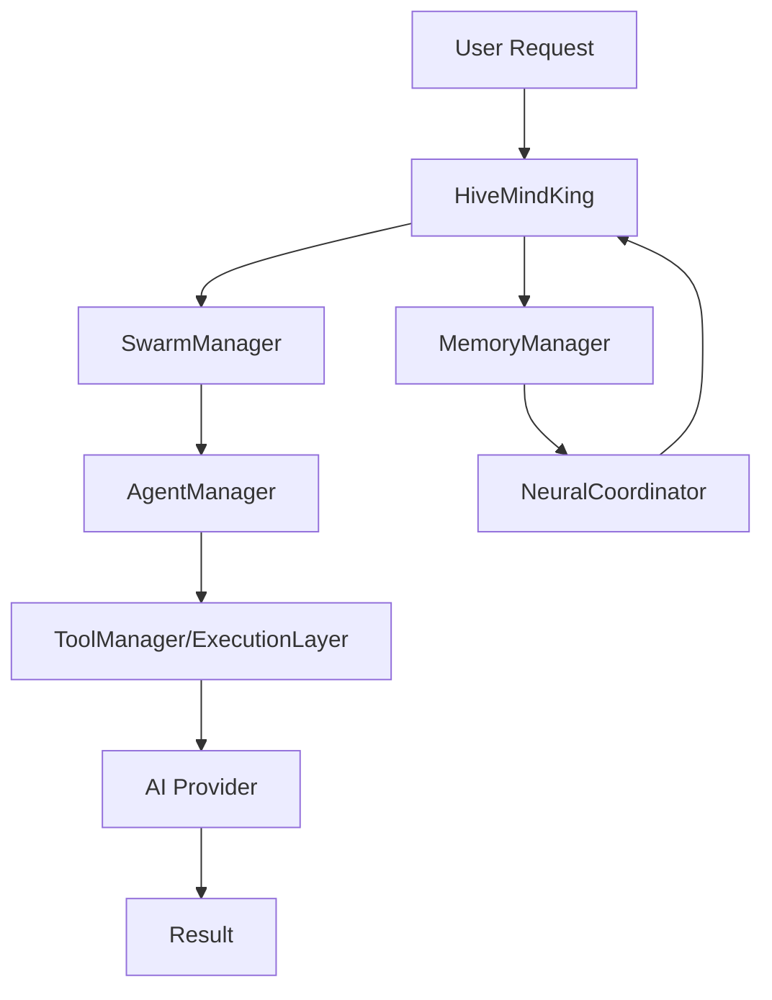

# Hive-Mind King

A sophisticated distributed AI agent orchestrator that manages swarms of
intelligent agents with dynamic tool integration, memory persistence, and
multi-provider execution capabilities.

## 🌟 Features

### Core Capabilities

- **Always-On Memory & Neural Modes**: Persistent memory with neural processing
  for continuous learning
- **Dynamic Swarm Management**: Create, scale, and destroy agent swarms
  on-demand
- **Runtime Agent Control**: Add/remove agents from swarms during operation
- **MCP Tool Integration**: Dynamic loading and execution of Model Context
  Protocol tools
- **Multi-Provider Execution**: Support for Claude, llama.cpp, and custom AI
  providers
- **Parallel Swarm Execution**: Run multiple swarms concurrently with resource
  management

### Architecture

- **Modular Manager System**: Separate managers for memory, neural processing,
  swarms, agents, tools, and execution
- **Event-Driven Communication**: Real-time coordination between all system
  components
- **Provider Abstraction**: Unified interface for different AI providers with
  automatic failover
- **Resource Management**: Intelligent scaling and resource allocation
- **Comprehensive Monitoring**: Built-in metrics, logging, and health monitoring

## 🚀 Quick Start

### Installation

```bash
# Install dependencies
pnpm install

# Build the project
pnpm build

# Run tests
pnpm test
```

### Basic Usage

```bash
# Start the Hive-Mind King
hive-king start

# Create a swarm
hive-king swarm create "my-swarm" --queen-type strategic --max-agents 10

# Add an agent to the swarm
hive-king agent add <swarm-id> worker --role executor --capabilities "task-execution,data-processing"

# Execute a task with Claude
hive-king execute "Analyze this dataset" --claude --model claude-3-sonnet-20240229

# Execute a task with llama.cpp
hive-king execute "Generate a summary" --llama-cpp --model llama-2-7b

# Check system status
hive-king status

# Stop the system
hive-king stop
```

### Programmatic Usage

```typescript
import { HiveMindKing } from '@noa/hive-mind-king';

const king = new HiveMindKing({
  memory: {
    alwaysEnabled: true,
    mode: 'persistent',
    backend: 'sqlite',
  },
  neural: {
    primaryProvider: 'claude',
    fallbackProviders: ['llama-cpp'],
  },
  swarms: {
    maxConcurrent: 10,
    autoScaling: true,
  },
});

await king.start();

// Execute a task
const result = await king.executeTask({
  description: 'Process customer feedback data',
  priority: 'high',
  executionFlags: {
    provider: 'claude',
    model: 'claude-3-sonnet-20240229',
    timeout: 30000,
  },
});

console.log('Task completed:', result);

await king.stop();
```

## 🏗️ Architecture

### Core Components

#### HiveMindKing (Main Orchestrator)

- Central coordinator for all system operations
- Manages lifecycle of all manager components
- Provides unified API for external interactions
- Handles configuration and system health

#### Manager Components

##### MemoryManager

- Persistent storage with configurable backends (SQLite, Redis, Memory)
- TTL-based expiration and automatic cleanup
- Neural memory patterns for intelligent recall

##### NeuralCoordinator

- Manages AI provider connections and routing
- Implements failover and load balancing
- Handles model-specific optimizations

##### SwarmManager

- Creates and manages agent swarms
- Implements queen-based coordination
- Handles swarm scaling and resource allocation
- Manages inter-swarm communication

##### AgentManager

- Lifecycle management for individual agents
- Task assignment and execution tracking
- Performance monitoring and optimization
- Agent migration between swarms

##### ToolManager

- MCP tool registration and discovery
- Dynamic tool loading and execution
- Tool performance metrics and caching
- Security validation and sandboxing

##### ExecutionLayer

- Multi-provider task execution
- Queue management and prioritization
- Cost tracking and optimization
- Result aggregation and formatting

### Data Flow



## ⚙️ Configuration

### Configuration Schema

```typescript
interface HiveMindKingConfig {
  version: string;
  memory: {
    alwaysEnabled: boolean;
    mode: 'persistent' | 'ephemeral' | 'hybrid';
    backend: 'sqlite' | 'redis' | 'memory';
    ttl: number;
    syncInterval: number;
  };
  neural: {
    alwaysEnabled: boolean;
    primaryProvider: 'claude' | 'llama-cpp' | 'auto';
    fallbackProviders: string[];
    modelConfigs: Record<string, any>;
  };
  swarms: {
    maxConcurrent: number;
    defaultQueenType: 'strategic' | 'tactical' | 'operational';
    autoScaling: boolean;
    resourceLimits: {
      maxAgentsPerSwarm: number;
      maxSwarms: number;
      memoryPerSwarm: number;
    };
  };
  tools: {
    mcpEnabled: boolean;
    dynamicLoading: boolean;
    toolTimeout: number;
    parallelExecution: boolean;
  };
  execution: {
    providers: Record<string, { enabled: boolean } & any>;
    defaultProvider: string;
    failoverEnabled: boolean;
  };
  monitoring: {
    enabled: boolean;
    metricsInterval: number;
    logLevel: 'debug' | 'info' | 'warn' | 'error';
  };
}
```

### Provider Configuration

#### Claude Provider

```json
{
  "claude": {
    "enabled": true,
    "apiKey": "your-api-key",
    "model": "claude-3-sonnet-20240229",
    "maxTokens": 4096,
    "temperature": 0.7
  }
}
```

#### llama.cpp Provider

```json
{
  "llama-cpp": {
    "enabled": true,
    "endpoint": "http://localhost:8080",
    "model": "llama-2-7b-chat.gguf",
    "contextSize": 2048,
    "threads": 4
  }
}
```

## 🛠️ CLI Commands

### System Management

```bash
hive-king start                    # Start the orchestrator
hive-king stop                     # Stop the orchestrator
hive-king status                   # Show system status
hive-king config show              # Show current configuration
hive-king interactive              # Start interactive mode
```

### Swarm Management

```bash
hive-king swarm create <name>       # Create a new swarm
hive-king swarm list                # List active swarms
hive-king swarm destroy <id>        # Destroy a swarm
hive-king swarm scale <id> <count>  # Scale swarm to N agents
```

### Agent Management

```bash
hive-king agent add <swarm> <type>  # Add agent to swarm
hive-king agent remove <id>         # Remove agent
hive-king agent list [swarm]        # List agents
```

### Tool Management

```bash
hive-king tool register <name> <type>  # Register a tool
hive-king tool list                   # List registered tools
```

### Memory Operations

```bash
hive-king memory store <key> <value>    # Store in memory
hive-king memory retrieve <key>         # Retrieve from memory
hive-king memory clear                  # Clear all memory
```

### Task Execution

```bash
# Execute with Claude
hive-king execute "task description" --claude --model claude-3-haiku

# Execute with llama.cpp
hive-king execute "task description" --llama-cpp --timeout 60000

# Execute with custom provider
hive-king execute "task description" --provider custom --cost-limit 0.5
```

## 🔧 Development

### Project Structure

```text
packages/hive-mind-king/
├── src/
│   ├── king/           # Main orchestrator
│   ├── memory/         # Memory management
│   ├── neural/         # Neural coordination
│   ├── swarms/         # Swarm management
│   ├── agents/         # Agent lifecycle
│   ├── tools/          # Tool integration
│   ├── execution/      # Provider execution
│   ├── cli/            # Command-line interface
│   └── __tests__/      # Test suites
├── bin/                # CLI executables
├── dist/               # Compiled output
└── docs/               # Documentation
```

```
packages/hive-mind-king/
├── src/
│   ├── king/           # Main orchestrator
│   ├── memory/         # Memory management
│   ├── neural/         # Neural coordination
│   ├── swarms/         # Swarm management
│   ├── agents/         # Agent lifecycle
│   ├── tools/          # Tool integration
│   ├── execution/      # Provider execution
│   ├── cli/            # Command-line interface
│   └── __tests__/      # Test suites
├── bin/                # CLI executables
├── dist/               # Compiled output
└── docs/               # Documentation
```

### Building and Testing

```bash
# Development mode
pnpm dev

# Build for production
pnpm build

# Run tests
pnpm test

# Type checking
pnpm typecheck

# Linting
pnpm lint
```

### Adding New Providers

1. Implement the provider interface in `ExecutionLayer`
2. Add provider configuration schema
3. Register provider in the execution manager
4. Add CLI support for the provider flag

### Adding New Tools

1. Implement tool interface in `ToolManager`
2. Add tool registration and discovery
3. Implement execution logic
4. Add CLI commands for tool management

## 📊 Monitoring and Metrics

### System Metrics

- **Execution Metrics**: Success rates, latency, cost tracking
- **Resource Usage**: Memory, CPU, network utilization
- **Swarm Performance**: Agent utilization, task completion rates
- **Tool Performance**: Execution times, error rates, usage patterns

### Health Checks

- Component status monitoring
- Automatic recovery from failures
- Resource limit enforcement
- Performance degradation detection

### Logging

- Structured logging with Winston
- Configurable log levels
- Performance tracing
- Error tracking and alerting

## 🔒 Security

### Provider Security

- API key encryption and secure storage
- Request/response validation
- Rate limiting and abuse prevention
- Secure communication channels

### Tool Security

- Sandboxed tool execution
- Input validation and sanitization
- Permission-based access control
- Audit logging for all operations

### System Security

- Secure configuration management
- Access control and authentication
- Data encryption at rest and in transit
- Regular security updates

## 🚀 Deployment

### Docker Deployment

```dockerfile
FROM node:20-alpine
WORKDIR /app
COPY package*.json ./
RUN npm ci --only=production
COPY dist/ ./dist/
EXPOSE 3000
CMD ["node", "dist/index.js"]
```

### Kubernetes Deployment

```yaml
apiVersion: apps/v1
kind: Deployment
metadata:
  name: hive-mind-king
spec:
  replicas: 3
  selector:
    matchLabels:
      app: hive-mind-king
  template:
    metadata:
      labels:
        app: hive-mind-king
    spec:
      containers:
        - name: hive-mind-king
          image: hive-mind-king:latest
          ports:
            - containerPort: 3000
          env:
            - name: NODE_ENV
              value: 'production'
```

## 🤝 Contributing

1. Fork the repository
2. Create a feature branch
3. Make your changes
4. Add tests for new functionality
5. Ensure all tests pass
6. Submit a pull request

### Development Guidelines

- Follow TypeScript strict mode
- Write comprehensive tests
- Document all public APIs
- Follow conventional commit messages
- Maintain backward compatibility

## 📄 License

This project is licensed under the MIT License - see the [LICENSE](LICENSE) file
for details.

## 🙏 Acknowledgments

- Built with TypeScript and Node.js
- Inspired by distributed AI systems and swarm intelligence
- Uses the Model Context Protocol for tool integration
- Leverages modern AI providers for execution

## 📞 Support

For support and questions:

- Create an issue on GitHub
- Check the documentation
- Join our Discord community

---

**Hive-Mind King**: Orchestrating the future of distributed AI intelligence.
