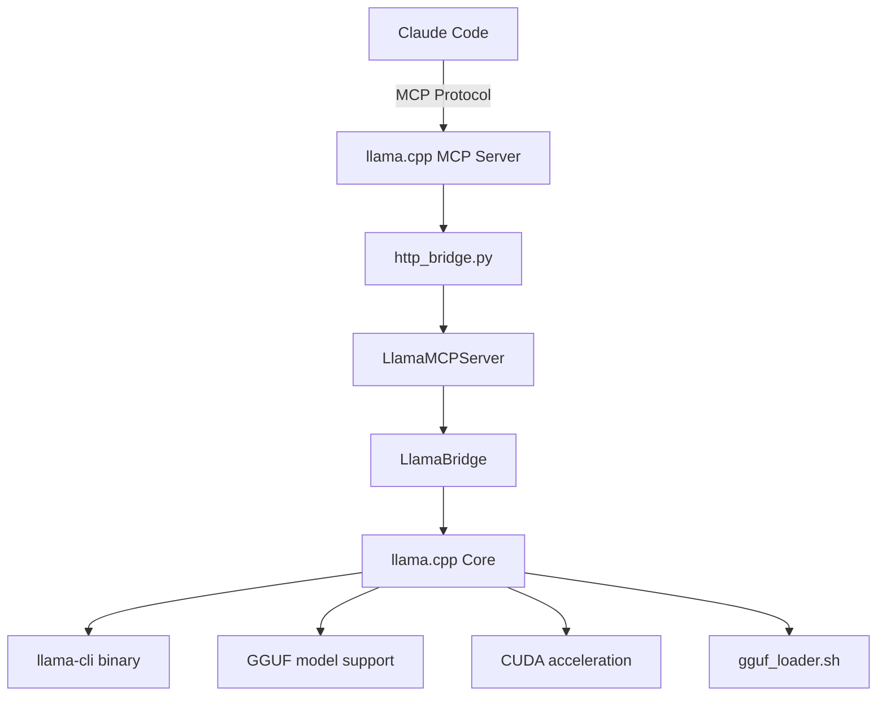

# Claude Code + llama.cpp MCP Integration Guide

This guide provides comprehensive documentation for the Model Context Protocol (MCP) integration between Claude Code and the llama.cpp neural processing layer.

## Overview

The integration enables Claude Code to access powerful local neural processing capabilities through MCP, allowing seamless AI-assisted development with local LLM models.

## Architecture



## Prerequisites

### System Requirements

- **Claude Code**: Latest version (`npm install -g @anthropic-ai/claude-code`)
- **Python**: 3.7+ with virtual environment
- **llama.cpp**: Built with CUDA support (recommended)
- **MCP Library**: `pip install mcp`

### Authentication

```bash
# Authenticate Claude Code
claude setup-token
```

## Installation & Setup

### 1. Install MCP Library

```bash
# Activate virtual environment
source praisonai_env/bin/activate

# Install MCP
pip install mcp
```

### 2. Verify llama.cpp Build

```bash
# Check build status
cd /home/deflex/noa-server/packages/llama.cpp
./test_neural_layer.sh env

# Expected: CUDA enabled, llama-cli executable
```

### 3. Configure MCP Server

The `.mcp.json` configuration file is automatically detected:

```json
{
  "mcpServers": {
    "neural-processing": {
      "command": "/home/deflex/praisonai_env/bin/python3",
      "args": ["/home/deflex/noa-server/packages/llama.cpp/shims/http_bridge.py", "mcp"],
      "env": {
        "LLAMA_CPP_DIR": "/home/deflex/noa-server/packages/llama.cpp",
        "LLM_MODEL_PATH": "/home/deflex/noa-server/packages/llama.cpp/models",
        "LLAMA_CUDA": "true",
        "LLAMA_CUDA_NO_VMM": "false",
        "LLAMA_CUDA_VMM_MAX_SIZE": "1073741824"
      }
    }
  }
}
```

### 4. Verify MCP Connection

```bash
# Check MCP server status
cd /home/deflex/noa-server/packages/llama.cpp
claude mcp list

# Expected output:
# neural-processing: /home/deflex/praisonai_env/bin/python3 ... - ✓ Connected
```

## Available Tools

### 1. Chat Completion (`chat_completion`)

**Purpose**: Generate text responses using llama.cpp models

**Parameters**:

- `prompt` *(required)*: Input text prompt
- `model_path` *(optional)*: Path to GGUF model file
- `context_size` *(optional)*: Context window size (default: 4096)
- `temperature` *(optional)*: Sampling temperature (default: 0.8)
- `max_tokens` *(optional)*: Maximum tokens to generate (default: 256)

**Usage Examples**:

```bash
# Basic chat completion
claude --print "Generate a response to: 'Explain neural networks'"

# With specific model
claude --print "Use the llama-7b model to explain quantum computing"

# Creative writing
claude --print "Write a short story about AI consciousness"
```

**Response Format**:

```json
{
  "response": "Generated text response...",
  "model": "/path/to/model.gguf",
  "usage": {
    "prompt_tokens": 5,
    "completion_tokens": 150,
    "total_tokens": 155
  },
  "timing": {
    "start_time": 1234567890.123,
    "end_time": 1234567892.456,
    "duration": 2.333
  },
  "cuda_enabled": true
}
```

### 2. Streaming Chat (`stream_chat`)

**Purpose**: Generate real-time streaming chat responses

**Parameters**:

- `prompt` *(required)*: Input text prompt
- `model_path` *(optional)*: Path to GGUF model file
- `context_size` *(optional)*: Context window size (default: 4096)
- `temperature` *(optional)*: Sampling temperature (default: 0.8)

**Usage Examples**:

```bash
# Streaming conversation
claude --print "Start a streaming discussion about machine learning"

# Real-time code explanation
claude --print "Stream an explanation of this Python code: [code snippet]"
```

**Response Format**: Continuous text stream

### 3. Model Benchmarking (`benchmark_model`)

**Purpose**: Test model performance and inference speed

**Parameters**:

- `model_path` *(optional)*: Path to GGUF model file
- `prompt` *(optional)*: Test prompt (default: "Hello, how are you?")
- `n_predict` *(optional)*: Number of tokens to predict (default: 128)

**Usage Examples**:

```bash
# Benchmark default model
claude --print "Benchmark the current model performance"

# Compare models
claude --print "Compare performance: validate model A, benchmark model A, validate model B, benchmark model B"

# Custom benchmark
claude --print "Benchmark with 256 tokens prediction"
```

**Response Format**:

```json
{
  "model": "/path/to/model.gguf",
  "prompt": "Hello, how are you?",
  "n_predict": 128,
  "duration_seconds": 2.456,
  "tokens_per_second": 52.1,
  "cuda_enabled": true
}
```

### 4. Model Validation (`validate_model`)

**Purpose**: Verify GGUF model file integrity

**Parameters**:

- `model_path` *(required)*: Path to GGUF model file

**Usage Examples**:

```bash
# Validate downloaded model
claude --print "Validate the integrity of llama-7b.gguf"

# Check model before use
claude --print "Is this model file corrupted: /path/to/model.gguf"
```

**Response Format**:

```json
{
  "valid": true,
  "model_path": "/path/to/model.gguf",
  "error": null
}
```

### 5. System Information (`get_system_info`)

**Purpose**: Get neural processing system configuration

**Parameters**: None

**Usage Examples**:

```bash
# Check system capabilities
claude --print "What neural processing capabilities are available?"

# Verify CUDA setup
claude --print "Is CUDA acceleration working?"
```

**Response Format**:

```json
{
  "llama_cpp_version": "built-from-source",
  "cuda_enabled": true,
  "model_path": "/home/deflex/noa-server/packages/llama.cpp/models",
  "cpu_count": 48,
  "system": "Linux",
  "python_version": "3.12.3"
}
```

### 6. List Models (`list_available_models`)

**Purpose**: Browse available GGUF models in the models directory

**Parameters**: None

**Usage Examples**:

```bash
# See available models
claude --print "What models can I use?"

# Find specific model types
claude --print "Show me all available Llama models"
```

**Response Format**:

```json
{
  "models": [
    {
      "name": "llama-7b.gguf",
      "path": "/path/to/models/llama-7b.gguf",
      "size_mb": 3584.5
    }
  ]
}
```

## Advanced Usage Patterns

### Development Workflow Integration

```bash
# Code review with AI
claude --print "Review this code for bugs: [code]"

# Documentation generation
claude --print "Generate documentation for this function"

# Test case generation
claude --print "Create unit tests for this class"
```

### Model Management

```bash
# Model comparison
claude --print "Compare performance: validate model A, benchmark model A, validate model B, benchmark model B"

# Model selection advice
claude --print "Which model should I use for code generation tasks?"
```

### Interactive Development

```bash
# Start Claude Code with MCP access
cd /home/deflex/noa-server/packages/llama.cpp
claude

# In Claude Code:
# "Help me debug this neural network code"
# "Explain this CUDA optimization"
# "Generate test cases for my ML pipeline"
```

## Configuration Options

### Environment Variables

| Variable | Description | Default | Impact |
|----------|-------------|---------|---------|
| `LLAMA_CPP_DIR` | llama.cpp installation path | Auto-detect | Required |
| `LLM_MODEL_PATH` | Default model directory | None | Optional |
| `LLAMA_CUDA` | Enable CUDA acceleration | `false` | Performance |
| `LLAMA_CUDA_NO_VMM` | Disable unified memory | `false` | Memory management |
| `LLAMA_CUDA_VMM_MAX_SIZE` | VMM pool size (bytes) | `1073741824` | Large model support |

### Model Directory Structure

```
/home/deflex/noa-server/packages/llama.cpp/models/
├── llama-7b-q4.gguf          # 7B parameter model, Q4 quantization
├── llama-13b-q4.gguf         # 13B parameter model, Q4 quantization
├── codellama-7b.gguf         # Code-focused model
├── mistral-7b.gguf           # Mistral architecture
└── vocabulary/               # Vocabulary-only files
    ├── ggml-vocab-llama.gguf
    └── ggml-vocab-gpt-2.gguf
```

## Performance Optimization

### CUDA Configuration

```bash
# Enable CUDA with optimal settings
export LLAMA_CUDA=true
export LLAMA_CUDA_NO_VMM=false  # Enable unified memory
export LLAMA_CUDA_VMM_MAX_SIZE=2147483648  # 2GB VMM pool

# Multi-GPU setup (if available)
export LLAMA_CUDA_DEVICE_COUNT=2
export LLAMA_CUDA_DEVICE=0,1
```

### Model Selection Guidelines

- **Small tasks** (< 1K tokens): 7B models, Q4 quantization
- **Code generation**: CodeLlama, DeepSeek-Coder variants
- **General chat**: Llama 2/3, Mistral, Phi-3
- **Large context**: Models with 8K+ context windows

### Memory Management

- **CPU-only**: Use memory mapping (`--mlock 0`)
- **CUDA**: Enable VMM for models > VRAM capacity
- **Batch processing**: Adjust context size based on available memory

## Troubleshooting

### Connection Issues

**Problem**: MCP server not connected

```bash
# Check status
claude mcp list

# Restart server
claude mcp remove neural-processing
claude mcp add-json neural-processing "$(cat .mcp.json | jq .mcpServers.neural-processing)"
```

**Problem**: Permission denied

```bash
# Use bypass flag for testing
claude --dangerously-skip-permissions --print "test"
```

### Performance Issues

**Problem**: Slow inference

- Check CUDA status: `nvidia-smi`
- Verify VMM settings
- Try smaller context size
- Use faster quantization (Q4_K_M vs Q5_K_M)

**Problem**: Out of memory

```bash
# Reduce context size
export LLAMA_CTX_SIZE=2048

# Enable memory mapping
export LLAMA_MMAP=true
export LLAMA_MLOCK=false
```

### Model Issues

**Problem**: Model not found

```bash
# Check model directory
ls -la $LLM_MODEL_PATH

# Verify model integrity
claude --print "Validate model: /path/to/model.gguf"
```

**Problem**: Invalid model format

- Ensure GGUF format (not GGML)
- Check file corruption
- Verify compatible architecture

## Security Considerations

### File Access

- Models restricted to configured directories
- No arbitrary file system access
- Path validation prevents directory traversal

### Resource Limits

- Configurable timeouts (300s for chat, 600s for benchmarks)
- Memory limits via VMM configuration
- CPU thread limits via OpenMP

### Network Security

- Local-only operation (no external API calls)
- No data exfiltration
- Isolated execution environment

## Development & Extension

### Adding New Tools

1. **Define tool schema** in `LlamaMCPServer.setup_tools()`
2. **Implement handler method** in `LlamaMCPServer` class
3. **Add tool registration** in `setup_tools()` method
4. **Update documentation**

### Custom Model Support

1. **Test model compatibility** with llama.cpp
2. **Add model validation** if needed
3. **Update model directory** structure
4. **Document model requirements**

### Performance Monitoring

- **Benchmark regularly** with `benchmark_model` tool
- **Monitor CUDA utilization** with `nvidia-smi`
- **Track memory usage** during inference
- **Log performance metrics** for optimization

## Integration Examples

### CI/CD Pipeline

```yaml
# .github/workflows/neural-test.yml
name: Neural Processing Tests
on: [push, pull_request]

jobs:
  test:
    runs-on: ubuntu-latest
    steps:
      - uses: actions/checkout@v3
      - name: Setup Python
        uses: actions/setup-python@v4
        with: python-version: '3.8'
      - name: Install dependencies
        run: pip install mcp
      - name: Run neural tests
        run: ./test_neural_layer.sh
```

### Docker Integration

```dockerfile
FROM nvidia/cuda:12.0-base-ubuntu22.04

# Install dependencies
RUN apt-get update && apt-get install -y \
    python3 python3-pip git cmake build-essential

# Setup llama.cpp
WORKDIR /app
RUN git clone https://github.com/ggerganov/llama.cpp.git
WORKDIR /app/llama.cpp
RUN mkdir build && cd build && \
    cmake .. -DGGML_CUDA=ON && \
    make -j$(nproc)

# Install MCP
RUN pip install mcp

# Copy neural processing layer
COPY packages/llama.cpp /app/neural
WORKDIR /app/neural

EXPOSE 8081
CMD ["python3", "shims/http_bridge.py", "serve"]
```

## Support & Resources

### Documentation Links

- [llama.cpp GitHub](https://github.com/ggerganov/llama.cpp)
- [Claude Code Documentation](https://docs.anthropic.com/claude/docs/claude-code)
- [MCP Specification](https://modelcontextprotocol.io/)

### Community Resources

- [GGUF Model Hub](https://huggingface.co/models?library=gguf)
- [Claude Code Community](https://github.com/anthropics/claude-code)
- [llama.cpp Discussions](https://github.com/ggerganov/llama.cpp/discussions)

### Getting Help

1. **Check logs**: `tail -f ~/.cache/claude-cli-nodejs/*/mcp-logs-*`
2. **Run diagnostics**: `./test_neural_layer.sh`
3. **Verify setup**: `claude mcp list`
4. **Community support**: GitHub issues and discussions

---

*This integration enables powerful local AI capabilities within Claude Code, combining the flexibility of MCP with the performance of llama.cpp.*
