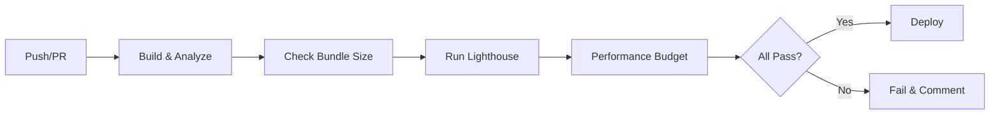

# Build System Quick Reference

## Commands

```bash
# Development
npm run dev                      # Start dev server (localhost:5173)

# Production Build
npm run build                    # Standard production build
npm run build:analyze            # Build + bundle analysis
npm run build:lib                # Build as library (tsup)

# Preview
npm run preview                  # Preview production build (localhost:4173)

# Analysis & Testing
npm run analyze                  # Analyze existing build
npm run lighthouse               # Run Lighthouse CI
npm run lighthouse:collect       # Collect Lighthouse data
npm run lighthouse:assert        # Run Lighthouse assertions
npm run perf:budget              # Check performance budget

# Utilities
./scripts/build-pwa-icons.sh     # Generate PWA icons
./scripts/lighthouse-ci.sh       # Run Lighthouse with server
```

## Bundle Size Targets

| Resource Type | Target | Critical |
|---------------|--------|----------|
| Total Bundle | <500KB | Yes |
| Initial Chunk | <200KB | Yes |
| Vendor Chunk | <150KB | Yes |
| Route Chunk | <50KB | No |

## Performance Targets

| Metric | Target | Critical |
|--------|--------|----------|
| First Contentful Paint (FCP) | <1.8s | Yes |
| Largest Contentful Paint (LCP) | <2.5s | Yes |
| Total Blocking Time (TBT) | <300ms | Yes |
| Cumulative Layout Shift (CLS) | <0.1 | Yes |
| Time to Interactive (TTI) | <3.8s | No |
| Speed Index (SI) | <3.0s | No |

## Code Splitting

### Vendor Chunks (7 total)

```typescript
react-vendor    // React + ReactDOM
router-vendor   // React Router
chart-vendor    // Recharts + D3
ui-vendor       // bits-ui + Radix UI + Framer Motion
form-vendor     // React Hook Form + Zod
utils-vendor    // Axios + date-fns + Zustand
data-vendor     // XLSX + PapaParse
```

### Lazy Loading Pattern

```typescript
// Routes
const Dashboard = lazy(() => import('./routes/Dashboard'));

// Components
const Chart = lazy(() => import('@components/charts/LineChart'));

// Features
const ExportModal = lazy(() => import('@components/modals/ExportModal'));

// Usage with Suspense
<Suspense fallback={<LoadingSpinner />}>
  <Dashboard />
</Suspense>
```

## Environment Variables

```bash
# Development
VITE_API_URL=http://localhost:3000
VITE_OPEN_BROWSER=false
VITE_SOURCEMAP=true

# Production
VITE_API_URL=https://api.production.com
VITE_DROP_CONSOLE=true
VITE_COMPRESS_ASSETS=true
VITE_PWA_ENABLED=true
```

## PWA Caching Strategies

```typescript
// API requests - Network First (5 min cache)
/^https:\/\/api\./  →  NetworkFirst

// Static assets - Cache First (30 days)
/\.(js|css|woff2)$/ →  CacheFirst

// Images - Cache First (7 days)
/\.(png|jpg|svg)$/  →  CacheFirst

// CDN - Stale While Revalidate (30 days)
/^https:\/\/cdn\./  →  StaleWhileRevalidate
```

## Build Output Structure

```
dist/
├── index.html                    # Entry point
├── assets/
│   ├── js/
│   │   ├── index-[hash].js      # Main entry
│   │   ├── react-vendor-[hash].js
│   │   ├── router-vendor-[hash].js
│   │   ├── chart-vendor-[hash].js
│   │   ├── ui-vendor-[hash].js
│   │   └── ...
│   ├── css/
│   │   └── index-[hash].css
│   ├── images/
│   │   └── [name]-[hash].{png,jpg,webp}
│   └── fonts/
│       └── [name]-[hash].woff2
└── manifest.json                # PWA manifest
```

## Troubleshooting

### Bundle Too Large

```bash
# 1. Analyze bundle
npm run build:analyze
open docs/bundle-stats.html

# 2. Check for duplicates
npm dedupe

# 3. Find unused dependencies
npx depcheck

# 4. Review large chunks
cat docs/bundle-report.txt
```

### Poor Lighthouse Score

```bash
# 1. Run Lighthouse
npm run lighthouse

# 2. Check specific metric
lhci collect --url http://localhost:5173

# 3. Review report
open .lighthouseci/lhci-report.html
```

### Service Worker Issues

```javascript
// Clear service worker in console
navigator.serviceWorker.getRegistrations()
  .then(registrations => {
    registrations.forEach(r => r.unregister());
  });

// Force update
navigator.serviceWorker.ready.then(registration => {
  registration.update();
});
```

## Best Practices

1. **Always lazy load routes**
   ```typescript
   const Route = lazy(() => import('./Route'));
   ```

2. **Use named imports for tree shaking**
   ```typescript
   import { Button } from '@components/ui';  // ✅
   import * as UI from '@components/ui';     // ❌
   ```

3. **Optimize images before committing**
   ```bash
   # Use WebP format
   convert image.png -quality 80 image.webp
   ```

4. **Monitor bundle size on PRs**
   - GitHub Actions automatically comments
   - Review bundle-stats.html artifact

5. **Check Lighthouse score weekly**
   ```bash
   npm run lighthouse
   ```

6. **Dynamic import heavy dependencies**
   ```typescript
   const exportPDF = async () => {
     const { jsPDF } = await import('jspdf');
     // Use jsPDF
   };
   ```

## File Locations

| File | Location |
|------|----------|
| Vite Config | `/packages/ui/vite.config.ts` |
| Service Worker | `/packages/ui/src/service-worker.ts` |
| PWA Manifest | `/packages/ui/public/manifest.json` |
| Lighthouse Config | `/packages/ui/.lighthouserc.json` |
| Bundle Analyzer | `/packages/ui/scripts/analyze-bundle.ts` |
| Performance Budget | `/packages/ui/scripts/performance-budget.json` |
| CI/CD Workflow | `/packages/ui/.github/workflows/build-optimization.yml` |

## Reports Generated

| Report | Location | Format |
|--------|----------|--------|
| Bundle Visualization | `docs/bundle-stats.html` | Interactive HTML |
| Bundle Report | `docs/bundle-report.json` | JSON |
| Bundle Summary | `docs/bundle-report.txt` | Text |
| Lighthouse Report | `.lighthouseci/lhci-report.html` | HTML |

## CI/CD Pipeline



## Performance Optimization Checklist

- [ ] Lazy load all routes
- [ ] Lazy load heavy components (charts, modals)
- [ ] Use dynamic imports for conditional features
- [ ] Optimize images (WebP, 80% quality)
- [ ] Enable font-display: swap
- [ ] Remove unused dependencies
- [ ] Check bundle analysis for large chunks
- [ ] Run Lighthouse CI
- [ ] Verify performance budgets
- [ ] Test on real devices with throttling

## Support

- **Documentation**: See `docs/` directory
- **Vite Docs**: https://vitejs.dev/
- **Workbox Docs**: https://developers.google.com/web/tools/workbox
- **Lighthouse Docs**: https://web.dev/lighthouse-performance/

---

**Quick Start**: `npm run build:analyze && open docs/bundle-stats.html`
